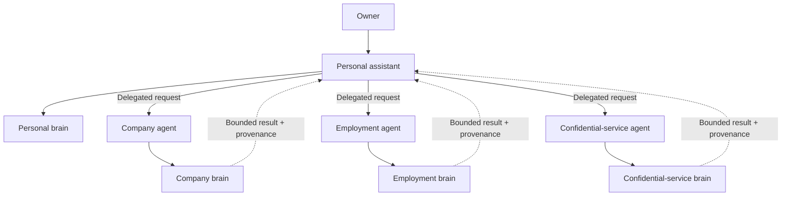

# Observable Multi-Brain Knowledge Runtime

## Summary

Evolve GBrain into an observable knowledge runtime that turns many intake streams into durable, enriched knowledge while preserving hard information boundaries and giving a personal assistant controlled, attributable access across brains.

---

## Problem Frame

GBrain already contains useful storage, hybrid retrieval, source isolation, Dream phases, Minion jobs, facts, concepts, links, and timelines. It also contains contracts for ingestion sources and connected brains. However, several of those surfaces remain partially wired: intake processing is inconsistent across adapters, binary media processors are external, mounted-brain execution is not uniformly enforced at runtime, and health commands emphasize component checks rather than proving complete capabilities.

The operational result is low trust. Material can be stored successfully without being enriched, retrieved, or routed as expected. A later session may discover that a worker stopped, a provider route drifted, a source was mis-scoped, or semantic retrieval degraded silently. Repeated repair sessions do not provide a durable answer to the operator's central question: “Is the brain working?”

The intended user also operates across multiple information domains. Some material shares one owner but differs in purpose, such as canonical personal knowledge, research bookmarks, and session evidence. Other material belongs to hard organizational or confidentiality boundaries and must not leak into personal recall or another domain. Prompt instructions alone are insufficient to enforce those boundaries.

---

## Actors

- A1. Owner: supplies information, defines boundaries, reviews proposals, and relies on the system for recall and action.
- A2. Personal assistant: handles personal work directly and coordinates authorized requests across domain boundaries.
- A3. Domain agent: operates within one protected brain using narrowly scoped credentials and domain-specific instructions.
- A4. Intake source: emits normalized evidence from an external system without owning downstream reasoning.
- A5. Knowledge operator: deploys, observes, repairs, upgrades, and evaluates the GBrain fleet.
- A6. Enrichment worker: executes one durable, independently versioned processing pass through the Minion system.

---

## Key Flows

- F1. Evidence becomes usable knowledge
  - **Trigger:** A4 observes new or changed material.
  - **Actors:** A4, A6, A5
  - **Steps:** The source emits a normalized event; durable processing captures it in the correct brain and source; eligible enrichment passes run; outputs preserve evidence lineage; canonical knowledge is updated or proposed; capability status records the outcome.
  - **Outcome:** The material is either searchable and attributable, awaiting a visible next step, or visibly failed with a repair path.
  - **Covered by:** R6, R7, R8, R9, R10, R11, R15

- F2. Everyday retrieval
  - **Trigger:** A1 asks A2 a question.
  - **Actors:** A1, A2
  - **Steps:** A2 searches canonical personal knowledge first; expands to relevant evidence sources when needed; preserves source provenance; returns an answer that distinguishes durable knowledge from supporting evidence.
  - **Outcome:** A1 receives a useful answer without noisy intake dominating ordinary recall.
  - **Covered by:** R2, R3, R12, R13

- F3. Protected-domain delegation
  - **Trigger:** A request is classified as belonging to a protected domain.
  - **Actors:** A1, A2, A3
  - **Steps:** A2 delegates to the correctly scoped A3; A3 queries only its authorized brain; A3 returns a bounded result with brain and source attribution; A2 composes the response without silently persisting protected content elsewhere.
  - **Outcome:** Cross-domain assistance works without granting the personal assistant unrestricted database access.
  - **Covered by:** R1, R4, R5, R13, R14

- F4. Continuous operational assurance
  - **Trigger:** A scheduled probe runs or a pipeline state changes.
  - **Actors:** A5, A4, A6
  - **Steps:** Capability metrics and canaries evaluate intake, queues, workers, Dream phases, enrichment, embeddings, and retrieval; dashboards display fleet and brain-specific status; actionable alerts fire on sustained or critical failures; diagnostics retain enough lineage to identify the failed stage.
  - **Outcome:** A5 can tell whether each capability works without manually interpreting changing Doctor scores.
  - **Covered by:** R15, R16, R17

---

## Requirements

**Brain and source boundaries**

- R1. Each hard ownership, confidentiality, or access boundary must use an independently configured brain database with its own credentials, lifecycle, backup policy, and access policy.
- R2. Material with the same owner but a different purpose or retrieval posture must use sources within a brain rather than additional databases.
- R3. A personal brain must support canonical, intake, research, and session-evidence postures so noisy or unreviewed material does not need to compete equally in ordinary retrieval.
- R4. Every remote agent and automated worker must receive only the brain and source permissions required for its role; an agent persona or prompt must never be treated as the security boundary.
- R5. Before a protected brain accepts intake, the operator must explicitly define approved data classes, retention expectations, export restrictions, and prohibited content for that domain.

**Intake and durable processing**

- R6. Intake adapters must emit a common, versioned event contract that preserves source identity, source URI, content identity, content type, timestamps, trust classification, and relevant metadata.
- R7. Intake supervision must provide validation, deduplication, backpressure, durable queue submission, retries, dead-letter visibility, and per-source health without requiring each adapter to reinvent them.
- R8. Text, documents, images, audio, and video must be processable through composable content processors; an unsupported type must fail visibly instead of becoming a useless path-only page or silently disappearing.
- R9. Minions must be the durable execution substrate for asynchronous processing, including timeouts, retry policy, idempotency, checkpoints, dependencies, and worker ownership.

**Independent enrichment and promotion**

- R10. Each enrichment pass must independently declare its eligible inputs, output posture, version, schedule, dependencies, model or tool needs, retry behavior, approval mode, and quality checks.
- R11. Dream must coordinate enabled enrichment passes and their ordering while Minions perform the durable work; collectors and workflow tools must not become competing systems of record for reasoning state.
- R12. Every generated artifact must retain bounded lineage to its source evidence and processing receipt so an operator or assistant can explain where it came from and which pass produced it.
- R13. The runtime must distinguish evidence from canonical knowledge and support explicit or policy-controlled promotion without deleting the underlying evidence.

**Assistant and cross-brain behavior**

- R14. The personal assistant must directly access only its default personal scope and delegate protected-domain requests to domain agents with independently scoped credentials.
- R15. Cross-brain answers must carry brain and source attribution, must not silently combine contradictory claims, and must not be persisted into another brain unless an authorized promotion action explicitly requests it.

**Operational truth**

- R16. The runtime must expose machine-readable capability metrics for sources, Minion queues and workers, Dream cycles and phases, enrichment passes, content processors, embeddings, derived knowledge, provider health, and retrieval quality.
- R17. The operator must have a fleet overview and per-brain drill-down with actionable alerts, while operational telemetry must exclude page bodies and other sensitive content by default.
- R18. Every critical end-to-end capability must have a repeatable canary that proves a known input reaches the expected durable and retrievable outcome through the deployed path.

**Managed-fork posture**

- R19. The maintained fork must integrate useful upstream reliability work before duplicating it, preserve upstream mergeability where practical, and express downstream behavior through supported contracts, plugins, source adapters, processors, and enrichment definitions before changing the core.

---

## Acceptance Examples

- AE1. **Covers R1, R4, R14, R15.** Given a question about a protected employment domain, when the personal assistant handles it, the assistant delegates to the employment agent; the employment credential cannot read any other protected brain; and the response identifies the originating brain without copying its evidence into the personal brain.
- AE2. **Covers R2, R3, R13.** Given a large collection of research bookmarks, when the owner asks an everyday personal question, canonical results rank first and relevant research evidence is added only when it improves the answer; a reviewed insight can later be promoted while retaining its bookmark citations.
- AE3. **Covers R6, R7, R8, R9.** Given a newly bookmarked video, when intake runs, the event is durably accepted once, transcription is queued with a visible checkpoint, retryable failure does not lose the item, and an unsupported processor produces a visible failed capability rather than a misleading successful page.
- AE4. **Covers R10, R11, R12.** Given two independently enabled enrichment passes, when one pass version changes, only its eligible stale inputs are reprocessed; its outputs identify the new pass version and evidence; and unrelated passes do not repeat work.
- AE5. **Covers R16, R17, R18.** Given a transcription worker has stopped, when the capability canary runs, the dashboard shows the affected brain and processing stage, the oldest backlog age, and an actionable alert without exposing transcript content.
- AE6. **Covers R18.** Given database, embedding, and worker component checks are individually healthy but semantic retrieval is silently disabled, when the retrieval canary runs, the overall retrieval capability reports failure and identifies the degraded stage.

---

## Success Criteria

- The owner can answer “Is each brain working?” from one operational surface and can drill from a failed capability to its stage, backlog, recent errors, and repair guidance.
- New intake sources and enrichment passes use repeatable contracts rather than introducing another standalone reasoning pipeline.
- Ordinary retrieval is useful rather than dominated by raw sessions, bookmarks, or inbox material.
- Protected-domain tests demonstrate that credentials, reads, writes, derived outputs, logs, and dashboards respect brain boundaries.
- A known canary proves intake-to-retrieval behavior for every production brain and critical media processor.
- Planning can decompose this product into phased implementation units without inventing its boundary model, agent model, observability outcome, or promotion behavior.

---

## Scope Boundaries

### Deferred for later

- Broad connector coverage beyond the first representative sources.
- A reviewed proposal inbox for accepting or rejecting automatically generated projects, takes, and cross-domain promotions.
- Rich administrative UI for creating brains, sources, agents, and policies after CLI and configuration contracts stabilize.
- Multi-user collaboration within a protected brain.
- Automated model selection or optimization across every enrichment pass.

### Outside this product's identity

- A company-wide document management or intranet product.
- A single database that relies on labels alone to separate unrelated owners or confidentiality domains.
- A universal super-agent credential with unrestricted access to every brain.
- Bulk-copying raw email, chats, or protected-domain evidence into the personal brain.
- Making a workflow orchestrator, collector, or Grafana the knowledge system of record.
- Treating a composite health score as proof that end-to-end user capabilities work.

---

## Key Decisions

- Managed fork instead of rewrite: GBrain's storage, retrieval, source, Minion, Dream, and skillpack foundations remain valuable, while unfinished extension seams are completed deliberately.
- Brain for ownership; source for purpose: database boundaries enforce ownership and confidentiality, while sources control organization and retrieval posture within one boundary.
- Delegation instead of universal access: protected-domain agents hold scoped credentials and return bounded, attributable results to the personal assistant.
- Canonical-first retrieval: ordinary recall prioritizes durable knowledge and expands into evidence when needed.
- Native reasoning ownership: external systems may collect, schedule, or notify, but GBrain records processing state, lineage, and durable outputs.
- Operational truth before expansion: observability and canaries precede adding more protected brains and intake sources.
- Generic public artifacts: checked-in documentation uses generic domain names; real deployment mappings and sensitive policies remain in private brain/configuration artifacts.

---

## Dependencies / Assumptions

- The fork will first integrate an intentionally selected upstream baseline and reconcile overlapping downstream model-routing work.
- Existing brain and source semantics in `docs/architecture/brains-and-sources.md` remain the conceptual foundation, even where runtime routing still needs completion.
- The public ingestion contract in `src/core/ingestion/types.ts`, durable Minion system, and Dream phase model are viable extension foundations.
- Existing homelab monitoring can host the initial metrics collection, dashboards, and alert routing.
- Protected-domain operators are responsible for confirming organizational, legal, and ecclesiastical data-handling constraints before activation.

---

## Outstanding Questions

### Deferred to Planning

- [Affects R16, R17][Needs research] Which existing metrics and admin surfaces can be exported directly, and which need a new stable capability-metrics contract?
- [Affects R18][Technical] What is the smallest canary fixture set that proves each capability without storing sensitive payloads in monitoring systems?
- [Affects R6-R11][Technical] Which ingestion and enrichment extension contracts can be completed compatibly, and which require a managed-fork API version?
- [Affects R14, R15][Technical] What delegation transport and authorization design provides bounded responses without turning the personal assistant into a credential proxy?
- [Affects R19][Needs research] Which upstream commits not yet merged into the selected baseline should be incorporated before downstream implementation begins?
