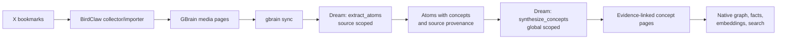

# Native Bookmark Knowledge Processing in GBrain Dream

## Summary

Move X-bookmark enrichment and knowledge-wiki synthesis from the parallel custom processor into GBrain's existing creator-pack dream lifecycle. BirdClaw remains a deterministic collector, while normal `extract_atoms` and `synthesize_concepts` phases become capable of producing bounded, evidence-linked concepts from bookmark pages through GBrain's configured OpenCode provider.

---

## Problem Frame

The current bookmark pipeline writes into the brain and invokes GBrain indexing, but its reasoning layer is a separate JavaScript system and separate LaunchAgent. This duplicates capabilities already present in the `gbrain-creator` and `gbrain-everything` packs, weakens lifecycle observability, and risks semantic drift from normal dream behavior.

Native creator phases are close to the desired behavior but have three gaps: bookmark pages are not eligible inputs, extracted atoms do not persist concept references, and synthesized concepts do not retain drill-down provenance to atoms and original research pages. The native concept prompt is bounded by sampled evidence, but its persisted output also needs bounded provenance and explicit evidence links.

---

## Requirements

- **R1 — Native lifecycle:** Bookmark-derived enrichment must run through standard `gbrain dream` creator-pack phases, receipts, rollups, locking, budgets, progress, and configured AI gateway.
- **R2 — Deterministic collection boundary:** BirdClaw collection/import remains separate from dream and must not be reimplemented as model-driven work.
- **R3 — Bookmark eligibility:** Synced media pages explicitly marked by the BirdClaw importer as concept-synthesis candidates, and meeting existing content and recursion guards, must be discoverable by native atom extraction; unrelated media remains ineligible.
- **R4 — Durable concepts:** Extracted atoms must carry a bounded, normalized set of concept references suitable for native aggregation.
- **R5 — Evidence-linked wiki:** Synthesized concept pages must retain bounded, source-aware supporting atom and source-page provenance and expose readable links back to research evidence. Bookmark-backed promotion requires at least two distinct original sources.
- **R6 — Archive safety:** No phase may send the full bookmark archive in one prompt; model inputs and persisted provenance must remain bounded.
- **R7 — Idempotency and recursion safety:** Existing source-hash deduplication and leaf-output safeguards must continue to prevent duplicates and dream self-consumption.
- **R8 — Safe migration:** The parallel custom reasoning scheduler is retired only after a bounded native pilot proves extraction, synthesis, provenance, search, and rerun behavior.
- **R9 — Existing dream behavior:** Meeting, transcript, article, video, book, source, and original processing must not regress.

---

## Assumptions

- `media` remains a broad generic type; bookmark admission additionally requires the importer's stable `intake_adapter`, `content_kind`, and concept-synthesis opt-in metadata.
- The creator or everything schema pack will be active in the deployed brain before the native pilot.
- GBrain's configured `opencode-server:*` models remain the only text-model route; embeddings remain on the configured embedding provider.
- Deterministic bookmark author metadata stays owned by the importer; normal graph/fact phases handle entities mentioned in generated native pages.
- The initial migration may preserve existing custom analyses as historical artifacts, but they do not feed native synthesis after cutover.

---

## Scope Boundaries

### In scope

- Extend native atom extraction to eligible media pages.
- Extract and normalize concept references on atoms.
- Preserve bounded atom/source provenance on synthesized concepts.
- Keep concept-model evidence samples bounded.
- Add regression and integration coverage for the full marked-bookmark-page → atom → concept path, including cross-source provenance.
- Document and execute a bounded local pilot and cutover checklist.

### Deferred to follow-up work

- Replacing BirdClaw collection with an `IngestionSource` plugin.
- Rich bookmark-specific person/place/organization pages beyond normal GBrain graph extraction.
- Hierarchical concept deduplication across semantically similar concept slugs.
- Per-atom deterministic retry completion for partially written multi-atom extractions.

### Out of scope

- Disabling or replacing the normal nightly dream cycle.
- Adding BirdClaw or X-specific credentials to GBrain core.
- Registering an arbitrary shell-command handler or writable handler registry.
- Importing the existing custom concept pages as native atom evidence.

---

## Key Technical Decisions

1. **Reuse creator-pack phases rather than add bookmark-specific phases.** The existing source-scoped extraction and global synthesis split already matches the required lifecycle and avoids a second orchestration model.
2. **Use the GBrain AI gateway.** Atom extraction and concept synthesis inherit configured OpenCode OAuth routing, receipts, budgets, progress, abort handling, and provider diagnostics.
3. **Bound both model evidence and persisted provenance.** Synthesis canonically sorts before sampling a deterministic maximum number of atom titles/bodies and supporting atoms/sources, with total atom and distinct-source counts retained separately.
4. **Keep raw evidence one-way.** Bookmark media pages may produce atoms; atoms remain non-extractable leaves; concept pages are synthesized outputs and never become atom inputs.
5. **Pilot before cutover.** Native output is validated in an isolated pilot brain/source so native and custom writers cannot collide on `concepts/<slug>`. Collection continues throughout.
6. **Accept two-cycle graph consistency.** The generating dream cycle writes and embeds atoms/concepts; a subsequent native extract/facts pass materializes downstream graph/fact projections unless same-write reconciliation is proven by tests.

---

## High-Level Technical Design

> Directional guidance for review, not implementation specification.

Failure isolation remains native: extraction records per-source failures and continues; synthesis falls back deterministically for model failures or exhausted budget; cycle reports remain the operational truth.

---

## Implementation Units

- U1. **Make bookmark media pages native atom inputs**

**Goal:** Allow qualifying bookmark media pages to enter creator-pack extraction without weakening existing recursion or idempotency guards.

**Requirements:** R1, R3, R7, R9

**Dependencies:** None

**Files:**
- Modify: `src/core/cycle/extract-atoms.ts`
- Create: `test/cycle/extract-atoms-page-discovery.test.ts`
- Test: `test/cycle/extract-atoms-synthesize-concepts.test.ts`

**Approach:**
- Add marked media pages to eligibility while leaving unrelated media excluded. Centralize or share predicate fragments used by discovery and backlog counts so they cannot drift.
- Preserve minimum-content, source scope, source-hash idempotency, imported-output, and dream-output exclusions.
- Require stable BirdClaw intake/content markers and explicit concept-synthesis opt-in in addition to the media type.

**Execution note:** Test-first.

**Patterns to follow:**
- Shared eligibility/query-builder logic in `src/core/cycle/extract-atoms.ts`.
- Existing discovery/backlog behavior adjacent to `test/cycle/extract-atoms-synthesize-concepts.test.ts`.

**Test scenarios:**
- Happy path: a marked BirdClaw media page above the minimum content threshold is discovered and extracted into atoms.
- Edge case: an otherwise identical unmarked media page remains ineligible and absent from backlog counts.
- Edge case: a short media page remains ineligible.
- Error path: a media page already represented by an atom source hash is skipped.
- Integration: discovery and backlog count return consistent results for the same media-page corpus.
- Regression: existing supported page types and dream/imported-output exclusions remain unchanged.

**Verification:**
- A bounded media fixture is processed by `extract_atoms`, while duplicate and recursion guards remain green.

---

- U2. **Persist bounded concept references on extracted atoms**

**Goal:** Give native concept synthesis durable topic grouping keys generated during atom extraction.

**Requirements:** R1, R4, R6, R7, R9

**Dependencies:** U1

**Files:**
- Modify: `src/core/cycle/extract-atoms.ts`
- Test: `test/cycle/extract-atoms-synthesize-concepts.test.ts`

**Approach:**
- Extend the atom extraction contract with a small concept-reference list.
- Normalize references to stable slugs, remove duplicates and empty/generic values, and enforce a strict per-atom cap.
- Persist references in atom frontmatter alongside existing source provenance.
- Retain tolerant parsing for older or malformed model outputs that omit concepts.

**Execution note:** Test-first.

**Patterns to follow:**
- Existing tolerant `parseAtomsResponse` validation and bounded string handling.
- Existing atom frontmatter persistence and source-aware `putPage` flow.

**Test scenarios:**
- Happy path: valid concept names normalize and persist on the atom.
- Edge case: duplicate, empty, oversized, and punctuation-heavy concepts normalize deterministically within the cap.
- Error path: non-array or malformed concept output does not reject an otherwise valid atom.
- Regression: responses without concepts continue to parse and write exactly as before except for absent optional metadata.

**Verification:**
- Native atoms created from bookmark media pages contain usable `concepts` frontmatter without changing required atom fields.

---

- U3. **Generate bounded evidence-linked native concept pages**

**Goal:** Make native concepts navigable back to supporting atoms and original bookmark pages while preserving bounded model input.

**Requirements:** R5, R6, R7, R9

**Dependencies:** U2

**Files:**
- Modify: `src/core/cycle/synthesize-concepts.ts`
- Test: `test/cycle/extract-atoms-synthesize-concepts.test.ts`
- Test: `test/cycle/synthesize-concepts-progress.test.ts`

**Approach:**
- Carry atom `source_id`, atom slug, original source slug, and source hash through grouping.
- Canonically sort by source identity and atom slug before every prompt or provenance cap; shuffled query/input order must produce the same support projection.
- Deduplicate original sources and keep deterministic bounded samples for prompts, source-aware frontmatter, and rendered supporting-research links.
- Record total atom count and distinct original-source count separately. Bookmark-backed concepts require at least two distinct original sources; repeated atoms from one bookmark do not promote a concept alone.
- Preserve tiering, budget fallback, receipts, rollups, and progress semantics.
- Ensure reruns replace the concept projection deterministically rather than accumulating duplicate links; avoid timestamp-only churn when semantic content and support are unchanged.

**Execution note:** Test-first.

**Patterns to follow:**
- Per-group bounded title/body sampling already used by `synthesize-concepts`.
- Source provenance written by `extract-atoms`.
- Existing concept `putPage` replacement semantics.

**Test scenarios:**
- Happy path: a concept synthesized from multiple original sources includes readable supporting atom and original-source links with explicit source identity.
- Edge case: repeated atoms from one bookmark deduplicate the source link, retain total atom count, and do not meet the two-source promotion threshold alone.
- Edge case: identical slugs in two GBrain sources remain unambiguous in stored provenance.
- Edge case: a dominant concept with a large corpus respects prompt and provenance caps.
- Error path: atoms without source provenance still contribute without producing broken links.
- Integration: shuffled input and a second synthesis run produce the same bounded support set and no duplicate links or timestamp-only rewrite.
- Regression: T1/T2 model narratives, T3 deterministic narratives, budgets, receipts, and progress remain intact.

**Verification:**
- Concept pages satisfy the intended wiki drill-down experience without corpus-sized prompts or unbounded frontmatter.

---

- U4. **Document and validate native cutover**

**Goal:** Provide a safe operational path from the parallel custom processor to native dream processing.

**Requirements:** R2, R8

**Dependencies:** U1, U2, U3

**Files:**
- Modify: `docs/guides/operational-disciplines.md`
- Create: `docs/guides/birdclaw-native-dream.md`
- Test: `test/e2e/dream.test.ts`

**Approach:**
- Document creator/everything pack activation, isolated pilot brain/source creation, dream phase drain, expected receipts/rollups, provenance checks, second-pass graph/fact timing, search checks, and rollback.
- Compare custom and native results across isolated namespaces; never allow both systems to own the same concept slug during pilot.
- Preflight the configured provider and verify receipts/model diagnostics show the OpenCode route; verify unavailable-provider behavior degrades through native warnings/fallback without invoking legacy processing.
- Define completion signals and steady-state schedule ownership.

**Test scenarios:**
- Integration: a bounded marked-media fixture in an isolated source flows through dream extraction and synthesis in creator-pack phase order.
- Error path: a phase warning is visible in the dream report and does not erase prior native output.
- Regression: a non-creator pack continues to skip creator-only phases.
- Integration: the documented second pass materializes graph/fact projections for newly generated pages, or the test proves same-write reconciliation.

**Verification:**
- The guide contains a reversible pilot/cutover procedure and the e2e dream path proves native orchestration.

---

- U5. **Split live BirdClaw collection from legacy reasoning and cut over**

**Goal:** Retain frequent deterministic collection/import while retiring only the custom analysis/synthesis engine after native validation.

**Requirements:** R2, R8

**Dependencies:** U4

**Target repository:** `gbrain-custom`

**Files:**
- Modify: `integrations/birdclaw-bookmarks-to-brain/run-pipeline.sh`
- Modify: `integrations/birdclaw-bookmarks-to-brain/README.md`
- Modify: `integrations/birdclaw-bookmarks-to-brain/launchd/ai.gbrain.birdclaw-bookmarks-to-brain.plist.template`
- Test: `integrations/birdclaw-bookmarks-to-brain/test/run-pipeline.test.mjs`

**Approach:**
- Add a collector/import-only mode that stops before custom analysis/synthesis while retaining sync of newly imported pages.
- Transfer enrichment-stage truth from legacy `pipeline_status`, `needs_enrichment`, and timestamp fields to native receipts/source-hash evidence; document which legacy fields become compatibility-only or disappear from new imports.
- Reload the live LaunchAgent into collector-only mode only after isolated native acceptance criteria pass.
- Preserve a rollback to the prior combined mode until the final native drain and quality audit complete.

**Execution note:** Characterization-first, then test-first for the new operating mode.

**Test scenarios:**
- Happy path: collector-only mode fetches/imports a new bookmark and syncs it without invoking custom analysis or synthesis.
- Edge case: rerunning the same slot remains idempotent.
- Error path: collection/import failure exits visibly without mutating native dream state.
- Integration: after LaunchAgent reload, imported bookmark count advances while custom analysis count stays fixed and native receipts advance after dream.

**Verification:**
- Live collection continues independently, legacy reasoning is quiescent, and rollback remains available.

---

## System-Wide Impact

- **Interaction graph:** sync writes marked media pages; source-scoped dream extraction writes atoms; global dream synthesis writes concepts; embedding follows in-cycle, while graph/fact projections are verified on the documented next pass unless same-write reconciliation is proven.
- **Error propagation:** per-item extraction failures remain warnings; synthesis model failures retain deterministic fallback; phase reports and receipts expose partial outcomes.
- **State lifecycle risks:** admitting marked bookmark media creates a large one-time atom backlog; source-hash idempotency and page-discovery budgets bound each cycle. Pilot isolation prevents concept namespace collisions.
- **API surface parity:** direct dream, autopilot source fan-out, and global maintenance must preserve phase scope and pack gating.
- **Integration coverage:** unit parsing tests alone are insufficient; a creator-pack e2e path must prove page discovery, atom persistence, concept provenance, and retrieval-ready output.
- **Unchanged invariants:** no credentials in core, no arbitrary shell handler, no atom/concept self-consumption, no global phase per-source fan-out, no replacement of normal dream.

---

## Risks & Dependencies

| Risk | Mitigation |
|---|---|
| Eligibility accidentally admits unrelated media | Require stable BirdClaw markers plus explicit opt-in in the shared discovery/backlog predicate |
| Generic model concept labels create topic fragmentation | Normalize/cap concept slugs now; defer semantic merging to follow-up |
| Large dominant concepts approach context limits | Deterministic prompt sampling and bounded persisted support evidence |
| Native output lacks rich author/entity pages from the custom system | Preserve deterministic import metadata and rely on normal graph/fact phases; audit after pilot |
| Parallel native and custom synthesis overwrite the same concept pages | Use an isolated pilot brain/source and prohibit shared concept ownership until atomic cutover |
| Creator pack is not active | Include schema-pack activation and verification in the runbook |
| Existing bookmark pages create a large initial backlog | Use the native drain job/phase with budgets, progress, and idempotent checkpoints |
| Cross-source slugs are ambiguous | Persist `source_id` with atom/source slugs and test identical-slug collisions |
| New outputs miss graph/fact processing in their generating cycle | Document and verify the required subsequent native pass unless direct reconciliation is proven |

---

## Documentation / Operational Notes

- Recommended pilot order: create an isolated pilot brain/source; activate creator/everything pack; sync marked fixtures; verify OpenCode provider routing; run `extract_atoms`; inspect atoms and source-aware provenance; run `synthesize_concepts`; inspect concept links; run the required graph/fact pass and embed; test search; then drain the remaining backlog.
- Monitor phase receipts, extract rollups, Minion progress, backlog count, model budget, and repeated source hashes.
- Surgical rollback leaves creator processing active for other content: disable marked-media eligibility or return the collector LaunchAgent to combined legacy mode. Restoring a non-creator pack is a broader rollback and affects all creator inputs.
- After successful cutover, restore bookmark collection to its steady-state cadence independently of nightly dream.

---

## Sources & References

- `src/core/cycle/extract-atoms.ts`
- `src/core/cycle/synthesize-concepts.ts`
- `src/core/cycle.ts`
- `src/core/schema-pack/base/gbrain-creator.yaml`
- `docs/architecture/lens-packs.md`
- `docs/guides/plugin-handlers.md`
- `docs/ai-providers/opencode-server.md`
- `test/cycle/extract-atoms-synthesize-concepts.test.ts`
- `test/cycle/extract-atoms-page-discovery.test.ts`
- `test/cycle-pack-gating.test.ts`
- `test/autopilot-global-maintenance.test.ts`
- `test/e2e/dream.test.ts`
