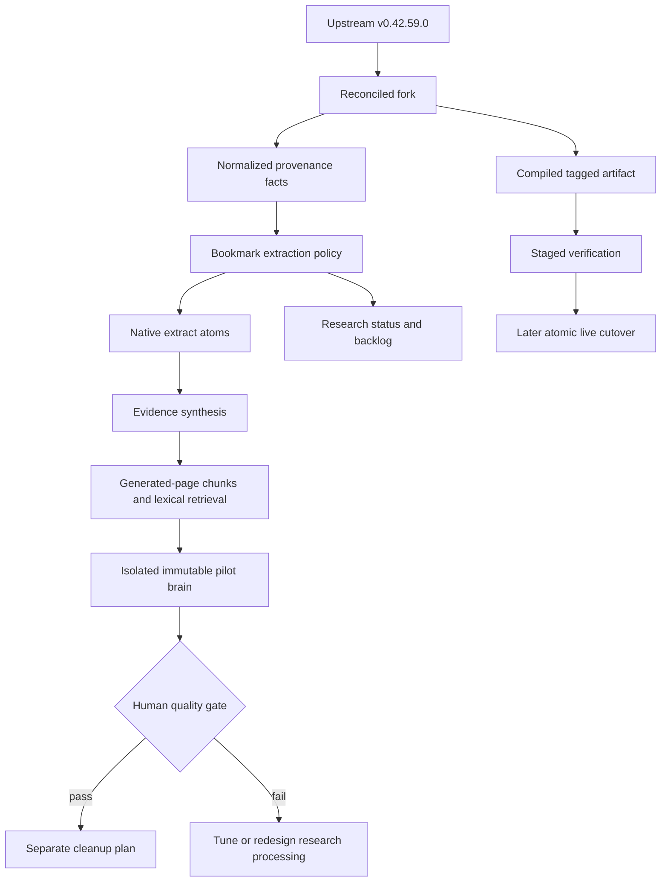
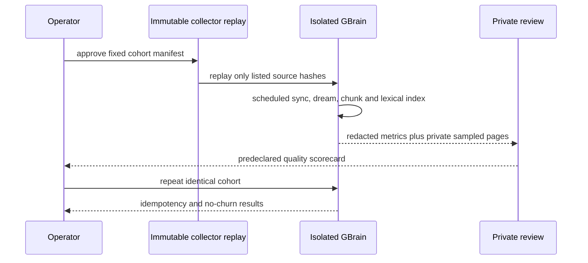

# Stabilize the Native Research GBrain Fork

## Goal Capsule

- **Objective:** Turn the working native BirdClaw/OpenCode fork into a maintainable, observable, reversible GBrain deployment without weakening normal GBrain behavior.
- **Authority:** Preserve raw bookmark sources and normal GBrain semantics first; then preserve native research provenance; then improve operational convenience.
- **Execution profile:** Reconcile and harden code on the user's fork only. Build and test safety mechanisms before any live cleanup or deployment cutover.
- **Stop conditions:** Stop before live mutation if embedding identity disagrees, the pilot cohort is not deterministically isolated, the fork cannot pass focused and diff-aware gates, build identity is incomplete, or binary rollback is unproven. This implementation phase performs no live mutation.
- **Tail ownership:** LFG owns fork code, tests, review, and fork-only commits. The main thread owns the later private pilot, immutable deployment, scheduler/log changes, canonical embedding choice, and any separately planned cleanup. No upstream pull request is authorized.

---

## Product Contract

### Summary

Stabilize the customized GBrain fork by reconciling it with current upstream, isolating bookmark-specific behavior from normal atom extraction and synthesis, exposing fork and research-pipeline health through existing GBrain status surfaces, repairing native page indexability, and packaging a managed immutable release. Prove the intended wiki behavior with an isolated scheduled-path pilot and predeclared quality gate before planning cleanup or releasing the backlog, while leaving live PostgreSQL and raw X bookmarks untouched.

### Problem Frame

The native research architecture is working: BirdClaw collects, GBrain dream extracts atoms and synthesizes concepts, OpenCode supplies ChatGPT OAuth-backed reasoning, and PostgreSQL remains healthy. The deployment is not yet stable. The live executable is a TypeScript symlink into a development worktree, the fork is six upstream commits behind, no tagged rollback artifact exists, a roughly 995-page backlog was draining at the audit snapshot, logs are unbounded, and obsolete scheduling artifacts could re-enable duplicate reasoning.

The database also contains two clearly different generations of derived content. Native GBrain owns 1,429 atoms and 637 research concepts, while the retired custom processor owns 1,206 legacy wiki pages and legacy status metadata on 1,843 bookmark pages. Those records remain untouched in this phase: first the native path must demonstrate useful atoms, evidence-backed concepts and representative question answering in an isolated brain.

### Requirements

#### Fork alignment and compatibility

- R1. Reconcile the fork with upstream GBrain v0.42.59.0 while preserving fork-only history and without opening an upstream pull request.
- R2. Bookmark eligibility and OpenCode response handling must not silently change extraction behavior for unrelated GBrain sources or providers.
- R3. The fork's custom layers—OpenCode transport, bookmark intake policy, evidence synthesis, and schema activation fix—must remain separable enough to review and carry across future upstream releases.

#### Deployment identity and observability

- R4. A running installation must expose the fork tag, commit SHA, artifact path or build identity, and self-upgrade posture without revealing credentials.
- R5. Existing status/doctor surfaces must report source-scoped research counts, backlog, newest activity, recent failures, and native provenance using the same eligibility policy as extraction.
- R6. Status collection must remain read-only, bounded, source-isolated, and tolerant of unavailable optional sections.
- R13. Native atom and concept pages must produce deterministic searchable chunks, expose observed embedding-identity disagreement, and fall back to lexical retrieval. Canonical provider reconciliation and production re-embedding remain deferred until R14's DGX comparison and operator selection.

#### Data preservation

- R7. Raw bookmarks, native outputs, receipts, digests, and legacy people/company/entity pages remain unchanged during stabilization and pilot work. No destructive cleanup command is implemented or run before the real pilot passes its knowledge-quality gate and a separate cleanup plan is approved.

#### Operational acceptance

- R11. Synthetic scheduled-path coverage plus an isolated pilot-brain mechanism and runbook must be delivered for a later bounded 50–100 real-bookmark pilot. Executing that private cohort remains operator-controlled follow-up work under R12.
- R12. Immutable compiled deployment, binary rollback, scheduler cleanup and log controls remain gated rollout work after fork implementation passes review and tests. Live database cleanup is a later plan gated by real-pilot quality acceptance.
- R14. Embedding evaluation must use provider-specific isolated brains/databases for one immutable private cohort. While the DGX Spark is offline, an optional OpenAI 768-dimensional evaluation may run only in its disposable evaluation brain; final local-model comparison, provider selection, and production backfill wait until the DGX is available. Unknown or mixed production vector provenance is incompatible even when dimensions match.
- R15. Any real-cohort OpenAI evaluation requires per-run operator opt-in and a private egress manifest naming the endpoint, retention posture and minimized text fields sent. Requests and logs must exclude credentials, usernames, URLs and unrelated metadata.
- R16. Private cohort manifests, evaluation brains, relevance judgments and reports must live under an owner-only root, use no-follow regular-file checks and atomic mode-0600 creation, exclude credential values, encrypt sensitive archives with a recoverable key outside the artifact root, and expire under an explicit retention policy.
- R18. OpenCode provider preflight must prove the configured endpoint is loopback-only and authenticated with bounded timeouts and response sizes; failures and error envelopes must redact OAuth and provider response content.
- R19. Fork maintenance must name an operator cadence, maximum tolerated upstream drift, required reconciliation/release gates, and explicit retirement criteria for every custom layer; contributing upstream remains a separate decision.

### Key Flow

- F1. **Safe fork release:** reconcile upstream, run characterization and regression gates, build a compiled artifact, record its identity, and retain the prior artifact as rollback.
- F2. **Read-only health audit:** resolve brain and source, calculate provenance/indexability counts and backlog, and emit no bodies, URLs, credentials, or personal identifiers.
- F5. **Indexability repair:** identify DB-only native pages without chunks, create deterministic chunks through an opt-in native indexing path, diagnose desired/observed embedding identity, use lexical fallback on disagreement, and prepare isolated evaluation brains without production re-embedding.
- F4. **Isolated automated pilot:** replay an immutable BirdClaw collector output snapshot into a dedicated brain/database, run the scheduled sync/dream path, record redacted outcomes and human quality judgments, and repeat to prove idempotency without contacting X or touching production backlog.

### Acceptance Examples

- AE1. Given a non-BirdClaw article and the default provider, when atom extraction runs, then its input eligibility and response contract remain the upstream-compatible default.
- AE2. Given marked BirdClaw media routed through OpenCode, when extraction runs, then labeled output is parsed and the resulting atoms retain source and concept provenance.
- AE6. Given a compiled fork artifact, when status is requested, then it reports build identity, update posture, research backlog and recent activity without probing private page bodies or printing secrets.
- AE7. Given an immutable private evaluation cohort while the DGX is offline, when an OpenAI evaluation runs, then it writes only to an isolated evaluation brain/database and production vector retrieval remains lexical/fail-closed on identity disagreement. The same source snapshot can later seed a separate DGX evaluation brain.

### Success Criteria

- The branch is based on current upstream and focused/diff-aware tests are green.
- Non-BirdClaw extraction behavior has characterization coverage independent of OpenCode/BirdClaw paths.
- Research health and deployment identity are visible through stable JSON and human status output.
- Native atoms and concepts have searchable chunks, and production vector disagreement is visible and falls back to lexical retrieval before backlog acceptance is measured.
- An isolated OpenAI evaluation can be prepared without contaminating the future DGX comparison or production vector space; mixed or unknown production vectors remain rejected.
- The code is ready for immutable build cutover and an isolated bounded live pilot; cleanup remains blocked on the pilot's human quality scorecard.

### Scope Boundaries

#### In scope

- Upstream reconciliation and characterization of the fork delta.
- Shared bookmark eligibility policy and provider-compatible atom response selection/parsing.
- Additive status/build identity and research-health reporting.
- Native generated-page chunking and embedding-provenance reconciliation.
- A fork-managed build channel that blocks generic upstream self-upgrade from replacing the customized artifact.
- Synthetic tests and a privacy-safe operational runbook for the later live rollout.

#### Deferred to Follow-Up Work

- Executing immutable symlink cutover, LaunchAgent restart, log archival, or the real-bookmark pilot. These occur after this plan's implementation is reviewed.
- Designing or executing legacy cleanup, paired state restore, raw-media normalization, quarantine, or purge. A separate plan begins only after the real pilot passes its knowledge-quality gate.
- Giving the local brain repository an off-machine remote or backup destination.
- Semantic merging of similar concept slugs and richer people/place/entity extraction.
- Native people/company/place generation. Until that follow-up is accepted, legacy entity classes remain preserved or quarantined outside the active namespace rather than purged.
- Removing injected legacy analysis sections or fields from raw bookmark media; that requires a separate normalization plan and archive because raw sources are immutable in this cleanup.
- Optimizing long-running native dream throughput beyond the safeguards needed for the bounded pilot.
- Final DGX model selection, OpenAI-versus-local retrieval comparison, production embedding migration, and full vector backfill while the DGX Spark is offline.

#### Outside this product's identity

- Replacing BirdClaw as the deterministic X bookmark collector.
- Restoring a second custom reasoning pipeline beside native GBrain dream.
- Publishing private bookmark content, people, titles, URLs, or database dumps in the public fork.
- Opening or preparing an upstream contribution without a later explicit user decision.

---

## Planning Contract

### Key Technical Decisions

- KTD1. **Reconcile before pinning.** Base stabilization on current upstream v0.42.59.0 because the fetched six-commit delta appears low-conflict and includes schema, source-scope, and entity/fact fixes that should precede a release pin.
- KTD2. **Separate normalized markers, extraction policy, and provider behavior.** A small pure primitive normalizes intake/provenance facts. `BookmarkExtractionPolicy` uses those facts for discovery, backlog and research status. Provider response format remains a separate capability/policy decision. Future cleanup ownership is explicitly outside this policy and this plan.
- KTD3. **Aggregate optional research health without changing generic source health.** Add a dedicated bounded research-health collector to `gbrain status` and reuse its deadline/partial-section framework. Keep `src/core/source-health.ts` free of BirdClaw-specific joins and distinguish local CLI build identity from remote server identity.
- KTD8. **Fix indexability before judging quality.** Native DB-only pages without chunks are not a usable wiki even when synthesis succeeds. Add an opt-in generated-page indexing writer used only by native atom/concept writes; leave generic `putPage` and import behavior unchanged. Deterministic chunks are written transactionally with the page, while embeddings flow through existing bounded backfill jobs.
- KTD6. **Compile immutable, fork-managed releases.** Embed fork channel, tag, SHA, upstream base, and clean-tree state in the binary; repeat them in a checksummed external manifest. Build fails on dirty state or tag/SHA mismatch. Shared upgrade guards redirect or refuse upstream self-update for a managed fork. Later deployment uses tag/SHA-keyed releases with `current` and `previous` symlinks.
- KTD7. **Keep live content private.** Tests and committed receipts use synthetic fixtures and counts/hashes only. Human quality review of real bookmarks remains a local private artifact.
- KTD10. **Resolve embedding desired state once, after an isolated-brain comparison.** Resolved runtime configuration becomes the sole desired identity only after explicit operator choice. Until the DGX Spark is available, database metadata, active column/dimension, chunker/preprocessing signature and stored vector provenance are observed inconsistent state; production vector retrieval fails closed to lexical fallback. Optional OpenAI and later DGX evaluations seed separate disposable brains/databases from the same immutable cohort, avoiding new vector-column schema. A later remediation digest binds the selected desired identity and observed production state before any backfill.
- KTD11. **Isolate research synthesis as well as extraction.** Eligible BirdClaw sources stamp an explicit research-policy marker on their atoms. Distinct-source promotion, evidence weighting and research-link rendering apply only to marked evidence; groups with no marked atoms retain upstream synthesis semantics, and mixed groups have an explicit tested merge policy.
- KTD12. **Treat private evaluation artifacts and third-party egress as explicit trust boundaries.** Private cohort state uses confined owner-only encrypted storage and retention; OpenCode remains loopback/authenticated; OpenAI evaluation sends only an operator-approved minimized payload recorded in a private egress manifest.
- KTD13. **Prove value before cleanup.** Ship a stable compiled fork and run the isolated real-bookmark quality pilot before designing destructive cleanup. The pilot scorecard, recorded before execution, is the gate for any later quarantine or purge plan.
- KTD14. **Maintain the fork deliberately.** The operator reviews upstream at least weekly and before any upstream release upgrade, with a maximum tolerated drift of two upstream releases or 30 days. Each reconciliation reruns default-behavior characterization, focused fork tests, diff-aware CI, compiled smoke and rollback checks. A custom layer is retired when upstream or configuration provides equivalent tested behavior; upstream contribution remains a separate explicit decision.

### High-Level Technical Design

### Assumptions

- Exact provenance markers observed in the live database remain available: `generated_by=research-wiki-v1`, `extracted_by=extract_atoms-v0.41.2.1`, `synthesized_by=synthesize-concepts-v0.41`, and BirdClaw intake markers.
- OpenCode remains a persistent authenticated local service; status displays configuration and recent native failures but does not spend tokens on every invocation.
- The DGX Spark remains offline for approximately one week. This plan may prepare isolated OpenAI evaluation infrastructure but cannot select or migrate the canonical production embedding identity.
- The implementation branch remains on the user's fork. Shipping automation must not create an upstream PR.

### Sequencing

U1 establishes a current, characterized base. U2 removes extraction and synthesis coupling. U3 lands build identity and baseline research health early. U6 repairs native indexability and defines the embedding decision gate, enriching U3's optional diagnostics. U7 builds the immutable release independently of cleanup. U5 then proves the isolated scheduled path and human knowledge quality. Any destructive cleanup starts in a separate plan only after that gate passes.

---

## Implementation Units

### U1. Reconcile and characterize the fork

- **Goal:** Bring the branch onto current upstream and pin the behavior that must survive future reconciliations.
- **Requirements:** R1, R2, R3
- **Dependencies:** None
- **Files:** `src/core/cycle/extract-atoms.ts`, `src/core/cycle/synthesize-concepts.ts`, `src/core/ai/providers/opencode-server-language-model.ts`, `src/commands/schema.ts`, `test/cycle/extract-atoms-synthesize-concepts.test.ts`, `test/opencode-server-language-model.test.ts`, `docs/guides/birdclaw-native-dream.md`
- **Approach:** Reconcile the upstream delta without flattening the logical custom layers. Update current-state docs and characterize non-BirdClaw/default-provider behavior before refactoring. Preserve user-fork-only remotes and avoid upstream shipping surfaces.
- **Execution note:** Start with characterization coverage, then reconcile and rerun it.
- **Patterns to follow:** `AGENTS.md` fork/privacy guidance, `docs/TESTING.md`, current branch commit boundaries, and upstream engine/source-scope invariants.
- **Test scenarios:**
  - A default supported source using the normal provider retains its pre-fork eligibility and parsing behavior.
  - A marked BirdClaw source through OpenCode retains labeled parsing and provenance.
  - Schema pack activation still recognizes every bundled pack after reconciliation.
  - Current upstream migrations and source-scope regression tests remain green.
- **Verification:** The branch reports no unresolved merge state, custom behavior is characterized, and focused provider/dream/schema suites pass on the reconciled base.

### U2. Isolate research intake, synthesis and provider response policy

- **Goal:** Prevent BirdClaw research and OpenCode compatibility rules from globally redefining normal GBrain extraction or concept synthesis.
- **Requirements:** R2, R3, R18, AE1, AE2
- **Dependencies:** U1
- **Files:** `src/core/cycle/extract-atoms.ts`, `src/core/cycle/synthesize-concepts.ts`, `src/core/cycle/research-provenance.ts`, `src/core/cycle/bookmark-extraction-policy.ts`, `src/core/ai/providers/opencode-server-language-model.ts`, `src/core/ai/recipes/opencode-server.ts`, `test/extract-atoms-page-discovery.test.ts`, `test/cycle/extract-atoms-synthesize-concepts.test.ts`, `test/opencode-server-language-model.test.ts`, `test/ai/opencode-server-gateway.serial.test.ts`
- **Approach:** Normalize provenance facts in a pure helper and let a separate extraction policy own discovery/backlog admission. Eligible BirdClaw pages stamp a research-policy marker on generated atoms. Select output format/parser fallback from provider capability or explicit policy, preserving JSON/default behavior for unrelated sources. Apply distinct-source promotion, evidence weighting and research-link rendering only to marked research evidence; groups without marked atoms retain upstream synthesis semantics, with an explicit deterministic policy for mixed groups.
- **Execution note:** Refactor behind characterization tests; do not broaden admitted page classes.
- **Patterns to follow:** Pure policy helpers near cycle code, provider recipe capabilities under `src/core/ai/recipes/`, and deterministic query-builder tests.
- **Test scenarios:**
  - Marked BirdClaw media is eligible in discovery, backlog, and classification; unmarked media is rejected in all three.
  - Non-BirdClaw article/transcript inputs keep the default response request and parser.
  - An unmarked concept group retains upstream synthesis tiering, support and rendering behavior.
  - A marked research group uses distinct-source promotion and evidence links, while a mixed group follows the documented deterministic merge policy without letting unmarked atoms acquire research provenance.
  - OpenCode labeled records, JSON-compatible records, top-level provider errors, and empty structured wrappers each produce their expected outcome.
  - Non-loopback or wildcard OpenCode endpoints, unauthenticated responses, oversized responses and timeouts fail preflight without exposing OAuth material or response bodies.
  - Duplicate concepts, generic labels, source-hash repeats, and identical atom titles remain bounded and collision-safe.
  - BirdClaw digest/source pages are rejected unless explicitly eligible; the six currently observed digest-derived atoms become a detectable repair class rather than a continuing leak.
- **Verification:** One extraction policy defines discovery/backlog/research-status eligibility, research synthesis is explicitly marker-scoped, and provider compatibility no longer changes unrelated extraction or synthesis behavior.

### U6. Repair native indexability and prepare isolated embedding evaluation

- **Goal:** Make native atoms and concepts chunk-searchable, fail closed on incompatible vector identity, and prepare isolated OpenAI/DGX evaluation brains without choosing production embeddings while the DGX is offline.
- **Requirements:** R5, R6, R13, R14, F5, AE7
- **Dependencies:** U1, U2
- **Files:** `src/core/cycle/extract-atoms.ts`, `src/core/cycle/synthesize-concepts.ts`, `src/core/generated-page-indexer.ts`, `src/core/embedding.ts`, `src/core/search/embedding-column.ts`, `src/core/ai/build-gateway-config.ts`, `test/generated-page-indexer.test.ts`, `test/cycle/extract-atoms-synthesize-concepts.test.ts`, `test/embedding-provider-consistency.test.ts`, `test/e2e/dream.test.ts`
- **Approach:** Add an opt-in generated-page indexing writer used only by dream-created atoms and concepts. It transactionally upserts the page and deterministic chunks/chunker provenance while leaving generic `putPage` and import semantics unchanged; embeddings are marked stale and delegated to existing bounded backfill. Resolve desired embedding identity from normal runtime config only after an explicit operator choice, and compare it with observed database metadata, active column/dimension, preprocessing/chunker signature and per-vector provenance. Until then, mismatch or unknown provenance disables production vector retrieval in favor of lexical search. Expose the diagnostics and indexing APIs U5 needs to seed separate disposable evaluation brains; cohort selection and evaluation lifecycle belong to U5.
- **Execution note:** Characterize missing-chunk behavior first. Use synthetic PGLite and real PostgreSQL coverage because existing PGLite behavior can hide provider/column mismatches.
- **Patterns to follow:** Existing page writer/import chunking, stale embedding backfill, embedding-column resolution, remediation planning, and Postgres engine parity.
- **Test scenarios:**
  - A dream-written atom and concept each receive searchable chunks through the canonical lifecycle.
  - A rerun creates no duplicate chunks; a semantic concept rewrite replaces old chunks transactionally and marks only changed chunks stale.
  - Runtime model, database metadata, dimension, active column, and stored-vector provenance agree in the healthy case.
  - Conflicting provider/model/dimension metadata produces a read-only failure and no automatic vector rewrite.
  - File-over-DB runtime config precedence defines desired identity after explicit selection, while a changed desired/observed remediation digest refuses stale execution.
  - An OpenAI evaluation writes only to its isolated brain/database and leaves production vectors and the future DGX evaluation brain untouched.
  - Lexical retrieval returns a synthetic concept and supporting atom while vector identity is inconsistent; vector search resumes only on a fully compatible selected column.
- **Verification:** No synthetic native atom/concept lacks chunks, incompatible vector spaces cannot mix in active search, and the isolated cohort can later compare OpenAI with the DGX without production migration.

### U3. Add build identity and research health to status

- **Goal:** Make the deployed fork and native research pipeline understandable from one read-only command.
- **Requirements:** R4, R5, R6, AE6
- **Dependencies:** U2
- **Files:** `src/commands/status.ts`, `src/core/research-health.ts`, `src/core/build-identity.ts`, `src/commands/upgrade.ts`, `src/core/self-upgrade.ts`, `src/version.ts`, `test/status-sections.test.ts`, `test/research-health.test.ts`, `test/upgrade.serial.test.ts`, `test/e2e/status-pglite.test.ts`, `docs/guides/birdclaw-native-dream.md`
- **Approach:** Add bounded optional build-identity and research-health sections under the existing status deadline/partial-section framework. Compile fork channel/tag/SHA/upstream base/clean-tree state into the binary, distinguish local CLI from remote server identity, and share a fork-managed upgrade guard across manual and self-upgrade paths. Land release identity and policy-derived backlog reporting first; U6 may enrich the optional section with chunk and embedding diagnostics without blocking U3. Report counts, timestamps, backlog and failure aggregates only; never page bodies or provider credentials.
- **Patterns to follow:** Existing status section registry, `sourceScopeOpts`, optional collector deadlines, binary build metadata, self-upgrade gates, and provider diagnostics that redact secrets.
- **Test scenarios:**
  - A compiled or source-linked build reports version and available fork identity without failing when metadata is absent.
  - A managed fork build refuses or redirects generic upstream upgrade while an ordinary upstream build retains its normal upgrade behavior.
  - Synthetic raw, native, legacy, and unknown pages produce correct source-scoped counts.
  - Native page counts distinguish chunked, embedded, stale and missing-index states, while provider disagreement is visible without printing credentials.
  - An unavailable optional query yields a partial section while the rest of status succeeds.
  - Cross-source fixtures prove one source cannot observe another source's private counts.
  - Human and JSON output contain no page body, URL, token, password, or database URL.
- **Verification:** Status answers release identity, native backlog and recent research activity in bounded time with stable redacted output; upgrade paths cannot silently replace a managed fork.

### U7. Build an immutable managed-fork release

- **Goal:** Replace the live worktree-linked CLI with a reproducible, identifiable release that has a tested code rollback path.
- **Requirements:** R4, R12, R16, R19, F1
- **Dependencies:** U1 and the build-identity slice of U3
- **Files:** `scripts/build-fork-release.sh`, `src/core/build-identity.ts`, `src/commands/upgrade.ts`, `src/core/self-upgrade.ts`, `test/build-fork-release.test.ts`, `test/upgrade.serial.test.ts`, `docs/guides/fork-release-operations.md`
- **Approach:** Build a clean tagged compiled binary with embedded fork channel/tag/SHA/upstream base/clean-tree identity and a checksummed external manifest into an isolated prefix. Maintain atomic `current` and `previous` targets, run smoke checks before selection, and share the managed-fork upgrade guard with U3 so generic upstream upgrade cannot silently replace the fork. Document an explicit recurring maintenance contract: check upstream weekly and before each release, allow no more than two upstream releases or 30 days of unreviewed drift, run characterization/focused/diff-aware CI and rollback smoke gates, and retire each custom layer when an upstream or configuration equivalent exists. Upstream contribution remains a separate explicit decision.
- **Execution note:** Tests use temporary repositories and prefixes. Do not change the live CLI symlink or create a production release during this unit.
- **Patterns to follow:** Canonical compile pipeline, atomic binary self-update, embedded build metadata, checksummed manifests and fork-only remotes.
- **Test scenarios:**
  - Dirty tree, tag/SHA mismatch, failed build or failed smoke check produces no selectable release.
  - A successful build embeds and externally repeats channel/tag/SHA/upstream base/checksum and atomically preserves current/previous targets in a temporary prefix.
  - Rollback reselects the previous compatible binary and preserves both manifests.
  - A managed fork refuses or redirects generic upgrade while an ordinary upstream build retains normal behavior.
- **Verification:** An isolated compiled release can be identified, selected, smoke-tested and rolled back without touching the live installation.

### U5. Define an isolated quality pilot and decision gate

- **Goal:** Prove that the scheduled GBrain-native path creates a useful research wiki before any cleanup or full backlog release.
- **Requirements:** R7, R11, R12, R14, R15, R16, F4, AE7
- **Dependencies:** U1, U2, U3, U6, U7
- **Files:** `scripts/run-isolated-research-pilot.sh`, `test/e2e/isolated-research-pilot.test.ts`, `docs/guides/fork-release-operations.md`, `docs/guides/birdclaw-native-dream.md`, `docs/guides/operational-disciplines.md`
- **Approach:** Materialize a private immutable replay of 50–100 already-collected bookmark records into a dedicated source checkout and isolated brain/database containing no unrelated backlog; never contact X during the test. Exercise the same collector-output import, sync and scheduled dream commands under an isolated `GBRAIN_HOME` and scheduler fixture. Record counts and hash prefixes for sources, atoms, concepts, chunks, evidence links, failures and no-op reruns. Score the result with a predeclared human rubric: useful atoms at least 80%, sampled source-link correctness 100%, evidence coverage at least 90%, false concept merges at most 10%, duplicate concepts at most 10%, and at least four of five representative research questions answered with correct evidence. Compare each later embedding candidate against the identical private query set and relevance judgments using lexical search as the baseline, Recall@10, nDCG@10, unsupported-result rate, latency and cost; bind chunker/preprocessing signatures and results to a private evaluation manifest. No provider is accepted if it performs worse than lexical, and the DGX decision remains deferred until it returns. An optional OpenAI run requires fresh operator opt-in and a minimized private egress manifest. A failed quality gate means tune or redesign, with no cleanup and no production backlog release.
- **Execution note:** Tests use synthetic cohorts only. The real pilot, deployment, cleanup and embedding comparison are later main-thread operations.
- **Patterns to follow:** GBrain's brain/source routing model, isolated E2E `GBRAIN_HOME` lifecycle, scheduled command fixtures, counts-only receipts, privacy guards and existing operational runbook style.
- **Test scenarios:**
  - Only immutable cohort members exist in the isolated pilot brain, so the production ~995-page backlog remains untouched without changing production discovery or autopilot.
  - A repeated cohort run creates no duplicate atom/concept/chunk/evidence records or timestamp-only rewrites.
  - An OpenAI experiment writes only its isolated brain/database; unknown production vectors trigger lexical fallback and cannot join semantic ranking.
  - Receipts and failure paths reject titles, URLs, usernames, bodies, absolute private paths and provider response content.
  - A deterministic scorecard reports every threshold and refuses a passing decision when any required metric fails.
  - The embedding harness compares immutable judgments and signatures, retains lexical as a baseline and cannot write outside its isolated brain.
- **Verification:** Synthetic scheduled-path coverage proves isolation, idempotency and privacy; the runbook defines the later private real-cohort review and makes quality—not cleanup—the production go/no-go gate.

---

## System-Wide Impact

- **Behavior boundaries:** Extraction policy changes source admission; research markers change synthesis only for marked atoms; default provider and unmarked synthesis behavior remain characterized and unchanged.
- **Data lifecycle:** Raw bookmarks, legacy pages and the live database remain unchanged in this phase. Only dream-generated pages in isolated/test databases gain deterministic chunks during implementation verification.
- **Retrieval:** Lexical search remains available during vector disagreement. Vector ranking is disabled for incompatible production spaces; experimental OpenAI and later DGX vectors live in separate isolated brains/databases.
- **Operations:** Status aggregates optional build/research collectors. Fork-managed upgrade guards protect the compiled artifact, and the maintenance contract bounds upstream drift.
- **Trust and privacy:** Public output is redacted aggregates. Real-cohort snapshots, relevance judgments, provider egress records and evaluation results stay in owner-only private artifacts.
- **Rollback:** The release unit provides code-only current/previous rollback. Persisted-state cleanup and full-state restore are deliberately deferred to a separate operator-approved plan.

---

## Risks and Dependencies

| Risk | Mitigation and stop signal |
|---|---|
| Fork reconciliation changes default GBrain behavior | Characterize unmarked extraction/synthesis before refactor; stop on semantic regression. |
| Generated-page indexing changes global write semantics | Use an opt-in native writer; leave generic `putPage` and import paths unchanged. |
| OpenAI, ZeroEntropy, Ollama or DGX vectors mix | Treat unknown provenance as incompatible, isolate evaluation brains and use lexical fallback until one explicit selection is completely backfilled. |
| Existing backlog escapes the pilot | Bind processing to an immutable cohort/watermark and assert unrelated backlog counts do not move. |
| The pipeline runs but produces a low-value wiki | Use a predeclared human scorecard and representative questions; fail the gate before cleanup or backlog release. |
| Fork drift accumulates silently | Check weekly and before releases, cap drift, run characterization and diff-aware CI, and track retirement criteria per custom layer. |
| Status/errors leak private research | Test normal and failure output for bodies, URLs, usernames, absolute paths, credentials and provider response content. |
| Generic upgrade replaces the fork | Embed managed channel identity and enforce one shared guard across manual and silent upgrade paths. |

---

## Verification Contract

| Gate | Scope | Required signal |
|---|---|---|
| Focused unit suites | U1, U2, U3, U6, U7, U5 | Provider, extraction, synthesis, indexing, status, release and pilot tests pass without live-home access. |
| `bun run verify` | All | Typecheck and repository invariants pass. |
| PostgreSQL E2E | U6, U3 | Generated chunks, embedding-space refusal, lexical fallback, source scoping and status aggregation match PGLite behavior with `DATABASE_URL` explicitly set to a test database. |
| `bun run ci:local:diff` | All | Diff-aware Docker gate passes after reconciliation and implementation. |
| `bun run build` | U7 | Canonical fork-managed compiled CLI is produced, embeds clean identity, and isolated selection/rollback smoke checks pass. |
| Cohort and embedding isolation | U6, U5 | The cohort runs in an isolated brain; experimental provider databases cannot affect active production semantic ranking. |
| Quality scorecard | U5 | Synthetic mechanics pass now; the later private cohort must meet every atom, evidence, merge, duplicate and representative-question threshold before cleanup or backlog release. |
| Privacy review | U2, U3, U5, U6, U7 | Public fixtures, normal/error logs, status, manifests and docs contain no real bookmark content, people, URLs, absolute private paths, credentials or database locations. |
| Review | All | Code review reports no unresolved data-integrity, source-isolation, provider-regression, deployment, or privacy finding. |

Live PostgreSQL changes, cleanup planning/apply, LaunchAgent changes, immutable symlink cutover, production re-embedding, and the real-bookmark pilot are explicitly outside these code-verification commands and require later operator-controlled work.

---

## Definition of Done

- U1: The fork is reconciled with v0.42.59.0 and its custom behavior is characterized on a fork-only branch.
- U2: Extraction eligibility and research synthesis are marker-scoped, and provider compatibility no longer changes unrelated source behavior.
- U6: Native atoms/concepts are chunked and lexical-searchable; incompatible vector spaces fail closed and isolated OpenAI/DGX evaluation brains are supported without production migration.
- U3: Status reports redacted local/remote build and optional research health with source isolation, bounded partial failure and enforced managed-fork upgrade protection.
- U7: A clean immutable managed-fork release has embedded identity, fork-safe upgrade behavior, isolated current/previous selection and a documented recurring maintenance contract.
- U5: A synthetic scheduled pilot is isolated and private, with a predeclared human quality gate, lexical embedding baseline, immutable relevance judgments and deferred DGX comparison.
- All focused tests, verify, PostgreSQL E2E, diff-aware CI, build smoke, and privacy checks required by the Verification Contract pass or an explicit blocker is recorded.
- No live database, scheduler, production symlink, config secret, or real bookmark content is modified during LFG implementation.
- No upstream pull request is created. Commits remain on the user's fork branch.
- Abandoned experiments, duplicate helpers, temporary artifacts, and obsolete code paths introduced during implementation are removed from the final diff.

---

## Appendix

### Audit Baseline

- Current upstream: v0.42.59.0 at `5008b287`; fork branch: 14 commits ahead and 6 behind before reconciliation.
- Live database: 5,340 pages; 2,045 raw BirdClaw media; 1,429 native atoms; 637 native research concepts; 1,206 exact legacy custom wiki pages (1,034 people, 158 companies, 7 concepts, 7 notes); 15 import digests; 6 native receipts.
- Legacy compatibility metadata appears on 1,843 raw media pages but does not make those source pages deletion candidates.
- Current native extraction backlog snapshot: roughly 995 pages and draining; long jobs and a 15-minute cadence create timeout/overlap risk.
- Native indexability gap: all 1,429 atoms and 636 of 637 native concepts currently lack chunks. Existing vectors report `zeroentropyai:zembed-1`, runtime config selects OpenAI/768, and database config records Ollama/768; the fork is not stable until these layers agree.
- Eligibility repair class: six native atoms currently point at BirdClaw digest/source pages rather than bookmark media.
- Live deployment currently points into the development worktree and has no tagged compiled rollback artifact.
- Cleanup is intentionally a follow-up decision. Legacy pages and raw bookmarks remain untouched until a representative native-wiki pilot passes the quality gate.

### Sources and Research

- `AGENTS.md`
- `CLAUDE.md`
- `docs/architecture/brains-and-sources.md`
- `docs/architecture/KEY_FILES.md`
- `docs/TESTING.md`
- `docs/guides/birdclaw-native-dream.md`
- `src/commands/status.ts`
- `src/core/destructive-guard.ts`
- `src/core/remediation/plan.ts`
- `src/core/remediation/run.ts`
- `src/core/source-health.ts`
- `src/core/cycle/extract-atoms.ts`
- `src/core/cycle/synthesize-concepts.ts`
