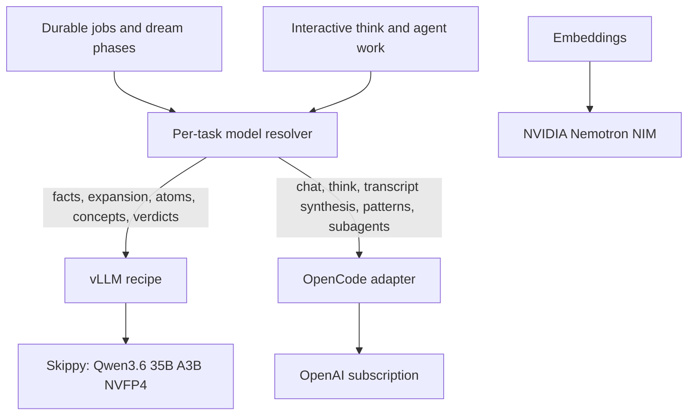

# feat: Route background cognition to Skippy and reasoning to OpenAI

## Summary

Add first-class support for Skippy's OpenAI-compatible vLLM endpoint, give native extraction and concept synthesis explicit model routes, and repair the OpenCode response adapter. Configure the operator's personal GBrain so high-volume background cognition uses local Qwen while interactive and tool-using reasoning continues through the OpenAI subscription.

---

## Problem Frame

GBrain's durable facts and dream jobs are now operational, but their current model routing is not sustainable: Anthropic incurs unwanted API spend, while the OpenCode subscription path has returned empty text despite reporting output tokens. Skippy already serves a fast Qwen3.6-35B-A3B NVFP4 model and should absorb predictable background workloads without making it the only reasoning path or adding a separate routing service.

---

## Assumptions

*This plan was authored without synchronous user confirmation. The items below are agent inferences that fill gaps in the input — un-validated bets that should be reviewed before implementation proceeds.*

- Skippy's vLLM service exposes a standard OpenAI-compatible chat-completions contract and remains an always-available homelab dependency.
- Qwen should handle fact extraction, query expansion, atom extraction, concept synthesis, and inexpensive dream verdicts; OpenCode should remain the default for interactive chat, think, patterns, transcript synthesis, and tool-using subagents.
- A direct provider route is preferable to introducing LiteLLM or a custom gateway because the workflow already owns task selection and retries.
- The rollout may update the operator's personal GBrain configuration and restart its existing autopilot service after code verification.

---

## Requirements

- R1. GBrain can call an arbitrary model on a self-hosted OpenAI-compatible vLLM endpoint without requiring a paid-provider API key.
- R2. `extract_atoms` and `synthesize_concepts` resolve explicit task-specific model configuration instead of silently inheriting the global chat model.
- R3. Facts extraction, query expansion, atom extraction, concept synthesis, and inexpensive verdict work can be routed to Skippy independently of interactive reasoning.
- R4. OpenCode-backed calls return the actual assistant text produced by the OpenAI subscription route, including the live response shape currently yielding an empty result.
- R5. Interactive chat, think, transcript synthesis, patterns, and tool-using subagents remain configurable on `opencode-server:*`.
- R6. Provider failures are visible and correctly classified; malformed empty responses must not masquerade as success, while best-effort expansion may fall back only with a sanitized diagnostic.
- R7. Existing provider integrations, source isolation, durable Minion retries, embedding configuration, and model assignments outside the operator's personal brain remain unchanged.
- R8. The deployed personal-brain route is verified with bounded live calls before background automation resumes.

---

## Scope Boundaries

- Do not add a general-purpose AI gateway, workflow scheduler, or model-selection service.
- Do not move embeddings away from the existing NVIDIA Nemotron NIM.
- Do not change the AKH Software brain or its email intake.
- Do not make Qwen the tool-using subagent runtime in this change.
- Do not evaluate or select a new model; use the already selected Qwen3.6-35B-A3B-NVFP4 deployment.

### Deferred to Follow-Up Work

- Automated ongoing quality/cost telemetry comparing local and subscription routes: add after the first production route has representative receipts; bounded rollout samples remain in scope.
- Failover between Skippy and OpenCode: design only if observed availability requires it; retries remain owned by current jobs/workflows.
- Routing additional dream phases to Qwen: decide from real output samples rather than broadening this rollout speculatively.

---

## Context & Research

### Relevant Code and Patterns

- `src/core/ai/recipes/*.ts` defines provider capabilities and `src/core/ai/recipes/index.ts` statically registers them.
- `src/core/ai/gateway.ts` already instantiates any recipe with `implementation: openai-compatible` through the AI SDK; a vLLM route needs recipe/configuration work rather than a new transport.
- `src/core/model-config.ts` owns the precedence chain for per-task, global, tier, environment, and fallback model choices.
- `src/core/facts/extract.ts` already resolves `facts.extraction_model` explicitly; `src/core/cycle/extract-atoms.ts` and `src/core/cycle/synthesize-concepts.ts` currently call the default chat route.
- `src/core/ai/providers/opencode-server-language-model.ts` owns the deny-all session lifecycle and response normalization for OpenAI subscription access.
- `test/opencode-server-language-model.test.ts`, `test/ai/opencode-server-gateway.serial.test.ts`, and `test/cycle/extract-atoms-synthesize-concepts.test.ts` provide direct contract seams for this work.

### Institutional Learnings

- `docs/plans/2026-07-13-001-refactor-stabilize-native-research-fork-plan.md` established that provider response policy must not globally redefine unrelated extraction behavior.
- `docs/architecture/KEY_FILES.md` identifies the gateway, model resolver, and native dream phases as the canonical ownership sites; provider configuration should remain gateway-routed.
- Durable facts extraction already delegates timeout and retry behavior to Minions, so provider routing must not duplicate queue policy.

### External References

- None required. The target endpoint and gateway integration are both established local contracts; implementation-time probing will characterize the exact live vLLM and OpenCode envelopes.

---

## Key Technical Decisions

- Add a dedicated `vllm` recipe rather than overloading NVIDIA embedding NIM or the embedding-only LiteLLM recipe: this keeps model IDs, base URL, health diagnostics, and capabilities honest while reusing the generic OpenAI-compatible transport.
- Add task-specific model keys for native atom extraction and concept synthesis: these phases have materially different cost/latency profiles from interactive chat and should not inherit `models.chat` accidentally.
- Preserve the existing model precedence chain: explicit task key first, then tier/global fallback, so upstream defaults and existing installations retain current behavior.
- Resolve native phase spend from the selected provider instead of hard-coded Anthropic prices: local zero-cost routes must not consume artificial USD budgets, while paid routes retain spend caps.
- Repair OpenCode by characterizing and normalizing its real response envelope, then enforce provider-neutral empty-output classification from finish reason and envelope contents: malformed responses fail explicitly, while generation-budget exhaustion remains distinguishable from a retryable transport error.
- Apply routing in configuration, not conditional application code: workflows decide the task and the model resolver maps that task to a provider.
- Quiesce background automation while applying the route table: running jobs must never observe a partially updated hybrid configuration.
- Treat Skippy as a separate trusted-processing host: send only task prompts, prohibit prompt/response logging, and permit unauthenticated access only over loopback or an encrypted private tunnel; otherwise require authenticated private transport.

---

## Open Questions

### Resolved During Planning

- Should a gateway abstraction be added? No; the existing GBrain gateway plus per-task model resolution already supplies the necessary boundary.
- Should Qwen replace OpenAI everywhere? No; use the local model for high-volume structured work and retain subscription-backed OpenCode for higher-value and tool-using reasoning.
- Should n8n own model routing? No; n8n may orchestrate jobs, while GBrain configuration owns the model associated with each GBrain task.

### Deferred to Implementation

- Exact Skippy base URL, served model identifier, authentication requirement, and readiness endpoint: discover from the running service without exposing credentials.
- Exact OpenCode response shape responsible for the empty-text result: capture metadata keys and content shapes from a bounded live request, then encode that contract in a fixture.
- Whether Qwen's endpoint advertises reliable native tool calling: not required for the background routes in this scope.
- Exact sustainable request concurrency and request-size envelope on Skippy: measure with representative bounded calls before enabling autopilot.

---

## High-Level Technical Design

> *This illustrates the intended approach and is directional guidance for review, not implementation specification. The implementing agent should treat it as context, not code to reproduce.*

---

## Implementation Units

- U1. **Add a first-class vLLM chat provider**

**Goal:** Let GBrain address Skippy's arbitrary served model through the existing OpenAI-compatible gateway path.

**Requirements:** R1, R6, R7

**Dependencies:** None

**Files:**
- Create: `src/core/ai/recipes/vllm.ts`
- Modify: `src/core/ai/recipes/index.ts`
- Modify: `src/core/ai/build-gateway-config.ts`
- Modify: `src/core/ai/capabilities.ts`
- Modify: `src/core/ai/gateway.ts`
- Modify: `docs/integrations/embedding-providers.md` or create a focused provider guide under `docs/ai-providers/`
- Test: `test/ai/recipes-existing-regression.test.ts`
- Test: `test/ai/gateway-chat.test.ts`
- Test: `test/ai/vllm-gateway.test.ts`

**Approach:** First characterize Skippy's sanitized model listing, readiness behavior, authentication posture, and minimal chat response. Then define a zero-cost, user-model-driven chat and expansion recipe with optional local authentication, configurable base URL, and a bounded readiness probe. Reuse the generic OpenAI-compatible AI SDK transport and existing base-URL/auth resolution. At the provider-neutral gateway boundary, classify empty output from content, usage, and finish reason, and emit sanitized diagnostics when expansion falls back after a transient provider failure.

**Execution note:** Characterize the live endpoint read-only, reduce it to a sanitized contract fixture, then start with failing gateway tests.

**Patterns to follow:** `src/core/ai/recipes/litellm-proxy.ts`, `src/core/ai/recipes/openrouter.ts`, `src/core/ai/recipes/llama-server.ts`, and recipe registry contract tests.

**Test scenarios:**
- Happy path: an arbitrary Qwen model ID sent through `vllm:*` reaches the configured chat-completions endpoint and returns text plus usage.
- Edge case: an unauthenticated local endpoint works when no API key is configured; an authenticated endpoint receives the configured bearer token.
- Error path: an unreachable or malformed endpoint surfaces a provider-specific diagnostic without leaking credentials.
- Error path: a malformed nonzero-usage empty completion fails explicitly, while a token-budget/truncation completion receives a distinct generation diagnostic.
- Error path: query expansion retains its best-effort original-query fallback but emits a sanitized provider diagnostic.
- Integration: provider listing and capability resolution identify vLLM as chat/expansion-capable but do not claim prompt-cache or subagent guarantees that have not been verified.

**Verification:** Fake-server contract tests cover the characterized Skippy envelope, authentication variants, empty-output classification, expansion fallback diagnostics, and readiness reporting; real Skippy calls are reserved for U4.

- U2. **Make native background phases independently routable**

**Goal:** Route atom extraction and concept synthesis explicitly while preserving current defaults for existing installations.

**Requirements:** R2, R3, R5, R7

**Dependencies:** U1

**Files:**
- Modify: `src/core/model-config.ts`
- Modify: `src/core/config.ts`
- Modify: `src/commands/models.ts`
- Modify: `src/core/cycle/extract-atoms.ts`
- Modify: `src/core/cycle/synthesize-concepts.ts`
- Test: `test/model-config.serial.test.ts`
- Test: `test/cycle/extract-atoms-synthesize-concepts.test.ts`
- Test: `test/models-command.test.ts`

**Approach:** Register `models.dream.extract_atoms` and `models.dream.synthesize_concepts`, resolve them at phase start through the canonical hierarchy, and pass the result into gateway calls. Replace phase-local Haiku/Sonnet price arithmetic with canonical pricing derived from the resolved provider/model so `vllm:*` contributes zero spend while paid providers retain caps. Keep current reasoning/utility tier fallbacks so users without the new keys see no routing change.

**Execution note:** Add routing assertions before changing phase calls.

**Patterns to follow:** `getFactsExtractionModel` in `src/core/facts/extract.ts`, verdict routing in `src/core/cycle/synthesize.ts`, and `PER_TASK_KEYS` in `src/commands/models.ts`.

**Test scenarios:**
- Happy path: each phase sends its explicitly configured `vllm:*` model to the gateway.
- Edge case: absent task keys preserve the existing tier/global/default resolution chain.
- Edge case: task-specific values win over `models.chat` without affecting other gateway callers.
- Error path: an invalid provider/model fails at the normal gateway validation boundary and remains retryable by the owning durable job.
- Integration: `gbrain models` displays the two new routes and their resolved providers.
- Integration: zero-cost vLLM calls do not exhaust phase USD budgets; paid-provider calls continue to accrue canonical spend.

**Verification:** Tests prove independent routing, registered configuration keys, visible model diagnostics, and provider-aware spend accounting; real mixed-route calls are reserved for U4.

- U3. **Repair the OpenCode subscription response contract**

**Goal:** Ensure OpenCode-backed calls return real assistant content or fail explicitly when the transport response is inconsistent.

**Requirements:** R4, R5, R6, R7

**Dependencies:** None

**Files:**
- Modify: `src/core/ai/providers/opencode-server-language-model.ts`
- Test: `test/opencode-server-language-model.test.ts`
- Test: `test/ai/opencode-server-gateway.serial.test.ts`
- Modify: `docs/ai-providers/opencode-server.md`

**Approach:** Observe a bounded live response without logging content or credentials, reduce it to a sanitized fixture, and extend response normalization at the adapter boundary. Preserve deny-all session creation/deletion, abort propagation, structured tool calls, and usage accounting. Leave provider-neutral empty-output classification to the gateway, using finish reason to distinguish malformed transport envelopes from reasoning-only or output-budget exhaustion.

**Execution note:** Add characterization coverage for the live envelope before changing normalization.

**Patterns to follow:** Existing structured-output recovery, assistant text-parts fallback, OAuth `output_text` recovery, and redaction tests in `test/opencode-server-language-model.test.ts`.

**Test scenarios:**
- Happy path: the newly observed live OpenCode envelope produces the assistant text and correct usage.
- Edge case: structured content, text parts, `output_text`, and native tool requests retain their existing behavior.
- Error path: nonzero output usage with no recoverable assistant content is surfaced to the gateway for finish-reason-aware classification and sanitized diagnostics.
- Error path: abort, authentication failure, malformed JSON, and session cleanup do not expose OAuth or server credentials.
- Integration: a real `gateway.chat` call through `opencode-server:gpt-5.5` returns non-empty text.

**Verification:** The previously empty live call returns content, all existing adapter tests remain green, and a forced inconsistent response fails loudly.

- U4. **Apply and verify the personal-brain hybrid route**

**Goal:** Replace temporary Anthropic routes with the agreed Skippy/OpenAI split and restart background processing safely.

**Requirements:** R3, R5, R6, R7, R8

**Dependencies:** U1, U2, U3

**Files:**
- Modify: operator configuration under the dedicated personal `GBRAIN_HOME` (not committed)
- Modify: `docs/ai-providers/` operational documentation as needed
- Test: `test/ai/vllm-gateway.test.ts`
- Test: `test/ai/opencode-server-gateway.serial.test.ts`

**Approach:** Stop autopilot or pause queue claims before the first configuration edit. Discover Skippy's exact endpoint/model and network posture, require loopback/SSH-tunneled access for an unauthenticated service or authenticated encrypted private access otherwise, and obtain any token through the existing secret store rather than committed or literal GBrain configuration. Apply the complete route table while quiesced: set background routes to `vllm:*`, restore interactive/reasoning routes to `opencode-server:*`, and leave Nemotron embeddings untouched. Use synthetic or redacted samples to compare Qwen outputs for facts, atoms, and concepts before enabling durable writes; run representative request sizes at current concurrency before resuming. Restart autopilot only after focused tests, bounded smoke calls, quality review, and capacity checks pass. Record provider/model/status/latency/usage only—never prompts, responses, credentials, or private endpoint details.

**Patterns to follow:** `docs/ai-providers/opencode-server.md`, `gbrain models --json`, provider readiness checks, and the existing launch service lifecycle.

**Test scenarios:**
- Integration: facts extraction returns valid JSON through Qwen and a durable `facts-absorb` job completes.
- Integration: one changed atom group synthesizes through Qwen; an unchanged group still skips before any LLM call.
- Integration: query expansion uses Qwen while a `think` smoke call uses OpenCode.
- Integration: one bounded gateway-native OpenCode subagent performs a tool round-trip with `agent.use_gateway_loop` enabled.
- Integration: representative facts, atoms, and concepts pass structured and semantic sample review before their durable routes are enabled.
- Integration: representative request sizes at the configured worker concurrency stay within the accepted timeout/error envelope before autopilot resumes.
- Error path: stopping or misrouting the local endpoint yields visible retryable failures instead of silent empty outputs.
- Invariant: embedding provider, dimensions, `halfvec(2048)`, and HNSW index remain unchanged.
- Security: unauthorized network access is denied when authentication is required; diagnostics and post-restart logs contain no prompt, response, credential, or private endpoint data.

**Verification:** `gbrain models`, provider diagnostics, queue status, focused live calls, and sanitized autopilot logs show the intended provider split. Facts extraction, query expansion, atom extraction, concept synthesis, and inexpensive verdicts make no Anthropic calls during the verification window; other dream routes remain unchanged. Automation resumes only after the complete route table, quality samples, concurrency gate, and OpenCode tool loop are green.

---

## System-Wide Impact

- **Interaction graph:** Configuration resolves a task model, the gateway validates the recipe, and either the generic vLLM transport or native OpenCode adapter performs the call; Minions and dream phases retain ownership of retries and state. Route changes are operationally atomic because workers are quiesced during updates.
- **Error propagation:** Provider/transport failures must throw through the gateway so durable workers can retry; deterministic dream fallbacks remain governed by existing phase policy.
- **State lifecycle risks:** Model changes can alter generated facts/atoms/concepts, but existing content hashes, synthesis fingerprints, job idempotency, and unchanged-group skips prevent unbounded churn.
- **API surface parity:** CLI model diagnostics must expose the new per-task keys and provider; no MCP contract changes are required.
- **Integration coverage:** Fake-server tests prove wire contracts; bounded Skippy/OpenCode smoke calls prove deployed paths; one durable job proves queue handoff.
- **Trust and data flow:** GBrain sends only the task prompt and model request to Skippy or OpenCode. Skippy is a separate trusted-processing host reached through protected private transport; both paths prohibit prompt/response/credential logging in GBrain diagnostics and deployment fixtures.
- **Unchanged invariants:** Database schema, source scoping, embeddings, and OpenCode deny-all sessions do not change.

---

## Risks & Dependencies

| Risk | Mitigation |
|------|------------|
| Skippy's live endpoint or model ID differs from assumptions | Discover through read-only service inspection and `/models`; keep identifiers in runtime config. |
| Qwen emits plausible but semantically weaker durable knowledge | Review bounded side-by-side facts, atom, and concept samples before enabling durable routes; strict parsers remain the structural backstop. |
| OpenCode server response formats vary across versions | Normalize documented variants at one adapter boundary and pin the observed version shape with sanitized fixtures. |
| Generic vLLM capability claims overstate a particular served model | Mark only chat/expansion basics; do not route tool-using subagents in this rollout. |
| Personal config is updated before code is deployable | Gate configuration and service restart on focused tests plus direct provider smoke calls. |
| Dirty unrelated workspace files enter the change | Stage only plan/provider/routing/test/docs files and preserve existing user edits. |
| Partial configuration is observed by running jobs | Quiesce autopilot/queue claims, apply the complete table, validate, then resume. |
| Current worker concurrency overwhelms vLLM and amplifies retries | Gate rollout with representative concurrent requests and lower existing workflow/worker concurrency if needed. |

---

## Documentation / Operational Notes

- Document the `VLLM_BASE_URL` and optional key contract without committing actual credentials or a private network address; retrieve any key from the existing secret store and document rotation/restart steps.
- Update current-state provider documentation and regenerate `llms.txt` / `llms-full.txt` if reference docs are changed.
- Record the final model-to-task table in operational documentation so future model replacements are configuration changes.
- Stop or pause `com.gbrain.autopilot` before editing routes; restart only after both provider paths, quality samples, and representative concurrency have passed; inspect the first durable job receipts and redacted logs after restart.

---

## Sources & References

- Related code: `src/core/ai/gateway.ts`
- Related code: `src/core/ai/providers/opencode-server-language-model.ts`
- Related code: `src/core/model-config.ts`
- Related code: `src/core/cycle/extract-atoms.ts`
- Related code: `src/core/cycle/synthesize-concepts.ts`
- Related plan: `docs/plans/2026-07-13-001-refactor-stabilize-native-research-fork-plan.md`
- Provider guide: `docs/ai-providers/opencode-server.md`
- Architecture index: `docs/architecture/KEY_FILES.md`
