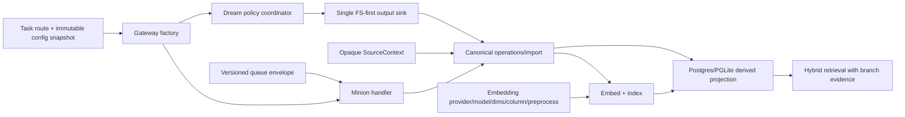
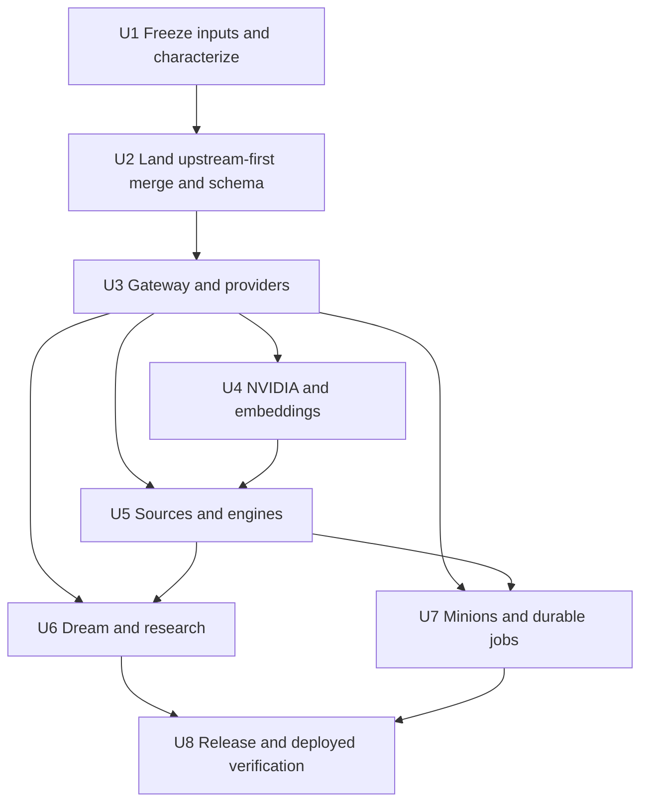
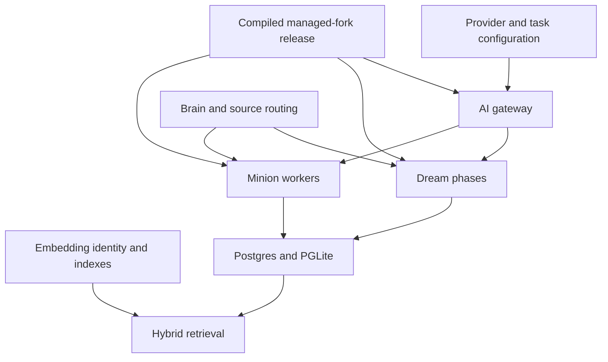

# refactor: Stabilize the managed fork on current upstream

## Summary

Pin the reviewed upstream baseline, reconcile the managed fork by behavioral subsystem, produce an immutable compiled release, and verify the personal and company deployments sequentially with explicit acceptance and rollback evidence.

---

## Problem Frame

The fork contains valuable research, provider-routing, embedding, status, and managed-release behavior on a v0.42.59.0 base, while upstream has advanced to a reviewed v0.42.64.0 baseline with 139 interdependent reliability commits. The overlap is semantic as well as textual: a mechanically clean merge can still select the wrong provider contract, double-index generated pages, lose source identity, strand Minion jobs, or report healthy retrieval while using incompatible vectors.

Phase 0 is the prerequisite stabilization phase from the [knowledge runtime requirements](../brainstorms/2026-07-22-001-gbrain-knowledge-runtime-requirements.md) and [roadmap](../roadmaps/2026-07-22-001-gbrain-knowledge-runtime-roadmap.md). It does not add the later knowledge-runtime capabilities.

---

## Requirements

- R19. Integrate useful upstream reliability work before duplicating it, preserve upstream mergeability where practical, and keep downstream behavior independently reviewable and retireable.
- R6. Preserve source identity and ingestion provenance across the reconciled code paths; Phase 0 must not regress the common intake contract.
- R9. Preserve durable Minion execution semantics, including retry, timeout, idempotency, checkpoint, worker ownership, and queued-job compatibility.
- R10. Preserve independently routable Dream and enrichment behavior without introducing provider-specific reasoning state into collectors or workflows.
- R11. Preserve Dream as coordinator and Minions as durable executor while adopting upstream lifecycle improvements.
- R12. Preserve source evidence and processing provenance on native atom and concept outputs.
- R16. Preserve existing machine-readable build, provider, source, queue, Dream, and research status surfaces needed for Phase 0 verification.
- R18. Prove the compiled deployed paths with bounded, content-free canaries that cannot pass through silent fallback or the wrong brain/source route.

**Origin actors:** A1 (owner), A2 (personal assistant as a deployment consumer), A4 (intake source), A5 (knowledge operator), A6 (enrichment worker). A3 domain agents are not provisioned in this phase.

**Origin flows:** F1 (evidence becomes usable knowledge) and F4 (continuous operational assurance) are preserved and exercised in bounded form. F2 and F3 remain product requirements for later phases.

**Origin acceptance examples:** AE3's durable acceptance and retry subset plus R9 idempotency, and AE4's repeat-run idempotency subset, shape Phase 0 regression gates; their media/processor and independently versioned enrichment-pass behaviors remain deferred. AE6 (semantic degradation cannot hide behind healthy components) shapes the deployment gate. AE1, AE2, and AE5 remain deferred with their owning roadmap phases.

---

## Scope Boundaries

### Deferred for later

- Broad connector coverage beyond the first representative sources.
- A reviewed proposal inbox for accepting or rejecting automatically generated projects, takes, and cross-domain promotions.
- Rich administrative UI for creating brains, sources, agents, and policies after CLI and configuration contracts stabilize.
- Multi-user collaboration within a protected brain.
- Automated model selection or optimization across every enrichment pass.

### Outside this product's identity

- A company-wide document management or intranet product.
- A single database that relies on labels alone to separate unrelated owners or confidentiality domains.
- A universal super-agent credential with unrestricted access to every brain.
- Bulk-copying raw email, chats, or protected-domain evidence into the personal brain.
- Making a workflow orchestrator, collector, or Grafana the knowledge system of record.
- Treating a composite health score as proof that end-to-end user capabilities work.

### Deferred to Follow-Up Work

- Grafana dashboards, a stable capability-metrics contract, continuous alerting, and fleet canaries begin in Phase 1.
- Production re-embedding, vector-width changes, destructive knowledge cleanup, and legacy-page normalization require separate data-migration plans.
- New ingestion sources, binary content processors, enrichment-pass APIs, protected-brain provisioning, and assistant delegation remain in their roadmap phases.
- Source/federation administration UI and proposal-review UI remain deferred until their core contracts stabilize.
- Upstream commits newer than the pinned baseline are included only when they close a reproduced Phase 0 acceptance failure with dependency closure; other improvements wait for the next reconciliation.

---

## Context & Research

### Relevant Code and Patterns

- `CLAUDE.md` defines fail-closed remote trust, source isolation through canonical scoping, composite source/slug identity, dual-engine parity, JSONB binding, migration, version, and release invariants.
- `docs/guides/fork-release-operations.md` provides immutable fork build identity, isolated release prefixes, `current`/`previous` selection, and the distinction between code rollback and persisted-data rollback.
- `docs/embedding-migrations.md` treats vector compatibility as provider, exact model, dimensions, active column, preprocessing signature, and stored provenance—not dimensions alone.
- `src/core/operations.ts` remains the shared CLI/MCP contract. `src/core/ai/` owns provider and task routing. `src/core/cycle/` owns Dream behavior. `src/core/minions/` owns durable execution.
- `src/core/postgres-engine.ts` and `src/core/pglite-engine.ts` must remain behaviorally aligned.
- Pinned upstream improves source-aware Dream output and retrievability, but its generated paths remain DB-first or dual-write. Phase 0 must reconcile those paths with the FS-canonical system-of-record contract rather than assume an upstream FS-first sink already exists.
- `scripts/ci-local.sh` and `docs/TESTING.md` define the authoritative local gate. The existing auto-fixing development smoke script is not an acceptable compiled-release acceptance test.

### Institutional Learnings

- `docs/plans/2026-07-13-001-refactor-stabilize-native-research-fork-plan.md` established characterization-before-reconciliation, independently retireable custom layers, immutable release identity, and stop conditions around embedding disagreement and unproven rollback.
- `docs/plans/2026-07-22-001-feat-hybrid-local-openai-routing-plan.md` established task-specific, configuration-owned routing with Minions retaining retry ownership and embeddings excluded from chat-route changes.
- `docs/guides/minions-fix.md` and `docs/guides/minions-deployment.md` show that schema, host wiring, workers, queues, and preferences are separate operational state planes; a healthy process or completed migration alone is insufficient.
- `docs/guides/birdclaw-native-dream.md` requires sequential Dream verification, repeat-run idempotency, source provenance, and retrievability from generated concepts back to original evidence.
- `docs/architecture/brains-and-sources.md` keeps brain ownership and source provenance orthogonal; source context is opaque and must survive every operation.
- `docs/architecture/system-of-record.md` makes repository files canonical knowledge, the database a derived retrieval projection, and the Minion queue durable runtime state. Dream therefore writes FS-first through one canonical import sink; database backup remains necessary for queue/history recovery, not as a substitute for the repository.

### Upstream Baseline

- Fork head: `d7fe0b60` on `fork/master`, including the landed hybrid local/OpenAI routing work.
- Upstream head: `bb5a6694` on the reviewed `origin/master` snapshot.
- Merge base: `5008b287`; fork and upstream have 26 and 139 commits beyond it respectively.
- Upstream contributes migrations v123 and v124 plus source-provenance, source-scoped Dream output, durable facts, per-source backpressure, retry reset, worker reconnect, queued gateway refresh, bounded Dream work, maintenance, and hosted NVIDIA support.
- The historical OpenCode side branches are considered superseded unless a characterization test demonstrates behavior missing from `fork/master`.

### External References

- None. This plan is governed by repository-specific contracts, history, and deployment behavior; generic merge advice would be weaker than the existing local evidence.

---

## Key Technical Decisions

| Decision | Selected approach | Rationale |
|---|---|---|
| Integration unit | Land one ancestry-preserving, upstream-first baseline merge, then restore fork policy in focused commits | The reliability commits remain intact while provider, embedding, source, Dream, and Minion customizations gain durable review/revert/retirement boundaries. |
| Resolution method | Maintain a behavior ledger and proving test for every semantic overlap | Textual conflict resolution cannot prove provider identity, source scope, idempotency, or rollback compatibility. |
| Provider identity | Keep hosted `nvidia` and local `nvidia-nim` distinct | Their endpoint, authentication, model, dimensions, cost, and privacy contracts are not interchangeable. |
| Dream output | Add one crash-recoverable FS-first generated-output sink, migrate upstream/fork callers to it, then reapply research policy | Pinned upstream is DB-first/dual-write, which conflicts with the repository system-of-record contract; the canonical file must be the commit point and the database a replayable projection. |
| Generated-output writer | Make the new FS-first write/import path the only authoritative sink | Atomic file placement precedes idempotent import; a crash after placement is repaired by retry/sync. The custom indexer is retired or becomes a non-writing adapter, and no namespace has dual writers. |
| Side branches | Treat older OpenCode branches as superseded by `fork/master` unless tests prove a missing behavior | Branch ancestry alone is not evidence that the squashed result lost functionality. |
| Data mutation | Allow required schema migrations only after the v123/v124 ordering defect is resolved and engine-specific backup/restore is proven; prohibit production re-embedding and destructive rewrites | Updated code requires its compatible schema, but v123 can otherwise strand an oversized non-English corpus before v124 installs the safe trigger. Embedding and destructive changes need independent plans. |
| Cutover | Personal deployment first, then company deployment; never switch both simultaneously | A bounded canary reduces blast radius and provides evidence before the protected deployment changes artifact. |
| Company configuration | Verify effective routes read-only; change them only under separately approved corrective scope | The completed hybrid-routing work explicitly excluded company route changes. |
| Candidate fixes beyond baseline | Include only fixes tied to a reproduced acceptance gap with dependency closure | This prevents Phase 0 from becoming an unbounded upstream sampling exercise. |

---

## Open Questions

### Resolved During Planning

- Which upstream baseline is integrated? The reviewed `bb5a6694` snapshot; implementation records its fetch time and object identity before work starts.
- Should upstream commits be cherry-picked individually? No; merge the baseline, then consider only later fixes that close a reproduced Phase 0 gap.
- Should hosted and local NVIDIA implementations be unified? No; retain distinct provider identities and block automatic migration between them.
- May Phase 0 re-embed production data? No. Required compatible schema migration is allowed only after backup/restore evidence; vector regeneration and width changes are separate work.
- What order should deployed brains use? Personal is the canary; company follows only after personal acceptance and bounded observation.
- Do historical OpenCode branches need merging? No by default; they are excluded unless a focused characterization proves missing behavior.
- Which component writes generated knowledge? A new crash-recoverable FS-first write/import path is the sole sink. The fork indexer is retired when parity passes or retained only as a non-writing adapter behind that sink.

### Deferred to Implementation

- Exact conflict count after the implementation-time fetch: record the pinned refs and regenerate the ledger before resolution because remote state may have advanced without changing the selected baseline.
- Whether the fork's generated-page indexer can be retired completely: characterize parity and record retire-versus-adapter disposition before deployment; dual writing is prohibited.
- Which in-flight jobs can drain and which require quarantine at cutover: classify from actual payload versions before building or selecting the artifact; vector-mutating jobs remain quarantined through the personal observation gate.
- Whether any post-baseline reliability commit is necessary: include only after a focused test reproduces the gap against the reconciled baseline.
- Exact private deployment selectors, service names, and configuration roots: resolve into a private content-free deployment matrix, never a checked-in public artifact.

---

## High-Level Technical Design

> *This illustrates the intended approach and is directional guidance for review, not implementation specification. The implementing agent should treat it as context, not code to reproduce.*

U2 finalizes an ancestry-preserving upstream-first baseline merge without deploying it. U3-U7 then restore or add fork policy in focused first-parent commits, each with a behavior-ledger update, proving tests, and retirement seam. U8 allocates the release version and verifies the composite candidate.

### Contract and ownership boundaries

| Contract | Owner | Consumers | Compatibility evidence |
|---|---|---|---|
| Task route and gateway factory | U3 | Dream, Minions, CLI/MCP | Config snapshot version, provider IDs, foreground/queued parity |
| Embedding identity and index compatibility | U4 | Import, stale detection, retrieval | Provider/model/dimensions/column/preprocessing provenance and legacy-cohort disposition |
| `SourceContext` and canonical operations/import | U5 | Collectors, Dream sink, Minions | `(source_id, slug)` behavior, old/new source reads, engine parity |
| Dream admission, synthesis, and output decision | U6 | Generic FS-first sink | One-writer proof, provenance schema, repeat-run no-op, old-output readability |
| Queue envelope and job lifecycle | U7 | Workers and handlers | Payload version, old-to-new execution, new-to-old rollback/quarantine |
| Status/build receipt | U8 | Operator verifier and later observability | Machine-readable schema version and live-process artifact identity |

Every applicable behavior-ledger row records producer, consumers, contract/version rule, old-to-new read behavior, new-to-old rollback behavior, owning unit, selected invariant, proving test, and retirement condition.

---

## Implementation Units

- U1. **Freeze integration inputs and characterize the fork**

**Goal:** Establish immutable inputs, a behavior ledger, pre-merge characterization, and layered rollback coordinates before changing the integration candidate.

**Requirements:** R19, R16, R18; origin A5, F4, AE6

**Dependencies:** None

**Files:**
- Create: `docs/operations/managed-fork-integration-report.md`
- Modify: `docs/guides/fork-release-operations.md`
- Modify: focused existing tests named by ledger rows
- Test: `test/build-identity.test.ts`
- Test: `test/build-fork-release.test.ts`
- Test: `test/cycle/extract-atoms-synthesize-concepts.serial.test.ts`
- Test: `test/opencode-server-language-model.test.ts`

**Approach:** Record fork, upstream, and merge-base objects; version/schema heads; included and excluded side branches; candidate post-baseline fixes; effective fork capabilities; and code/config/data rollback classes. Characterize default-provider behavior, OpenCode/vLLM routes, hosted/local NVIDIA separation, embedding identity, source propagation, native research admission, generated output, and durable facts before resolving the merge. For every persisted or consumed contract, the ledger records producer, consumers, compatibility/version rule, old-to-new behavior, new-to-old rollback behavior, owner, proving test, and retirement condition. The public report contains only generic deployment labels, hashes, counts, statuses, and timestamps.

**Execution note:** Add or refresh characterization coverage before beginning the merge transaction.

Generate a pinned-conflict coverage table from `git merge-tree 5008b287 d7fe0b60 bb5a6694` before opening the merge. Assign every conflict to U2-U7 with its selected invariant and proving test, or explicitly mark it mechanical/retired. No conflicted path may remain outside a unit simply because it is a CLI, status, search, summary, or shared-types surface.

Build a second, two-sided semantic inventory independent of textual conflicts: enumerate changed exported symbols, persisted contracts, configuration keys, migrations, queue payloads, and producer/consumer edges across both commit ranges. Every coupled contract—including clean auto-merges—receives a ledger row with a proving test or an explicit mechanical/retired/no-interaction disposition.

**Patterns to follow:** `docs/plans/2026-07-13-001-refactor-stabilize-native-research-fork-plan.md`, `docs/guides/fork-release-operations.md`, and existing build-identity manifests.

**Test scenarios:**
- Happy path: the manifest binds the exact fork, upstream, and merge-base objects plus four-part versions and schema heads.
- Edge case: a remote-tracking branch advances after pinning; the selected upstream object remains unchanged and later commits remain excluded.
- Edge case: older OpenCode branches contain commits absent by ancestry but equivalent by characterized behavior; they remain excluded without losing coverage.
- Error path: a dirty or mismatched build identity blocks release preparation.
- Integration: baseline fixtures prove both NVIDIA provider IDs, personal hybrid routes, source-aware research behavior, and durable facts before the merge.

**Verification:** Every semantic overlap has an owner, selected invariant, proving test, rollback class, and report row; the current deployment remains untouched.

- U2. **Land the upstream-first baseline merge and reconcile schema foundations**

**Goal:** Land the complete pinned upstream ancestry as a non-deployed baseline merge, reconcile its migration/schema foundation, and defer fork-policy restoration and release versioning to focused later commits.

**Requirements:** R19, R6, R16

**Dependencies:** U1

**Files:**
- Modify: `VERSION`
- Modify: `package.json`
- Modify: `bun.lock`
- Modify: `CHANGELOG.md`
- Modify: `src/core/migrate.ts`
- Modify: `src/schema.sql`
- Modify: `src/core/pglite-schema.ts`
- Modify: `src/core/schema-embedded.ts`
- Modify: `src/commands/reindex-search-vector.ts`
- Modify: `docs/architecture/KEY_FILES.md`
- Test: `test/migrations-registry.test.ts`
- Test: `test/migration-in-process.serial.test.ts`
- Test: `test/e2e/migration-flow.test.ts`
- Test: `test/e2e/migrate-chain.test.ts`
- Test: `test/fts-language-migration.serial.test.ts`
- Test: `test/reindex-search-vector.serial.test.ts`
- Test: `test/schema-bootstrap-coverage.test.ts`

**Approach:** Land one ancestry-preserving merge of the pinned baseline, resolving conflicts to upstream behavior wherever possible and limiting merge-commit changes to dependency closure, buildability, migration correctness, and mechanically required fork scaffolding. Do not deploy this intermediate commit. Reconcile every schema mirror and reindex consumer, but do not accept v123/v124 unchanged until the known ordering hazard is closed: v123's non-English backfill must use the final oversized-content-safe page trigger before it retokenizes existing pages, or an equivalent guard must be proven. Historical migrations and comments retain their historical versions. U3-U7 restore fork policy in separate commits; release version allocation and final metadata synchronization occur in U8.

**Execution note:** Treat migration and engine-parity tests as characterization gates before accepting schema conflict resolutions.

**Patterns to follow:** migration rules in `CLAUDE.md`, engine-specific migration forms in `src/core/migrate.ts`, and schema bootstrap coverage.

**Test scenarios:**
- Happy path: fresh, v122, v123, and fork-current databases reach the same latest schema on Postgres and PGLite under English and non-English FTS settings.
- Edge case: migration diagnostics preserve machine-readable stdout.
- Error path: an oversized page cannot strand v123 before v124; failure injected after each multi-stage handler operation leaves a known state and an idempotent resume reaches the final trigger/function/schema state.
- Integration: search-vector migration and reindex behavior agree across schema baselines and both engines.
- Invariant: migration diagnostics inventory the live schema version, configured language, installed text-search configuration, affected rows, and oversized pages without exposing content.

**Verification:** The baseline merge is ancestry-preserving, builds, has one coherent resumable schema history, and passes upstream behavior tests on both engines. The report retains its exact resolution patch. U2 does not claim fork-policy or release-version coherence; U3-U7 and U8 own those later gates.

- U3. **Reconcile gateway, provider, and configuration behavior**

**Goal:** Preserve fork hybrid routing while incorporating upstream gateway, tool-loop, prompt-cache, provider-option, model-list, and DB/file configuration fixes.

**Requirements:** R9, R10, R11, R19; origin A6, F1

**Dependencies:** U2

**Files:**
- Modify: `src/core/ai/gateway.ts`
- Modify: `src/core/ai/build-gateway-config.ts`
- Modify: `src/core/ai/recipes/index.ts`
- Modify: `src/core/ai/types.ts`
- Modify: `src/core/config.ts`
- Modify: `src/commands/models.ts`
- Modify: `src/commands/providers.ts`
- Modify: `src/core/ai/providers/opencode-server-language-model.ts`
- Modify: `src/core/page-summary.ts`
- Modify: `src/core/contextual-retrieval-service.ts`
- Test: `test/ai/build-gateway-config.test.ts`
- Test: `test/ai/gateway-chat.test.ts`
- Test: `test/ai/gateway-tool-loop.test.ts`
- Test: `test/ai/gateway-toolcall-pairing.test.ts`
- Test: `test/ai/opencode-server-gateway.serial.test.ts`
- Test: `test/ai/recipe-vllm.test.ts`
- Test: `test/models-report.test.ts`
- Test: `test/loadConfig-merge.test.ts`
- Test: focused page-summary/contextual-retrieval tests identified by U1

**Approach:** Keep the central task-model resolver and gateway as the only routing authority. Preserve OpenCode and vLLM contracts, task-specific Dream model keys, authenticated readiness, provider-neutral empty-output classification, sanitized diagnostics, and page-summary's pure synopsis-transformer contract for contextual retrieval. Incorporate upstream dynamic configuration refresh for queued work and provider base-URL precedence without adding phase-local provider conditionals.

Provider credentials come only from deployment-scoped secret references in the private operator environment. Repository files, database configuration, status JSON, fingerprints, and reports never contain secret material. The gate records least-privilege access and proves rotation/revocation without leaking the credential.

**Execution note:** Resolve the gateway cluster against provider fixtures before any live configuration is read.

**Patterns to follow:** provider recipes under `src/core/ai/recipes/`, canonical model resolution, and durable-job retry ownership.

**Test scenarios:**
- Happy path: fork task routes resolve to OpenCode or vLLM while upstream providers retain their documented defaults.
- Edge case: DB-backed and file-backed provider configuration merge with the established precedence and refresh in long-lived workers.
- Error path: empty model output, authentication failure, timeout, and malformed tool-call pairing fail with sanitized diagnostics and correct retry ownership.
- Integration: tool calls, prompt caching, task-model reports, and foreground/queued gateway initialization work through the reconciled gateway.
- Invariant: no provider-specific conditional enters Dream phase code or workflow adapters.

**Verification:** Focused provider suites prove the fork's hybrid routes and upstream gateway fixes simultaneously, with no credential, prompt, or response leakage.

- U4. **Reconcile NVIDIA and embedding identity**

**Goal:** Preserve local Nemotron NIM and wide-vector retrieval while adding upstream hosted NVIDIA support and dimension/config improvements without mixing vector spaces.

**Requirements:** R18, R19; origin AE6

**Dependencies:** U2, U3

**Files:**
- Modify: `src/core/ai/recipes/nvidia.ts`
- Modify: `src/core/ai/recipes/nvidia-nim.ts`
- Modify: `src/core/ai/dims.ts`
- Modify: `src/core/embedding-dim-check.ts`
- Modify: `src/core/vector-index.ts`
- Modify: `src/commands/embed.ts`
- Modify: `src/core/embed-stale.ts`
- Modify: embedding sections of `src/core/postgres-engine.ts`
- Modify: embedding sections of `src/core/pglite-engine.ts`
- Test: `test/ai/recipe-nvidia.test.ts`
- Test: `test/ai/recipe-nvidia-nim.test.ts`
- Test: `test/ai/recipe-ollama-dims.test.ts`
- Test: `test/embed.serial.test.ts`
- Test: `test/embed-stale.serial.test.ts`
- Test: `test/embedding-dim-check.test.ts`
- Test: `test/embedding-provider-consistency.test.ts`
- Test: `test/vector-index-lifecycle.test.ts`
- Test: `test/e2e/engine-parity.test.ts`

**Approach:** Retain separate provider IDs and recipes for hosted authenticated NVIDIA and local NIM. Reconcile Matryoshka dimension options, local fixed-width behavior, asymmetric query/passage inputs, provider/model metadata, embedding signatures, `halfvec(2048)`, and HNSW lifecycle. Inventory embedding counts and identity metadata by source, including NULL signatures and legacy stored-model provenance. A complete identity mismatch fails semantic retrieval closed rather than falling back to another embedding provider; an unprovable legacy cohort is explicitly quarantined, failed closed, or documented as a bounded legacy exception from immutable pre-upgrade evidence—not described as fully verified.

**Execution note:** Characterize full embedding identity and equal-width/different-model failure before editing provider resolution.

**Patterns to follow:** `docs/embedding-migrations.md`, provider-specific dimension options, and wide-vector index lifecycle tests.

**Test scenarios:**
- Happy path: hosted `nvidia` and local `nvidia-nim` resolve their own endpoints, authentication, models, dimensions, and cost posture.
- Edge case: equal vector dimensions from different models remain incompatible and are reported as such.
- Error path: missing provenance, provider mismatch, partial stale corpus, or unsupported index width cannot silently enable semantic search; legacy NULL signatures receive an explicit acceptance disposition.
- Integration: local Nemotron query and stored vectors share provider, exact model, dimensions, column, preprocessing signature, and provenance.
- Integration: Postgres `halfvec(2048)` and HNSW behavior remains intact while PGLite retains engine parity where supported.
- Invariant: Phase 0 performs no production vector clear, width alteration, or re-embedding. A non-mutating stale preview is zero; vector-mutating queued/running jobs are quarantined; pre/post per-source vector counts, timestamps, stored models, signatures, column width, and index definition remain unchanged except for named synthetic canary rows.

**Verification:** Focused and engine-parity tests prove both NVIDIA contracts and fail-closed vector identity; the deployment gate can distinguish semantic success from lexical fallback.

- U5. **Reconcile source routing and engine behavior**

**Goal:** Adopt upstream source-provenance and engine reliability improvements without weakening composite source identity, RLS, or fork routing.

**Requirements:** R6, R9, R12, R19; origin A4, F1

**Dependencies:** U3, U4

**Files:**
- Modify: `src/core/operations.ts`
- Modify: `src/core/import-file.ts`
- Modify: `src/core/source-resolver.ts`
- Modify: `src/core/sources-ops.ts`
- Modify: source and lifecycle sections of `src/core/postgres-engine.ts`
- Modify: source and lifecycle sections of `src/core/pglite-engine.ts`
- Modify: `src/commands/sync.ts`
- Modify: `src/core/minions/handlers/ingest-capture.ts`
- Test: `test/sources-ops.test.ts`
- Test: `test/source-resolver-with-tier.test.ts`
- Test: `test/extract-source-aware.test.ts`
- Test: `test/e2e/multi-source.test.ts`
- Test: `test/e2e/ingestion-roundtrip.test.ts`
- Test: `test/e2e/engine-parity.test.ts`

**Approach:** Thread source identity through capture, import, extraction, links, timelines, and cycle dispatch using the canonical source-scoping primitives. Preserve fail-closed remote trust and optional source-scoped RLS. Reconcile engine reconnect and JSONB behavior in both implementations rather than accepting a one-engine resolution. Define content-free production queries for pre/post counts by source across pages, chunks, links, timelines, jobs, facts, and generated outputs; child-to-parent source equality; unexpected NULL/default values; `(source_id, slug)` uniqueness; and orphaned derived/queue rows.

**Execution note:** Begin with cross-source isolation and composite-identity fixtures before resolving shared engine files.

**Patterns to follow:** `sourceScopeOpts`, `(source_id, slug)` identity, source-aware engine methods, and remote/local trust separation.

**Test scenarios:**
- Happy path: non-default-source capture and sync preserve their source through page, chunks, links, timeline, and downstream job data.
- Edge case: identical slugs in two sources remain independently readable, writable, and extractable.
- Error path: unauthorized remote source access and malformed source IDs fail closed.
- Integration: Postgres RLS binding and application scoping agree; PGLite returns equivalent authorized results without pretending to implement server RLS.
- Integration: a transient Postgres connection failure recovers without rerouting work or losing source attribution.

**Verification:** Source-aware and engine-parity suites plus the deployment inventory prove no cross-source leakage, wrong-default writes, duplicate composite identities, orphaned derivatives, or unexplained per-source delta. Any unexplained company mapping delta is a stop condition.

- U6. **Reconcile Dream and native research outputs**

**Goal:** Reconcile upstream generated-output paths with the FS-canonical architecture while preserving source-aware retrievability and fork-only research eligibility, lineage, promotion, model routing, and idempotency.

**Requirements:** R10, R11, R12, R18, R19; origin A6, F1, AE4

**Dependencies:** U3, U5

**Files:**
- Modify: `src/core/cycle/extract-atoms.ts`
- Modify: `src/core/cycle/patterns.ts`
- Modify: `src/core/cycle/synthesize-concepts.ts`
- Modify: `src/core/cycle/synthesize.ts`
- Modify: `src/core/cycle/bookmark-extraction-policy.ts`
- Modify: `src/core/cycle/research-provenance.ts`
- Retire or convert to a non-writing adapter: `src/core/generated-page-indexer.ts`
- Create: `src/core/generated-output-writer.ts`
- Modify: `src/commands/dream.ts`
- Test: `test/cycle/extract-atoms-synthesize-concepts.serial.test.ts`
- Test: `test/extract-atoms-page-discovery.serial.test.ts`
- Test: `test/cycle-patterns-child-outcome.test.ts`
- Test: `test/cycle-patterns-deadline-budget.test.ts`
- Test: `test/cycle-synthesize-subagent-timeout.test.ts`
- Test: `test/generated-page-indexer.serial.test.ts`
- Create: `test/generated-output-writer.serial.test.ts`
- Modify: `test/e2e/system-of-record-invariant.test.ts`
- Test: `test/e2e/dream.test.ts`
- Test: `test/e2e/isolated-research-pilot.test.ts`

**Approach:** Adopt upstream deterministic atom identity, source-aware discovery, output roots, provenance, reachability, and honest failure handling, then migrate every actual generated-output caller identified in U1—including atom/concept synthesis, Dream reflections/originals/summary, and patterns—to one FS-first sink. Source-homogeneous outputs belong to their originating source. Cross-source concepts retain Phase 0 compatibility by writing to the brain-local `default` aggregation source with complete evidence provenance; a dedicated generated source is later provisioning work, not an implicit Phase 0 change. The sink acquires the existing per-source sync lock plus a bounded canonical-path lease and compares the expected prior digest before replacement: identical content is a no-op, while divergent concurrent content fails explicitly for reconciliation rather than using last-writer-wins. It renders to a sibling temporary file, durably and atomically places the canonical markdown file as the commit point, then invokes idempotent source-aware import/chunk/embedding work. Before projection commit, import rechecks the canonical digest so an older concurrent sync retries instead of overwriting newer state. A crash before placement leaves no knowledge mutation. A crash after placement is recovered automatically by the existing sync mechanism, extended with startup and periodic file-digest reconciliation plus durable projection-completion receipts and a degraded file-only status. Database projection never precedes the file. Reapply only fork research policy: marked bookmark eligibility, provider response selection, research lineage, distinct-source promotion, bounded evidence, synthesis fingerprints, and unchanged-output suppression. Retire the custom indexer when parity passes; if legacy code remains necessary, retain it only as a non-writing adapter behind the sink. Never activate both writers for one namespace, and preserve pre-existing custom chunks without adding new writes to them.

**Execution note:** Characterize unmarked/default-source behavior and repeat-run output before resolving research-specific paths.

**Patterns to follow:** `docs/guides/birdclaw-native-dream.md`, upstream generic import behavior, and fork policy helpers.

**Test scenarios:**
- Happy path: marked research evidence produces deterministic source-scoped atoms and one retrievable concept with bounded provenance.
- Edge case: unmarked and unrelated sources retain upstream extraction and synthesis behavior.
- Edge case: a mixed evidence group follows the existing explicit research-policy rules without leaking policy to unmarked groups.
- Error path: provider unreachability, timeout, or failed judge produces an honest job/phase outcome rather than a misleading success.
- Error path: injected failure before atomic placement, after placement/before import, during chunking, and before embedding enqueue converges by retry/sync to one canonical file and one derived projection without a DB-only generated page.
- Error path: overlapping Dream runs, retry-versus-Dream, and retry-versus-sync on the same source/path either coalesce identical content or surface an explicit digest conflict; no valid result is silently overwritten.
- Integration: after a process is killed immediately following canonical placement, startup/periodic reconciliation discovers the file-only receipt and completes retrieval without an operator manually invoking sync.
- Integration: Exercises AE4's repeat-run idempotency subset; the same fixture runs twice and the second pass creates no duplicate atoms, concepts, chunks, embeddings, or timestamp-only rewrite. Pass-version and independent-pass coverage remains deferred.
- Integration: new concepts can be retrieved and traced to supporting source evidence without touching a neighboring source.

**Verification:** System-of-record and Dream/research suites prove FS-first crash recovery, source scope, default compatibility, retrievability, one indexing lifecycle, bounded deadlines, and stable repeat-run output for every migrated caller family.

- U7. **Reconcile Minions, facts, and durable-job lifecycle**

**Goal:** Adopt upstream worker, retry, backpressure, gateway-refresh, and child-outcome fixes while retaining durable facts and pack-aware maintenance.

**Requirements:** R9, R11, R16, R19; origin A5, A6, F1

**Dependencies:** U3, U5

**Files:**
- Modify: `src/commands/jobs.ts`
- Modify: `src/core/minions/queue.ts`
- Modify: `src/core/minions/worker.ts`
- Modify: `src/core/minions/handlers/subagent.ts`
- Modify: `src/core/minions/types.ts`
- Modify: `src/core/facts/durable-job.ts`
- Modify: `src/core/facts/cli-process-mode.ts`
- Modify: `src/core/facts/extract.ts`
- Modify: `src/commands/maintain.ts`
- Test: `test/handlers.test.ts`
- Test: `test/minions.test.ts`
- Test: `test/subagent-handler.test.ts`
- Test: `test/worker-promote-reconnect.test.ts`
- Test: `test/e2e/minions-resilience.test.ts`
- Test: `test/e2e/subagent-gateway-path.test.ts`
- Test: `test/e2e/subagent-gateway-resume-reconciliation.test.ts`

**Approach:** Preserve source-scoped backpressure, genuine retry reset, worker reconnection, explicit child outcomes, configurable time budgets, and fresh gateway configuration for queued work. Rebase fork durable facts and maintenance handlers onto the reconciled lifecycle. Record payload compatibility for queued old jobs and rollback disposition for any new payload shape.

**Execution note:** Add old-payload/new-handler and new-payload/rollback compatibility fixtures before changing job data contracts.

**Patterns to follow:** protected job registration, canonical Minion queue ownership, pack-aware maintenance, and durable facts receipts.

**Test scenarios:**
- Happy path: a queued facts job uses the refreshed task route and completes with correct source attribution.
- Edge case: backpressure in one source does not starve a different source.
- Error path: retry resets start/attempt/stall state, transient connection loss reconnects, and dead or timed-out children produce explicit terminal outcomes.
- Integration: old queued payloads execute on the candidate; new payloads are either backward-compatible or have a documented drain/quarantine requirement before rollback.
- Integration: Exercises AE3's durable acceptance and retry subset plus R9 idempotency; an accepted intake item survives a retryable worker/provider interruption and produces one durable result without duplicate output. Media and processor coverage remains deferred.

**Verification:** Minion and E2E resilience suites prove progress, source fairness, retry freshness, connection recovery, route refresh, child outcomes, and queue compatibility.

- U8. **Assemble the candidate, build releases, and verify deployed paths**

**Goal:** Assemble the baseline merge plus focused policy commits, allocate the coherent release version, pass authoritative gates, rehearse rollback, and cut over personal then company deployments with objective acceptance evidence.

**Requirements:** R16, R18, R19; origin A1, A2, A5, F4, AE6

**Dependencies:** U2, U4, U6, U7

**Files:**
- Modify: `docs/operations/managed-fork-integration-report.md`
- Modify: `docs/guides/fork-release-operations.md`
- Modify: `docs/architecture/brains-and-sources.md`
- Modify: `docs/architecture/system-of-record.md`
- Modify: `VERSION`
- Modify: `package.json`
- Modify: `bun.lock`
- Modify: `CHANGELOG.md`
- Modify: `docs/architecture/KEY_FILES.md`
- Modify: `llms.txt`
- Modify: `llms-full.txt`
- Create: `scripts/verify-managed-fork-release.ts`
- Modify: `scripts/build-fork-release.sh`
- Modify: `src/core/build-identity.ts`
- Modify: `src/commands/status.ts`
- Modify: `src/commands/autopilot.ts`
- Modify: `src/core/minions/supervisor.ts`
- Modify: `src/core/minions/worker.ts`
- Test: `test/verify-managed-fork-release.test.ts`
- Test: `test/status-sections.test.ts`
- Create: `test/autopilot-build-identity.test.ts`
- Test: `test/supervisor.test.ts`
- Test: `test/build-fork-release.test.ts`
- Test: `test/build-identity.test.ts`
- Test: `test/upgrade.serial.test.ts`

**Approach:** Allocate the release version only after every ledger decision, focused policy commit, retirement seam, and focused suite passes. Keep one release-selection authority by extending the existing release tool with non-selecting build/install and explicit select operations backed by the same verification and atomic `current`/`previous` primitives. The mandatory private deployment matrix records OS, CPU architecture, executable format, and runtime ABI. Build one reproducible artifact per unique target tuple from the same clean commit; install identical bytes only where target tuples match, and track checksums and rollback independently otherwise. Bind each artifact to manifest, checksum, pinned commit, upstream baseline, version, channel, target tuple, schema compatibility, and required runtime assets; operator signing and external key lifecycle remain separate supply-chain-hardening work unless a concrete threat requires them. The non-mutating-by-default verifier targets an explicit private deployment descriptor rather than `$HOME` defaults and proves identity through every real entrypoint: CLI, scheduler, supervisor, and worker receipts report the executing process build, binary checksum, deployment/brain fingerprint, and effective-config fingerprint; the live executable must resolve to the selected immutable release after restart.

Before build/selection, complete a candidate/previous compatibility matrix for schemas v122, v123, v124, and final head; config shapes; queue envelopes; facts, generated pages, chunks, links, timelines, provenance, embedding metadata, and status JSON. Classify every plane as backward-compatible, restore-required, quarantine-required, or roll-forward-only, and exercise the previous compiled artifact against a migrated clone. Resolve private selectors, service definitions, config roots, in-flight job disposition, and exact stop thresholds as mandatory inputs—not cutover discoveries.

For each deployment: quiesce producers and schedulers; drain or quarantine in-flight jobs, including every vector-mutating handler; stop workers; take and restore-test an engine-specific quiescent backup; migrate/select/preflight; start exactly one candidate worker on a canary-isolated source/queue; run bounded deterministic canaries while broad Dream and backlog processing remain paused; restore normal worker concurrency; then resume producers only after the write boundary is accepted. Write canaries use a disposable repository-backed source with its own checkpoint and never mutate an existing canonical source; cleanup and a post-cleanup sync are part of the receipt. Canary identifiers are unique and idempotent, expected mutations are enumerated, repeat execution is a no-op, and unrelated counts/timestamps remain unchanged. Once normal writes resume, database or repository rollback is prohibited unless a tested delta replay/merge procedure and recovery-point objective exist; otherwise failures use the predeclared roll-forward repair.

Personal receives its own go/no-go record and observation window. Company starts from a fresh baseline only after personal acceptance, gets an independent migration/rollback decision, and retains read-only route verification unless a separate change is authorized.

**Execution note:** Treat the compiled artifact—not source execution—as the verification subject. Engine-specific backups are encrypted in a private least-privilege location; public receipts contain neither paths nor keys, and the private custody record includes creation, access, expiry, and verified deletion. Restore evidence must validate schema version, source/row counts, functions/triggers, RLS behavior, vector columns/indexes, queue state, configuration, and both candidate/previous compiled readers. Predeclare observation durations, migration lock/duration limits, queue-progress deadlines, allowed error/dead/stalled deltas, expected count changes, and zero-tolerance failures: wrong brain/source/build, embedding mismatch, cross-source write, duplicate output, vector mutation outside synthetic rows, or skipped required tests.

**Patterns to follow:** `scripts/ci-local.sh`, `docs/TESTING.md`, immutable release selection, content-free status JSON, and private deployment configuration.

**Test scenarios:**
- Happy path: focused suites, full unit/serial/slow tests, real-Postgres E2E, compiled-build checks, and authoritative CI complete without required-gate skips.
- Edge case: the verifier receives the wrong brain home, artifact, engine, source, or build identity and refuses to report success.
- Error path: rehearse stop/start, process identity, configuration restore, queue disposition, prior retrieval, and—where classified—database restore for failures before selection, after selection but before writes, during canary writes, and after normal writes resume.
- Integration: personal verifies intended hybrid chat routes, unchanged local embeddings, source-aware durable work, repeat-run Dream idempotency, and an isolated semantic canary that asserts the expected provider/model/dimensions/signature branch executed and contributed the winning result—not a cache or lexical fallback.
- Integration: company verifies its prior effective route fingerprint, explicit source-scoped read/write, one retry-safe Minion job, retrieval, and content-free status without inheriting personal route changes.
- Integration: backup restore is exercised in isolation using an engine-correct consistent set. The receipt records recovery point/time and validates schema, data/source counts, functions/triggers, RLS, vector metadata/indexes, queue state, and both binary generations; a backup file alone is insufficient.
- Security: public receipts and logs contain no credentials, endpoints, prompts, responses, URLs, private source names, page bodies, backup paths, or secret-derived/low-entropy hashes. Sensitive configuration fingerprints remain in private receipts; public artifacts use opaque receipt IDs or keyed digests.

**Verification:** Each deployment independently proves the actual running candidate, queue progress, its accepted embedding cohort, source/Dream/retrieval canaries, and stability through its predeclared observation window. Checks occur immediately, at each deployment's observation gate, and at 24 hours for build drift/restarts, migration state, queue age/dead/stalled counts, route/provider errors, semantic-disable events, source-scope failures, duplicates, and latency. Preserve each prior artifact, configuration, and backup until its own rollback horizon expires. The report records baseline, per-unit resolution diffs, conflicts, tests, artifact identity, effective route hashes, migrations, compatibility classifications, canary receipts, included/excluded later fixes, and separate code/config/queue/source/data rollback points.

---

## System-Wide Impact

- **Interaction graph:** Provider configuration flows through the gateway into Dream and Minions; source context and engine behavior govern every durable write; embedding identity governs semantic retrieval; the compiled release binds all of these behaviors into the deployed artifact.
- **Error propagation:** Provider and worker failures must remain explicit and retry-owned by Minions. Source/auth violations fail closed. Embedding mismatch disables semantic success rather than silently changing providers. Migration failure must preserve the prior schema version.
- **State lifecycle risks:** The merge changes code, configuration interpretation, migrations, queued payload handling, generated outputs, and derived retrieval state. Each state plane receives its own snapshot, compatibility classification, and rollback or roll-forward strategy.
- **API surface parity:** Shared operation contracts, CLI, MCP, OpenClaw, Postgres, and PGLite must remain aligned. Provider listings and model diagnostics must reflect both upstream and fork routes accurately.
- **Integration coverage:** Unit fixtures prove cluster contracts; real Postgres E2E proves migrations and engine behavior; compiled-artifact canaries prove configuration, services, queues, Dream, and retrieval through actual deployment selectors.
- **Unchanged invariants:** No new knowledge-runtime product capability, production re-embedding, destructive cleanup, company route change, cross-brain federation, or protected-domain provisioning occurs in Phase 0.

---

## Risks & Dependencies

| Risk | Mitigation |
|---|---|
| Moving upstream changes the conflict set during work | Pin and record the upstream object; later commits require an explicit ledger row and acceptance-gap justification. |
| A textual resolution selects semantically incompatible behavior | Require one behavior decision and proving test per overlap cluster before finalizing the merge. |
| Hosted NVIDIA replaces or aliases local NIM | Preserve distinct providers and full identity tests; reject automatic configuration migration. |
| Generated concepts are indexed twice or lose fork provenance | Characterize the generic output path; retire the custom indexer only after exactly-once chunks, embeddings, provenance, and repeat-run no-op are proven. |
| v123 retokenizes oversized non-English pages before v124 installs the safe trigger | Reconcile ordering before accepting upstream, test v122/v123 upgrades on both engines with oversized content and stage-level failure injection, and require idempotent resume. |
| Same-width vectors from different models silently corrupt retrieval | Verify full embedding identity and require a semantic golden query with fallback detection. |
| Legacy vectors lack enough provenance to prove full identity | Inventory NULL signatures by source and explicitly quarantine, fail closed, or document the immutable-evidence exception; never claim the cohort is fully verified. |
| Resumed work silently starts a production re-embedding | Quarantine vector-mutating jobs, require a zero stale preview, and compare pre/post vector fingerprints before claims resume. |
| Old and new workers process the same queue concurrently | Quiesce schedulers/claims, classify in-flight and queued payloads, then cut over one deployment at a time. |
| Binary rollback cannot reverse schema or candidate-created writes | Gate on the candidate/previous compatibility matrix and prior-binary-on-migrated-clone test; after normal writes resume, use roll-forward unless a tested delta replay makes restore lossless. |
| Full CI appears green because required Postgres tests were skipped | Predeclare the authoritative gate set and reject any run that skips required real-Postgres or compiled-build coverage. |
| Verification targets the default or wrong brain | Require explicit private deployment descriptors and compare expected build/config/engine/source fingerprints before canaries. |
| Company deployment inherits personal model configuration | Treat company route comparison as read-only and require a separate authorization for any correction. |
| Public artifacts disclose private operational details | Store only generic labels, hashes, counts, timestamps, and statuses; keep deployment selectors and samples private. |

---

## Success Metrics

- The behavior ledger has a resolved, tested disposition for every semantic overlap and every considered post-baseline fix.
- Repository-authoritative gates pass with required Postgres, compiled-build, privacy, migration, and dual-engine coverage present rather than skipped.
- Every live CLI/scheduler/supervisor/worker entrypoint reports the candidate bytes and preserves its expected provider, accepted embedding cohort, engine, source, and config fingerprints.
- One retry-safe durable job and one repeat-run Dream/research fixture complete correctly per deployment.
- A semantic golden query proves vector retrieval uses the intended embedding identity and is not masked by lexical fallback.
- Candidate selection and each rollback phase are rehearsed; any restore-required migration has an engine-specific verified restore path and an explicit post-write recovery rule.
- The content-free integration report contains enough evidence to begin Phase 1 without reopening Phase 0 discovery.

---

## Alternative Approaches Considered

- Cherry-pick selected upstream commits: rejected because the desired reliability work spans migrations, config, CLI, engine, worker, and tests and would create an untested synthetic release.
- Rebase or replay every fork commit onto upstream: rejected because it rewrites the managed fork's historical integration points and makes it harder to distinguish the landed fork behavior from conflict-resolution changes.
- Take upstream provider and Dream implementations wholesale: rejected because hosted/local NVIDIA and generic/research Dream policies have different contracts that must coexist.
- Defer upstream and start observability immediately: rejected because Phase 1 would otherwise encode metrics and canaries around defects upstream has already corrected.

---

## Documentation / Operational Notes

- Keep real deployment names, service identifiers, configuration roots, endpoints, and credentials in private operator artifacts.
- Update current-state architecture documentation rather than appending release-history narration.
- Regenerate `llms.txt` and `llms-full.txt` whenever their source reference documents change.
- The public integration report records sanitized object IDs, versions, hashes, counts, statuses, and timestamps only.
- Preserve each prior compiled artifact, compatible configuration, and quiescent backup until that deployment's declared rollback horizon expires.
- Do not run the legacy auto-fixing smoke script as a go/no-go gate; use the explicit non-mutating compiled-release verifier.

---

## Sources & References

- **Origin document:** [docs/brainstorms/2026-07-22-001-gbrain-knowledge-runtime-requirements.md](../brainstorms/2026-07-22-001-gbrain-knowledge-runtime-requirements.md)
- **Roadmap:** [docs/roadmaps/2026-07-22-001-gbrain-knowledge-runtime-roadmap.md](../roadmaps/2026-07-22-001-gbrain-knowledge-runtime-roadmap.md)
- `CLAUDE.md`
- `docs/TESTING.md`
- `docs/RELEASING.md`
- `docs/embedding-migrations.md`
- `docs/architecture/brains-and-sources.md`
- `docs/architecture/system-of-record.md`
- `docs/guides/fork-release-operations.md`
- `docs/guides/minions-deployment.md`
- `docs/guides/minions-fix.md`
- `docs/guides/birdclaw-native-dream.md`
- `docs/plans/2026-07-13-001-refactor-stabilize-native-research-fork-plan.md`
- `docs/plans/2026-07-22-001-feat-hybrid-local-openai-routing-plan.md`
