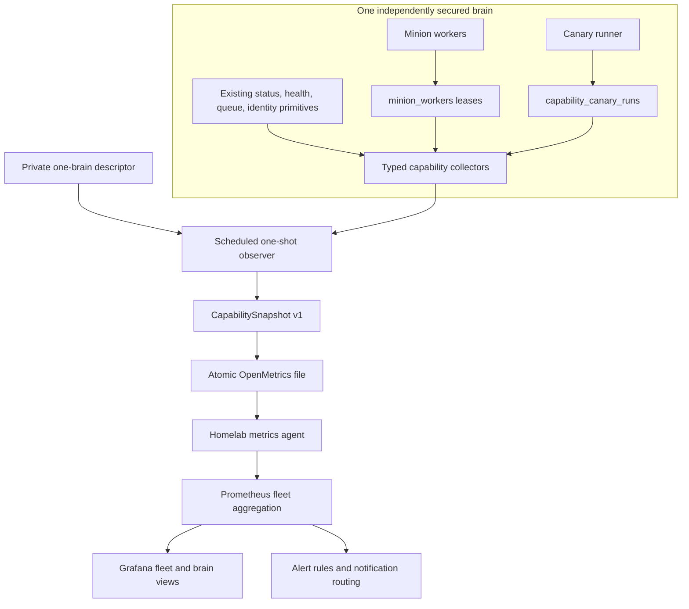
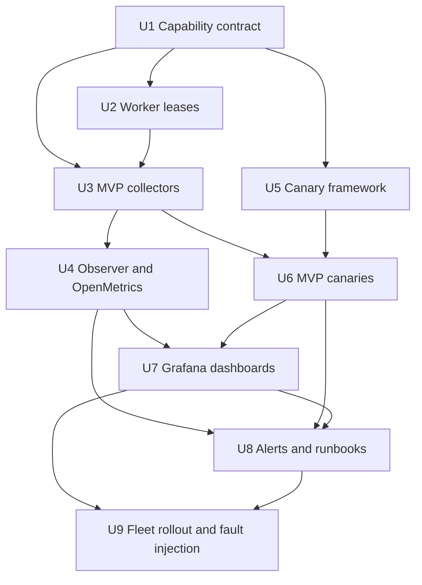

# Establish Operational Truth - Plan

## Goal Capsule

- **Objective:** Make every production GBrain report whether its critical capabilities are working continuously, with fleet and per-brain views, bounded alerts, and stage-specific evidence that does not expose knowledge content.
- **Authority:** Product behavior comes from R16-R19 and AE5-AE6 in `docs/brainstorms/2026-07-22-001-gbrain-knowledge-runtime-requirements.md`; phase sequencing and the MVP capability set come from `docs/roadmaps/2026-07-22-001-gbrain-knowledge-runtime-roadmap.md`.
- **Entry gate:** The Phase 0 managed-fork release is accepted. A brain's semantic-retrieval canary cannot count as operational truth until its embedding cohort passes `docs/plans/2026-07-22-003-refactor-rebuild-embedding-cohorts-plan.md`.
- **Execution profile:** Build contracts and collectors before transport or presentation, prove them with deterministic fixtures, then deploy one read-only observer and activate alerts only after fault injection demonstrates bounded behavior.
- **Stop conditions:** Stop rollout on wrong brain/build/source identity, sensitive-content emission, unbounded metric cardinality, any observer mutation, any canary-runner mutation outside an explicitly authorized synthetic canary, or a dashboard state that disagrees with the underlying capability receipt.
- **Tail ownership:** Checked-in capability definitions, dashboards, alert rules, tests, and generic runbooks live in this repository. Credentials, real brain names, endpoints, notification routes, and deployment mappings remain private operator configuration.

---

## Product Contract

### Summary

Phase 1 establishes a content-free operational surface that answers whether intake freshness, Minion execution, Dream processing, embedding readiness, and hybrid retrieval work for each brain. It replaces interpretation of changing Doctor scores with stable capability states, repeatable deployed-path canaries, and actionable fleet alerts.

### Problem Frame

GBrain already exposes component evidence through `gbrain status --json`, Doctor checks, source health, queue statistics, build receipts, and search telemetry. Those surfaces were designed independently and do not share stable capability identities, state semantics, reason codes, or freshness rules. An operator can therefore see healthy components while a user-visible path is degraded, or receive a composite score that changes without revealing whether an important capability stopped working.

Worker liveness is especially ambiguous. The current worker registry is a best-effort host-local file used for niceness observability, while supervisor audit events report historical process outcomes. Neither is authoritative fleet-visible proof that a worker with the expected brain and build identity is currently renewing a lease.

The phase must preserve hard brain boundaries. Monitoring may aggregate content-free states across independently credentialed databases, but it must not query knowledge through connected-brain federation, centralize page bodies, or turn Grafana into a knowledge system of record.

Product Contract preservation: R16-R19, F4, AE5, and AE6 remain the source authority. Phase 1 fulfills only their roadmap-defined MVP subset; later capability families remain additive follow-up work.

### Actors

- A5. Knowledge operator: views fleet state, investigates a failed stage, acknowledges maintenance, and follows repair guidance.
- A6. Enrichment worker: registers authoritative liveness and produces durable job or Dream outcomes.
- A7. Observer: runs as a scheduled one-shot process for exactly one brain, evaluates capability state through independently scoped credentials, and atomically exports content-free telemetry.
- A8. Canary runner: submits only versioned synthetic fixtures authorized for its target and records stage-specific receipts.
- A9. Monitoring stack: scrapes metrics, renders dashboards, evaluates alert rules, and routes notifications without becoming authoritative for knowledge state.

### Requirements

**Capability truth**

- R16. The runtime must expose machine-readable capability metrics for sources, Minion queues and workers, Dream cycles and phases, enrichment passes, content processors, embeddings, derived knowledge, provider health, and retrieval quality.
- R20. The Phase 1 MVP must provide stable identities and state semantics for intake freshness, Minion worker and queue liveness, Dream phase outcomes, embedding identity and readiness, and retrieval with lexical and semantic stages distinguished.
- R21. Every capability observation must identify its brain, capability, stage, database observation time, freshness deadline, state, and bounded reason code; free-form errors remain in private diagnostic logs.
- R22. `healthy`, `degraded`, `failed`, `unknown`, and `disabled` must have one shared meaning across CLI snapshots, metrics, dashboards, alerts, and canary receipts.
- R23. Doctor diagnostics may contribute evidence and repair guidance, but Doctor categories and composite scores must not define capability state.

**Fleet visibility and privacy**

- R17. The operator must have a fleet overview and per-brain drill-down with actionable alerts, while operational telemetry must exclude page bodies and other sensitive content by default.
- R24. Each brain must run an independently configured scheduled observer with a database role restricted to enumerated content-free observability views; the monitoring agent aggregates their atomic metric files so no observer process becomes a universal cross-brain credential or knowledge reader.
- R25. Public metrics and receipts must use configured opaque brain/source identifiers and bounded labels; they must not contain database URLs, file paths, source names, page slugs, prompts, responses, job payloads, email addresses, or unbounded error text.
- R26. Alerting must include hold periods, maintenance inhibition, deduplication, severity, ownership, and a repair link so transient or planned conditions do not create repeated noise.

**Canary proof**

- R18. Every critical end-to-end capability must have a repeatable canary that proves a known input reaches the expected durable and retrievable outcome through the deployed path.
- R27. Every canary must declare its version, target fingerprint, expected stages and mutations, timeout, cleanup rule, idempotency key, and expiry before execution.
- R28. A canary must distinguish `not run`, `unsupported`, `blocked`, `failed`, and `passed`; absence of evidence must never be rendered as success.
- R29. Mutating canaries must use a disposable repository-backed source and isolated queue, enumerate allowed mutations, verify unrelated state remains unchanged, clean up, and record a post-cleanup receipt.

**Managed-fork posture**

- R19. The maintained fork must integrate useful upstream reliability work before duplicating it, preserve upstream mergeability where practical, and express downstream behavior through supported contracts, plugins, source adapters, processors, and enrichment definitions before changing the core.
- R30. Capability collection must adapt existing status, source-health, queue, build-identity, embedding-identity, and search-telemetry primitives through typed collectors rather than duplicating their queries in dashboards or alert rules.

### Key Flow

- F4. Continuous operational assurance
  - **Trigger:** A scheduled collection or canary run begins, or an underlying capability receipt changes.
  - **Actors:** A5, A6, A7, A8, A9
  - **Steps:** Each observer connects to exactly one configured brain; typed collectors produce a capability snapshot; the observer exports bounded metrics; scheduled canaries record stage receipts; Prometheus evaluates rules; Grafana renders fleet and brain views; alerts link to capability-specific repair guidance.
  - **Outcome:** The operator sees current capability truth for every configured brain and can identify the failed stage without accessing knowledge content.
  - **Covered by:** R16-R30

### Acceptance Examples

- AE5. **Covers R16, R17, R20-R26.** Given a required Minion worker stops renewing its lease while queued work exists, the affected brain transitions from healthy to degraded and then failed at the configured deadlines; the dashboard shows worker and backlog stages; one bounded alert fires with repair guidance; no job payload or brain content appears in telemetry.
- AE6. **Covers R18, R20-R23, R27-R30.** Given database, embedding, and worker components are healthy but semantic retrieval is disabled, the lexical stage passes, the semantic stage fails, overall retrieval fails, the receipt identifies the embedding identity branch actually exercised, and neither cache nor lexical fallback masks the failure.
- AE7. **Covers R17, R24-R26.** Given one protected brain's observer credential is revoked, only that brain reports `unknown` with a bounded authorization reason; other brains continue reporting; no endpoint or credential detail is emitted.
- AE8. **Covers R18, R27-R29.** Given a mutating canary is repeated with the same identity, it produces no duplicate durable output, cleans its synthetic source, and proves unrelated counts and timestamps did not change.
- AE9. **Covers R20-R23, R26.** Given a planned maintenance window inhibits a worker-stopped alert, the dashboard still reports the true degraded state while notification delivery is suppressed only for the bounded maintenance interval.

### Success Criteria

- A stopped worker, stale source, dead job, failed Dream phase, embedding mismatch, and degraded semantic retrieval each produce the correct capability state and bounded alert.
- Every configured production brain reports build identity, observation freshness, and MVP capability state from one fleet view.
- Capability snapshots, OpenMetrics output, canary receipts, dashboards, and alerts share the same stable capability IDs and reason-code registry.
- Monitoring stores no page body, prompt, response, evidence excerpt, private source name, or raw endpoint.
- Fault-injection tests prove that Doctor score changes cannot override capability truth and that healthy component checks cannot mask a failed end-to-end canary.

### Scope Boundaries

#### Included

- The five Phase 1 MVP capability families.
- A stable typed snapshot and reason-code contract.
- Authoritative worker heartbeats for Postgres and compatible one-shot snapshots for PGLite.
- One scheduled read-only Postgres observer command per brain with atomic OpenMetrics output.
- Versioned canary receipts and the MVP canary set.
- Provisioned Grafana dashboards, Prometheus rules, private per-brain observer descriptors, generic runbooks, and fault-injection acceptance.

#### Deferred to Follow-Up Work

- Additive capability families for transcription, OCR, media processing, enrichment definitions, knowledge derivation quality, provider cost, and assistant delegation.
- A web administration UI for configuring observers or maintenance windows.
- Automated remediation beyond links to operator-approved repair procedures.
- Long-term SLO/error-budget policy after enough baseline data exists.

#### Outside This Product's Identity

- Replacing Doctor as an interactive diagnostic tool.
- Using Grafana, Prometheus, or alert history as the knowledge system of record.
- Scraping all databases with one universal credential.
- Exporting per-page, per-job-ID, per-query, or other unbounded labels.
- Treating `process exists`, `HTTP 200`, or a composite score as end-to-end proof.

---

## Planning Contract

### Key Technical Decisions

- KTD1. **Capability state is the contract, not Doctor score.** (session-settled: user-directed — chosen over relying on composite Doctor scores: changing scores repeatedly failed to establish whether the brain was useful.) A versioned `CapabilitySnapshot` owns IDs, states, reason codes, timestamps, and stage composition. Doctor maps relevant checks into diagnostic evidence but cannot directly set the overall state.
- KTD2. **Collect one consistent snapshot and project it many ways.** Database-backed evidence is read in one bounded read-only repeatable-read transaction using database time as the generation watermark. External evidence is timestamped separately and joined only under explicit freshness rules. Pure typed collectors produce one content-free snapshot consumed by `gbrain status --json`, the observer, canary evaluation, and tests. Prometheus exposition and CLI rendering are adapters; dashboards never query GBrain databases directly.
- KTD3. **Run one scheduled least-privilege observer per brain.** `gbrain observe snapshot --openmetrics` runs outside `gbrain serve`, resolves one explicit deployment descriptor, and atomically replaces a local metrics file collected by the existing homelab monitoring agent. Its PostgreSQL role has `default_transaction_read_only=on` and `SELECT` only on enumerated content-free observability views or tables, with no access to page, chunk, prompt, response, or evidence payload columns. A serving failure cannot take monitoring down, and no observer process holds credentials for multiple hard-boundary brains.
- KTD4. **Make worker liveness database-authoritative.** Add a `minion_workers` lease table keyed by brain-local worker identity and queue. Workers upsert build/config identity and renew `last_seen_at`; clean shutdown retires the lease, while expiry is authoritative. The existing host-local registry remains for niceness and process debugging only.
- KTD5. **Use a bounded deterministic OpenMetrics projection.** A small internal renderer emits only the registered Phase 1 families with a `gbrain_` namespace, base units, help/type metadata, configured opaque target IDs, and a fixed label registry. State is exported as a one-hot gauge over the five allowed states; ages, deadlines, backlogs, and counts use separate gauges. Build metadata uses one bounded info family rather than attaching checksums to every series.
- KTD6. **Persist build-bound canary receipts in the target brain.** Versioned definitions live in code/config; content-free execution receipts live in a dedicated table so the observer can distinguish never-run, stale, blocked, and failed outcomes without scraping logs. A receipt contributes state only when its target, deployment build, effective config, and canary-definition fingerprints exactly match the current snapshot; mismatches are `not run` or `blocked`, never inherited success. Synthetic knowledge remains in its disposable source and is removed after proof.
- KTD7. **Separate observation from mutation authority.** The observer credential is read-only. A one-time target token provisions or rotates a revocable canary policy bound to one target, disposable source, isolated queue, operation allowlist, schedule, and maximum lifetime. Scheduled runs derive short-lived run authorization and idempotency from that policy without human token minting. Every canary mutation and cleanup call passes through one guarded API that revalidates policy, run identity, expiry, synthetic source, isolated queue, and enumerated operation; direct general-purpose writes are denied. An unfinished run may receive cleanup-only authorization tied to its original artifacts and deletion allowlist until a separate bounded cleanup deadline.
- KTD8. **Distinguish retrieval stages explicitly.** Retrieval receipts record cache bypass, lexical candidates, embedding identity acceptance, semantic candidates, fusion contribution, and expected winner. A lexical result cannot satisfy semantic proof, and a semantic-disable event cannot be downgraded because the final answer still looks plausible.
- KTD9. **Aggregate metrics, not credentials or knowledge.** Each brain's private observer descriptor supplies one opaque monitoring ID, one brain home or endpoint, one credential reference, expected build/config fingerprints, capability policy, atomic output path, and an optional `maintenance_until` timestamp. The homelab monitoring agent collects each file and Prometheus performs fleet aggregation; observers never mount another brain or read knowledge content. Missing, invalid, or expired maintenance values mean no inhibition.
- KTD10. **Alerts follow state duration and capability criticality.** Checked-in Prometheus rules use per-capability hold periods and a bounded maintenance signal. Database time is authoritative for brain evidence, lease, receipt, and maintenance timestamps; monotonic observer time is used only for local deadlines. The observer exports clock offset and returns unknown for time-dependent evidence beyond a declared skew limit. Critical identity or cross-boundary failures alert immediately; freshness and liveness failures use configured grace periods. Dashboard truth remains visible even when notifications are inhibited.

### High-Level Technical Design

The implementation has three ownership layers:

1. **Evidence primitives** retain their current owners: source health, queue stats, cycle outcomes, build identity, embedding identity, and search telemetry.
2. **Capability collectors** normalize that evidence into stable state and reason semantics. They are deterministic and content-free.
3. **Operational projections** expose the snapshot through CLI JSON, OpenMetrics, dashboards, alerts, and canary receipts without redefining state.

### Capability Model

| Capability ID | Required stages | Healthy proof | Primary failure evidence |
|---|---|---|---|
| `intake.freshness` | source identity, checkpoint, freshness | Required sources are observed within policy and have no blocking failure | stale checkpoint, source authorization, failed intake job |
| `minions.execution` | worker lease, queue progress, dead/stalled jobs | Required queues have fresh workers and progress within policy | expired lease, oldest waiting age, dead/stalled delta |
| `dream.processing` | schedule, run, phase outcomes | Required phases completed within policy with no hidden failure | stale full run, failed/partial phase, aborted durable job |
| `embeddings.readiness` | provider/model/dimensions/signature/coverage | Accepted identity matches policy and required cohorts are complete | identity mismatch, missing labels, backlog, endpoint failure |
| `retrieval.hybrid` | cache bypass, lexical, semantic, fusion | Lexical and semantic stages execute and the semantic branch contributes as expected | semantic disabled, identity rejection, no vector contribution, timeout |

### State Semantics

| State | Meaning |
|---|---|
| `healthy` | Required evidence is fresh and all mandatory stages satisfy policy. |
| `degraded` | The capability still functions but a non-critical stage, freshness margin, or backlog threshold is outside its preferred range. |
| `failed` | A mandatory stage is broken, expired beyond its failure deadline, or contradicted by an end-to-end canary. |
| `unknown` | Required evidence cannot be obtained or is too stale to classify; unknown never rolls up as healthy. |
| `disabled` | The capability is intentionally not required by the brain's declared policy; disabled is not success and cannot satisfy a required fleet gate. |

Stage rollup is deterministic: any mandatory failed stage yields `failed`; otherwise any unknown mandatory stage yields `unknown`; otherwise any degraded stage yields `degraded`; all mandatory stages healthy yields `healthy`; an explicitly non-required capability yields `disabled`. A fresh, fingerprint-matching failed canary outranks healthy component evidence until a later fingerprint-matching successful canary supersedes it. Time-dependent evidence becomes unknown when observer/database clock skew exceeds policy.

### Metric and Label Contract

The snapshot adapter exports a bounded family such as:

- `gbrain_target_info{brain,build}` with value `1`.
- `gbrain_observation_timestamp_seconds{brain}`.
- `gbrain_capability_state{brain,capability,state}` with exactly one active state.
- `gbrain_capability_last_success_timestamp_seconds{brain,capability}`.
- `gbrain_capability_deadline_seconds{brain,capability}`.
- `gbrain_capability_stage_state{brain,capability,stage,state}`.
- `gbrain_capability_backlog_items{brain,capability,stage}`.
- `gbrain_capability_oldest_item_age_seconds{brain,capability,stage}`.
- `gbrain_canary_last_run_timestamp_seconds{brain,canary}`.
- `gbrain_canary_result{brain,canary,result}` with one bounded result value active.
- `gbrain_maintenance_until_timestamp_seconds{brain}`; absent or expired values do not inhibit alerts.
- `gbrain_maintenance_active{brain}` calculated against the snapshot's database time.
- `gbrain_observer_clock_offset_seconds{brain}` for bounded skew diagnosis.

Allowed labels come from a checked-in registry. `brain`, `source`, and `build` values are configured opaque IDs or bounded release identifiers; `capability`, `stage`, `state`, `reason`, `canary`, and `result` are enums. Metric names use base units and omit label names, following Prometheus exporter guidance and the OpenMetrics exposition specification.

### Sequencing

U1, fixture design for U3, and non-mutating portions of U5 may begin during the Phase 0 observation window in an isolated worktree. Do not migrate a live database, replace a worker, deploy an observer, or run mutating canaries against an observed Phase 0 target until that target's gate is accepted.

### Assumptions

- The homelab has an existing Prometheus-compatible scraper, local metrics-agent or textfile-collector path, Grafana instance, and alert-routing path; private inventory must verify the collection path before U4 deployment.
- Production brains use Postgres for authoritative worker leases and standalone observers. PGLite supports the same capability contract through in-process or one-shot status snapshots but cannot run a concurrent observer or act as a fleet coordination substrate because its database has an exclusive process lock.
- Every monitored brain can schedule its own observer command with an independently scoped read-only credential, private atomic output path, and opaque operator-assigned monitoring ID.

---

## Implementation Units

### U1. Define the capability contract and snapshot

- **Goal:** Establish the stable vocabulary that every later projection and test consumes.
- **Requirements:** R20-R23, R25, R30
- **Dependencies:** Accepted Phase 0 build/status identity vocabulary
- **Files:**
  - Create: `src/core/observability/types.ts`
  - Create: `src/core/observability/capability-registry.ts`
  - Create: `src/core/observability/reason-codes.ts`
  - Create: `src/core/observability/rollup.ts`
  - Create: `src/core/observability/snapshot.ts`
  - Modify: `src/commands/status.ts`
  - Test: `test/observability/capability-contract.test.ts`
  - Test: `test/observability/rollup.test.ts`
  - Test: `test/status-sections.test.ts`
- **Approach:** Define a versioned `CapabilitySnapshot` with target identity, database generation time, external-evidence timestamps, clock-offset diagnostic, collector freshness, capabilities, stages, state, bounded reasons, thresholds, and evidence timestamps. Keep build/config fingerprints opaque and content-free. Extend status JSON additively with a `capabilities` section while retaining schema-v1 fields for backward compatibility. Add compile-time/exhaustive registries so new state, capability, stage, or reason values cannot appear only in one projection. Agent-facing capability operations remain deferred until an assistant flow requires them.
- **Test Scenarios:**
  - Healthy, degraded, failed, unknown, and disabled stage combinations roll up per KTD1.
  - A failed fresh canary outranks healthy components.
  - A receipt from a different target, build, config, or definition cannot contribute success or failure to the current snapshot.
  - Stale or missing mandatory evidence yields unknown rather than healthy.
  - Snapshot serialization rejects free-form reason labels and private fields.
  - Existing status consumers continue reading schema-v1 fields.
- **Verification:** Focused unit tests pass; golden JSON contains no path, URL, prompt, content, or unbounded field; TypeScript exhaustiveness fails when a registry entry lacks a renderer mapping.

### U2. Add authoritative Minion worker leases

- **Goal:** Distinguish an idle healthy worker from no worker using durable brain-local evidence.
- **Requirements:** R16, R20-R22, R24, R30
- **Dependencies:** U1; accepted Phase 0 schema baseline
- **Files:**
  - Modify: `src/core/migrate.ts`
  - Modify: `src/schema.sql`
  - Modify: `src/core/schema-embedded.ts`
  - Modify: `src/core/pglite-schema.ts`
  - Modify: `test/e2e/helpers.ts`
  - Create: `src/core/minions/worker-heartbeat.ts`
  - Modify: `src/core/minions/worker.ts`
  - Modify: `src/core/minions/supervisor.ts`
  - Modify: `src/commands/status.ts`
  - Modify: `src/commands/doctor.ts`
  - Test: `test/minion-worker-heartbeat.test.ts`
  - Test: `test/e2e/minion-worker-heartbeat-postgres.test.ts`
  - Test: `test/status-sections.test.ts`
- **Approach:** Add the next available migration and both schema mirrors for `minion_workers`. Store a random worker instance ID, queue, started/last-seen/retired timestamps, lease duration, process build receipt, and opaque config/brain fingerprints. Renew through the worker's existing control loop with bounded jitter; heartbeat failure degrades the worker and cannot be silently swallowed indefinitely. Use database time for expiry. Preserve `worker-registry.ts` only for host-local PID/niceness diagnostics. Standalone lease monitoring is Postgres-only; PGLite exposes in-process snapshots without claiming concurrent-process authority.
- **Test Scenarios:**
  - A new worker registers before claiming work and renews while idle and active.
  - Clean shutdown retires its lease; SIGKILL expires without cleanup.
  - Two workers on one queue retain separate identities.
  - Wrong brain/build/config identity becomes a failed stage.
  - Database interruption recovers without creating duplicate live identities.
  - PGLite supports local heartbeat reads without claiming cross-process authority.
- **Verification:** Migration parity, Postgres E2E, restart/reconnect, lease expiry, and previous-reader compatibility tests pass; Doctor reports diagnostic evidence but capability rollup remains owned by U1.

### U3. Build the MVP capability collectors

- **Goal:** Normalize existing operational evidence into the five stable capability families.
- **Requirements:** R16, R20-R24, R30
- **Dependencies:** U1, U2
- **Files:**
  - Create: `src/core/observability/collectors/intake.ts`
  - Create: `src/core/observability/collectors/minions.ts`
  - Create: `src/core/observability/collectors/dream.ts`
  - Create: `src/core/observability/collectors/embeddings.ts`
  - Create: `src/core/observability/collectors/retrieval.ts`
  - Create: `src/core/observability/collectors/index.ts`
  - Modify: `src/core/source-health.ts`
  - Modify: `src/core/search/embedding-identity.ts`
  - Modify: `src/core/search/telemetry.ts`
  - Modify: `src/commands/status.ts`
  - Test: `test/observability/collectors/*.test.ts`
  - Test: `test/e2e/capability-snapshot-postgres.test.ts`
- **Approach:** Wrap current source metrics, worker leases, queue statistics, cycle job results, phase outcomes, embedding identity/coverage, and retrieval telemetry behind typed collectors. Read database evidence in one bounded repeatable-read transaction and use its database timestamp as the watermark. Timestamp external probes separately and join them only while both freshness and clock-skew policy hold. Each collector declares evidence freshness and policy inputs, uses bounded queries, and returns unknown on collection failure or deadline. Move only reusable pure evidence reads when necessary; do not copy SQL into observer code.
- **Test Scenarios:**
  - Quiet but caught-up sources remain healthy; stale checkpoints do not.
  - Required queue with no fresh lease fails while an optional queue is disabled.
  - Dead/stalled jobs and oldest waiting age affect the correct stage.
  - Partial or failed Dream phases cannot be masked by a later job-level completion.
  - Embedding dimensions, provider/model, preprocessing signature, and coverage must all match.
  - Retrieval collection distinguishes cache, lexical, semantic, and fusion evidence.
  - A concurrent lease/job/phase transition cannot produce a snapshot state that never existed.
- **Verification:** Unit fixtures cover every reason code; Postgres E2E proves bounded query behavior and source/brain isolation; status snapshot stays content-free and deterministic.

### U4. Implement the one-shot observer and OpenMetrics projection

- **Goal:** Provide one independently scheduled atomic metric projection per brain without coupling monitoring to GBrain serving.
- **Requirements:** R17, R21-R26, R30
- **Dependencies:** U1-U3
- **Files:**
  - Create: `src/core/observability/observer-config.ts`
  - Create: `src/core/observability/openmetrics.ts`
  - Create: `src/core/observability/observer-snapshot.ts`
  - Create: `src/commands/observe.ts`
  - Modify: `src/cli.ts`
  - Create: `ops/observability/postgres/observer-role.sql.example`
  - Create: `docs/guides/observability-operator.md`
  - Test: `test/observability/observer-config.test.ts`
  - Test: `test/observability/openmetrics.test.ts`
  - Test: `test/observability/observer-snapshot.test.ts`
  - Test: `test/e2e/observer-isolation-postgres.test.ts`
- **Approach:** Add `gbrain observe snapshot --openmetrics --output <path>` as a Postgres-only one-shot command that short-circuits generic CLI engine connection, requires an explicit private 0600 one-brain deployment descriptor, opens one least-privilege observer connection, and writes a complete OpenMetrics document to a sibling temporary file before atomic replacement. Provision the role from an explicit allowlist of content-free views/tables and deny knowledge payload reads. File permissions default to 0600 and the configured local monitoring agent is granted only the access required to collect it. Emit observer success and generation timestamps so a missed schedule becomes stale/unknown rather than retaining apparent health. Validate label registry, series count, descriptor permissions, one-brain identity, output path, and `maintenance_until` on every run. PGLite callers use one-shot status JSON without concurrent file access.
- **Test Scenarios:**
  - Two separately scheduled observers export separate opaque identities with no shared credential or configuration.
  - An unavailable or unauthorized brain causes its command to fail without replacing the last file; Prometheus derives unknown from the expired generation timestamp without affecting another brain.
  - Slow collection obeys deadlines and never partially replaces the previous file.
  - Labels reject newline, secrets, high-cardinality values, and unknown enum members.
  - The observer role can read required operational views but cannot select page, chunk, prompt, response, or evidence payloads.
  - Output refuses broad file modes, unsafe paths, symlink replacement, and inline credential literals.
  - Series count remains within a formula based on configured brains and registered stages.
  - Health/readiness distinguish observer-process health from complete fleet health.
- **Verification:** Golden OpenMetrics fixtures pass `promtool check metrics` or an equivalent parser; descriptor mode, credential separation, cardinality bounds, atomic replacement, stale-schedule behavior, and content scans pass.

### U5. Add the versioned canary framework and receipt store

- **Goal:** Make deployed-path proof durable, repeatable, target-bound, and stage-aware.
- **Requirements:** R18, R21-R22, R25, R27-R29
- **Dependencies:** U1; Phase 0 mutation-target verifier contract
- **Files:**
  - Modify: `src/core/migrate.ts`
  - Modify: `src/schema.sql`
  - Modify: `src/core/schema-embedded.ts`
  - Modify: `src/core/pglite-schema.ts`
  - Modify: `test/e2e/helpers.ts`
  - Create: `src/core/observability/canary/policies.ts`
  - Create: `src/core/observability/canary/types.ts`
  - Create: `src/core/observability/canary/registry.ts`
  - Create: `src/core/observability/canary/receipts.ts`
  - Create: `src/core/observability/canary/runner.ts`
  - Create: `src/core/observability/canary/mutations.ts`
  - Create: `src/commands/canary.ts`
  - Modify: `src/cli.ts`
  - Modify: `src/commands/jobs.ts`
  - Modify: `src/core/minions/protected-names.ts`
  - Modify: `scripts/verify-gbrain-mutation-target.ts`
  - Test: `test/observability/canary-contract.test.ts`
  - Test: `test/observability/canary-policy.test.ts`
  - Test: `test/observability/canary-receipts.test.ts`
  - Test: `test/observability/canary-mutation-guard.test.ts`
  - Test: `test/e2e/canary-idempotency-postgres.test.ts`
- **Approach:** Add `capability_canary_policies` and `capability_canary_runs` tables. A one-time target token provisions or rotates a policy with target fingerprint, disposable source, isolated queue, operation allowlist, cadence bounds, expiry, and revocation state. Each scheduled run atomically derives short-lived authorization and one protected Minion job from the policy. Route every synthetic write and cleanup through a guarded mutation API that checks policy, run, expiry, source, queue, and operation allowlist on each call; canary code receives no unrestricted engine mutation surface. Coalesce scheduled submissions. Run receipts are append-only except finalization of the owning run.
- **Test Scenarios:**
  - Read-only canaries run without mutation authority.
  - Policy provisioning refuses wrong target, build, brain, source, expiry, or reused token.
  - Revoked or expired policy blocks new runs while allowing only deletion-listed cleanup for a previously authorized unfinished run until its cleanup deadline.
  - A crash recovered after run expiry can clean only artifacts owned by the original run.
  - A valid run identity cannot write an unlisted page, source, queue, job, or operation.
  - Crash after synthetic write is visibly incomplete and cleanup can resume idempotently.
  - Reusing one run idempotency key cannot duplicate knowledge or its receipt; repeating the definition with a new run key creates one receipt and no duplicate durable knowledge.
  - Unsupported and blocked outcomes remain distinct from failure and pass.
  - Receipt serialization rejects payloads, content, URLs, and raw errors.
- **Verification:** Dual-engine migration tests, mutation-target security tests, crash/retry E2E, privacy scans, and previous-reader compatibility pass.

### U6. Implement the MVP deployed-path canaries

- **Goal:** Prove the five MVP capabilities through deterministic stage-specific fixtures.
- **Requirements:** R18, R20-R23, R27-R30
- **Dependencies:** U3, U5; accepted embedding cohort for semantic truth
- **Files:**
  - Create: `src/core/observability/canary/definitions/intake-freshness.ts`
  - Create: `src/core/observability/canary/definitions/minion-execution.ts`
  - Create: `src/core/observability/canary/definitions/embedding-readiness.ts`
  - Create: `src/core/observability/canary/definitions/hybrid-retrieval.ts`
  - Modify: `src/core/types.ts`
  - Modify: `src/core/search/hybrid.ts`
  - Create: `test/fixtures/observability/canary-brain/`
  - Test: `test/observability/mvp-canaries.test.ts`
  - Test: `test/e2e/mvp-canary-postgres.test.ts`
- **Approach:** Keep identity/freshness probes read-only where possible. Use one repository-backed synthetic source and isolated queue for write-path proof. Establish Dream truth from persisted phase outcomes and prove its failure path through U9 fault injection rather than paying for a recurring synthetic Dream run. Extend `HybridSearchMeta` with bounded lexical, semantic, and fusion-contribution evidence that contains no query or result content. The retrieval canary uses a unique lexical distractor and semantic target, bypasses query cache, asserts the accepted embedding identity, and derives the expected-winner assertion from that metadata.
- **Test Scenarios:**
  - Each canary passes on a healthy disposable deployment and fails at every mandatory stage under fault injection.
  - Stopped worker, dead job, failed Dream phase, wrong embedding identity, semantic disablement, and cache-only success produce distinct reasons.
  - Repeated execution is a no-op outside new receipts.
  - Cleanup removes synthetic pages/chunks/jobs and a post-cleanup sync converges.
  - Unrelated source counts, timestamps, and retrieval results remain unchanged.
- **Verification:** All canaries pass on restored Postgres fixtures, failure injection proves each reason and stage, privacy scans pass, and semantic acceptance is skipped or blocked—not passed—until the cohort gate is green.

### U7. Provision fleet and per-brain Grafana dashboards

- **Goal:** Render capability truth in one fleet view with drill-down to evidence and repair ownership.
- **Requirements:** R17, R20-R26
- **Dependencies:** U4, U6
- **Files:**
  - Create: `ops/observability/grafana/provisioning/dashboards/gbrain.yaml`
  - Create: `ops/observability/grafana/dashboards/gbrain-fleet.json`
  - Create: `ops/observability/grafana/dashboards/gbrain-detail.json`
  - Create: `ops/observability/grafana/dashboards/gbrain-canaries.json`
  - Create: `ops/observability/prometheus/gbrain-recording-rules.yaml`
  - Create: `test/observability/grafana-provisioning.test.ts`
  - Create: `test/observability/dashboard-contract.test.ts`
- **Approach:** Provision dashboards as code against recording rules derived from the metric contract. The fleet dashboard is the default landing view and orders failed, unknown, and stale brains before healthy ones. Selecting a brain/capability opens the detail dashboard with variables and time range preserved; relevant stages link to the canary dashboard and runbook. Detail and canary views retain the current brain/capability context and provide a clear return to fleet. Fleet overview shows each brain and five capabilities, observation age, current state, and alert state. Brain detail shows stage state, freshness/deadline, backlog and oldest age, last successful canary, and a bounded reason. Variables use only registered opaque identifiers.
- **Test Scenarios:**
  - Every registered capability appears in fleet and detail dashboards.
  - Unknown and disabled are visually and semantically distinct from healthy.
  - A failed canary remains visible even when current component probes are healthy.
  - Empty fleet, one brain, and multiple brains render without query errors.
  - Loading, empty, query error, observer unavailable, stale last-known data, and partial capability data have distinct messages, retained timestamps, and operator actions.
  - Canary panels render `not run`, `unsupported`, `blocked`, `failed`, and `passed` separately with the relevant timestamp and runbook action.
  - State is encoded with text or icon plus color; panel/link names, variables, focus order, contrast, keyboard navigation, and narrow-width overflow meet Grafana's supported accessibility behavior.
  - Dashboard JSON contains no real brain/source names, endpoints, credentials, or content fields.
- **Verification:** Provisioning schemas validate, dashboard queries parse against fixture metrics, golden screenshots or panel-model tests cover all operational and canary states, keyboard/drill-down paths and responsive layouts are exercised, and recording rules preserve state semantics.

### U8. Add bounded alerts, maintenance inhibition, and runbooks

- **Goal:** Notify on sustained actionable failures without hiding dashboard truth or creating alert fatigue.
- **Requirements:** R17, R21-R26
- **Dependencies:** U4, U6, U7
- **Files:**
  - Create: `ops/observability/prometheus/gbrain-alert-rules.yaml`
  - Create: `ops/observability/alertmanager/gbrain-inhibition.example.yaml`
  - Create: `docs/runbooks/observability/intake-freshness.md`
  - Create: `docs/runbooks/observability/minion-execution.md`
  - Create: `docs/runbooks/observability/dream-processing.md`
  - Create: `docs/runbooks/observability/embedding-readiness.md`
  - Create: `docs/runbooks/observability/hybrid-retrieval.md`
  - Create: `docs/runbooks/observability/observer-unknown.md`
  - Create: `test/observability/alert-rules.test.ts`
- **Approach:** Define alerts for observer absence, wrong identity, stale source, expired required worker lease, dead/stalled queue, failed Dream phase, embedding mismatch, and retrieval-stage failure. Use recording rules, explicit `for` durations, and one alert per brain/capability/severity. Inhibit only while a fresh snapshot reports `gbrain_maintenance_active=1`; missing, stale, invalid, expired, or clock-skewed maintenance evidence cannot inhibit. Runbooks start with safe read-only diagnosis and identify when mutation authorization is required.
- **Test Scenarios:**
  - Each roadmap failure produces the expected alert after its hold period.
  - Recovery resolves the alert without manual state deletion.
  - Maintenance inhibits notification but not metrics or dashboard state.
  - Identity/cross-boundary failure bypasses normal hold periods.
  - Repeated stage failures deduplicate to one capability alert.
  - Alert labels and annotations remain content-free and bounded.
- **Verification:** `promtool check rules` passes; rule-unit fixtures prove firing, pending, inhibited, and resolved states; every alert maps to an existing runbook and registered reason.

### U9. Deploy, inject failures, and accept the fleet

- **Goal:** Demonstrate operational truth against actual immutable deployments and hand off repeatable fleet operations.
- **Requirements:** R16-R30; AE5-AE9
- **Dependencies:** U1-U8; Phase 0 accepted; embedding gate accepted per covered brain
- **Files:**
  - Modify: `docs/guides/fork-release-operations.md`
  - Modify: `docs/guides/observability-operator.md`
  - Create: `docs/operations/observability-acceptance-report.md`
  - Create: `scripts/verify-observability-deployment.ts`
  - Test: `test/verify-observability-deployment.test.ts`
- **Approach:** Build the observer from the same clean release discipline as GBrain. Validate private descriptors and read-only credentials without printing them. Roll out personal first, then AKH, and add future protected brains only after independent policy and credential checks. Run bounded fault injection on restored targets: stop worker renewal, stale one synthetic source, create a dead synthetic job, fail a deterministic Dream phase, reject an embedding identity, disable semantic retrieval, revoke one observer credential, and activate maintenance. Record immediate, 30-minute, and 24-hour content-free receipts.
- **Test Scenarios:**
  - Every injected failure changes the expected brain/capability/stage and no unrelated brain.
  - Alerts fire and resolve within declared bounds.
  - Observer restart, Prometheus restart, and one target outage preserve honest unknown/stale states.
  - Previous and current GBrain binaries remain readable through the agreed compatibility window.
  - No telemetry, receipt, dashboard, alert, or report contains sensitive configuration or knowledge content.
- **Verification:** Deployment verifier, fault-injection matrix, canary schedule, dashboard review, alert delivery/resolve proof, privacy scan, rollback rehearsal, and 24-hour fleet receipt are green.

---

## Verification Contract

| Gate | Command or proof | Applies to | Done signal |
|---|---|---|---|
| Type safety | `bun run typecheck` | U1-U6, U9 | No TypeScript errors |
| Unit behavior | `bun test test/observability test/status-sections.test.ts test/minion-worker-heartbeat.test.ts` | U1-U8 | All capability, privacy, and projection fixtures pass |
| Migration parity | `bun test test/migrations-registry.test.ts test/migration-in-process.serial.test.ts test/e2e/minion-worker-heartbeat-postgres.test.ts test/e2e/canary-idempotency-postgres.test.ts` | U2, U5 | Postgres and PGLite schemas/readers remain coherent |
| Repository guards | `bun run verify` | All | Generated references, isolation, and repository guards pass |
| Full repository gate | `bun run ci:local` | Before U9 | Complete unskipped CI passes on the clean candidate |
| Metrics validity | `promtool check metrics < fixture` | U4 | Exposition parses with expected family types and bounded series |
| Rule validity | `promtool check rules ops/observability/prometheus/*.yaml` | U7-U8 | Recording and alert rules parse |
| Rule behavior | Prometheus rule-unit fixtures | U8 | Pending, firing, inhibited, recovery, and deduplication match R26 |
| Dashboard contract | `bun test test/observability/grafana-provisioning.test.ts test/observability/dashboard-contract.test.ts` | U7 | Every capability/state has a valid query and panel |
| Security/privacy | Content scanner plus descriptor permission tests | U1-U9 | No prohibited field or unsafe descriptor mode is present |
| Deployed acceptance | `bun run scripts/verify-observability-deployment.ts --descriptor <private-path>` | U9 | Correct immutable observer/build/brain identities and fresh snapshots |
| Fault injection | Acceptance matrix for AE5-AE9 | U9 | Each failure produces one correct bounded state and alert |
| Observation | Immediate, 30-minute, and 24-hour receipts | U9 | No build drift, stale observer, missed canary, cross-brain effect, or alert leak |

The full repository gate remains authoritative. Focused tests accelerate iteration but cannot replace the final clean-commit gate. External tools such as `promtool` run from a pinned container or private operator toolchain recorded in the acceptance receipt.

---

## Definition of Done

- U1 is done when one versioned capability contract and exhaustive registry drive status JSON and test fixtures.
- U2 is done when idle and active workers renew brain-local database leases, expired workers are detected, and host-local registry files are no longer treated as authoritative liveness.
- U3 is done when every MVP collector uses existing evidence owners, emits bounded states and reasons, and returns honest unknown on collection failure.
- U4 is done when each scheduled read-only observer atomically exports valid bounded OpenMetrics, exposes stale schedules honestly, and cannot read knowledge payloads or mutate a monitored brain.
- U5 is done when canary definitions and receipts are versioned, target-bound, idempotent, private, and recoverable after interruption.
- U6 is done when every MVP canary proves its deployed stages and each injected stage failure is distinguishable.
- U7 is done when fleet and per-brain dashboards render all five states and all MVP capabilities from provisioned code.
- U8 is done when alerts are actionable, deduplicated, maintenance-aware, content-free, and linked to tested runbooks.
- U9 is done when every configured production brain passes identity, canary, fault-injection, privacy, rollback, and 24-hour observation acceptance.
- Requirements R20-R30, the Phase 1 MVP portions of R16-R19, and acceptance examples AE5-AE9 are covered by passing tests or deployment receipts.
- Experimental dependencies, abandoned collectors, duplicate SQL, temporary dashboards, synthetic knowledge, stale canary jobs, and unused migration scaffolding are removed before completion.

---

## Appendix

### Existing Patterns to Reuse

- `src/commands/status.ts` for additive machine-readable status and deadline-bounded sections.
- `src/core/source-health.ts` for batched source metrics and shared evidence between commands.
- `src/core/minions/queue.ts` for queue counts, retries, idempotency, and durable job outcomes.
- `src/core/minions/worker-registry.ts` for local process diagnostics, but not fleet liveness authority.
- `src/core/build-identity.ts` for content-free process and artifact receipts.
- `src/core/search/embedding-identity.ts` and `src/core/search/telemetry.ts` for retrieval-stage evidence.
- `scripts/verify-gbrain-mutation-target.ts` for target-bound mutating authorization.
- `docs/guides/fork-release-operations.md` for immutable release, canary, rollback, and observation discipline.

### Sources

- `docs/brainstorms/2026-07-22-001-gbrain-knowledge-runtime-requirements.md`
- `docs/roadmaps/2026-07-22-001-gbrain-knowledge-runtime-roadmap.md`
- `docs/plans/2026-07-22-002-refactor-stabilize-managed-fork-plan.md`
- `docs/plans/2026-07-22-003-refactor-rebuild-embedding-cohorts-plan.md`
- `docs/operations/managed-fork-integration-report.md`
- `docs/guides/queue-operations-runbook.md`
- Prometheus exporter and OpenMetrics guidance: `https://prometheus.io/docs/instrumenting/writing_exporters/` and `https://prometheus.io/docs/specs/om/open_metrics_spec/`
