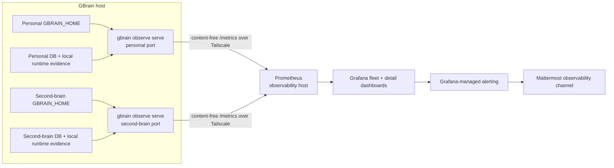
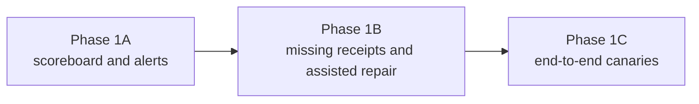

# Establish Operational Truth - Plan

## Goal Capsule

- **Objective:** Give the operator one reliable Grafana view showing whether every configured brain and every expected recurring GBrain activity is working, with Mattermost notification when a sustained failure occurs.
- **First delivery:** Phase 1A is an operational scoreboard built from existing GBrain evidence. It does not require synthetic transactions, a new canary framework, or a new general monitoring agent.
- **Architecture boundary:** GBrain owns the operational meaning and emits a content-free snapshot. Prometheus transports and retains metrics; Grafana displays them; Grafana-managed alerting notifies.
- **Deployment:** One native GBrain observer process runs per brain on the GBrain host. Prometheus and Grafana remain on the observability host and are provisioned through the deployment-local observability repository.
- **Stop conditions:** Stop if metrics expose knowledge content or credentials, a collector bypasses GBrain domain services with duplicated SQL, one observer can access multiple protected brains, or Grafana/Prometheus starts defining health independently of GBrain.

---

## Product Contract

### Summary

Phase 1A adds a native, read-only operational projection to GBrain. It answers whether the brain is reachable, registered sources are healthy, enabled recurring work happened, queues are progressing, Dream phases completed, embeddings are ready, and configured content-processing paths are current.

The first release intentionally reports existing truth. It does not attempt automatic repair. Missing evidence is shown as `unknown` with an actionable reason instead of being inferred as healthy.

### Problem Frame

GBrain already stores most of the evidence needed to determine whether it is operating:

- `gbrain status --json` reports build, source sync, recent cycles, research backlog, locks, supervisor history, queues, and autopilot state.
- `src/core/source-health.ts` computes batched source, queue, and embedding coverage metrics.
- `minion_jobs` records scheduled and asynchronous work, attempts, progress, outcomes, and failures.
- Dream and autopilot persist job and phase results.
- Build receipts, embedding identity, and search telemetry describe the deployed and retrieval paths.
- Doctor contains valuable diagnostics and repair guidance.

These surfaces do not yet answer “did every activity that was supposed to run actually run?” They also do not project a stable fleet status into the homelab observability stack. As a result, a stopped Dream cycle, stale source, embedding backlog, or failed custom enrichment is often discovered only when someone manually runs Doctor.

The implementation must extend GBrain rather than create a second health model beside it. The observer will call GBrain collectors and domain services. Prometheus will scrape their result; it will not query the brain database.

Product Contract preservation: R16-R18 remain authoritative. Phase 1A narrows the first delivery to visibility and alerts over existing evidence. End-to-end canaries remain required follow-up work after the scoreboard earns trust.

### Actors

- A5. Knowledge operator: opens the fleet dashboard, sees what is late or broken, and follows repair guidance.
- A6. Enrichment worker: records durable Minion, Dream, source, or processor outcomes.
- A7. GBrain observer: a native GBrain process scoped to one `GBRAIN_HOME` and one brain credential that computes and exposes the operational snapshot.
- A9. Homelab observability stack: Prometheus scrapes content-free metrics; Grafana displays and alerts without reading brain data.

### Requirements

#### Operational truth inside GBrain

- R16. GBrain must expose machine-readable operational state for sources, Minion work, Dream cycles and phases, embeddings, retrieval evidence, and configured enrichment or content-processing activities.
- R20. GBrain must derive a bounded expected-work registry from registered `IngestionSource` instances, the active pack’s enabled Dream phases, scheduled Minion work, and explicit configuration only where an existing runtime registration cannot express cadence.
- R21. Each expected-work entry must have a stable key, enabled/required state, criticality, expected cadence, grace period, evidence adapter, optional backlog thresholds, alert policy, and repair guidance.
- R22. Each configured work item must report current state, last attempt, last success, next due time, backlog count, oldest pending age, recent failure count, and one bounded reason when that field applies.
- R23. `healthy`, `degraded`, `failed`, `unknown`, and `disabled` must mean the same thing in GBrain JSON, OpenMetrics, dashboards, and alerts.
- R24. Doctor checks may supply evidence and repair guidance, but Doctor category scores and the aggregate brain score must not define operational state.
- R25. An expected item with no supported evidence must report `unknown` with `instrumentation_missing`; absence of evidence must never be healthy.

#### Fleet visibility and notifications

- R17. Grafana must provide a fleet overview and per-brain drill-down, while exported telemetry excludes knowledge content, source URLs, credentials, prompts, responses, and raw errors.
- R26. Each brain must run an independently configured native GBrain observer; no observer may load credentials for another hard-boundary brain.
- R27. Prometheus on the observability host must scrape each observer over the tailnet and retain only bounded, content-free time series.
- R28. Grafana-managed alerting must notify the existing Mattermost observability route for missed cadence, repeated failure, stalled/dead work, growing backlog, embedding mismatch, or missing observer after configured hold periods.
- R29. Dashboard state must remain visible during planned maintenance even when notifications are suppressed.

#### Sources and recurring enhancement

- R30. Every registered source must appear through the same source-health contract, without source-specific monitoring code in GBrain core.
- R31. Every enabled Dream phase, scheduled Minion activity, and registered content processor that already records a source checkpoint, Minion job, phase result, or retrieval receipt must appear through the same expected-work contract.
- R32. A current process that records no durable GBrain evidence must appear as unobservable and receive a follow-up instrumentation task; Grafana, n8n, and shell scripts must not become competing reasoning-state stores.

#### Deferred proof

- R18. Every critical end-to-end capability must eventually have a repeatable deployed-path canary.
- R33. Synthetic transactions, mutation policies, canary receipt storage, and fault injection are deferred to Phase 1C and do not block the Phase 1A scoreboard.

### Key Flow

- F4. Continuous operational assurance
  - **Trigger:** The observer refresh interval elapses or Prometheus scrapes an observer.
  - **Actors:** A5, A6, A7, A9
  - **Steps:** The per-brain observer loads that brain’s expected-work registry; GBrain collectors read existing domain evidence; GBrain produces one content-free snapshot; the observer exposes OpenMetrics; Prometheus scrapes it; Grafana renders fleet and detail views; sustained actionable states notify Mattermost.
  - **Outcome:** The operator can identify the affected brain, activity, stage, backlog, age, and repair path without manually running Doctor or exposing knowledge content.
  - **Covered by:** R16-R17, R20-R32

### Acceptance Examples

- AE5. **Covers R16-R17, R20-R32.** Given a required Dream cycle or exact Minion job has no successful run inside its cadence and grace window, the affected work item becomes failed, the brain becomes degraded or failed according to criticality, Grafana shows its last attempt and backlog, and one Mattermost alert links to repair guidance.
- AE6. **Covers R18, R33.** Semantic end-to-end canary proof remains visibly unavailable until Phase 1C; healthy database and embedding component metrics do not claim that the canary passed.
- AE7. **Covers R17, R26-R29.** Given the second-brain observer stops, Prometheus reports only that brain as unavailable, the personal brain remains visible, and no database credential or protected content crosses the boundary.
- AE8. **Covers R30-R32.** Given a registered source remains healthy but one enabled Dream enhancement stops, the dashboard shows source intake as current and that enhancement as late instead of collapsing the entire source-to-knowledge path into one healthy pipeline.
- AE9. **Covers R22, R30-R32.** Given a transcript processor is configured but has no durable GBrain receipt, the dashboard reports `unknown / instrumentation_missing` and identifies instrumentation as the next action rather than silently omitting the processor.

### Success Criteria

- One Grafana fleet dashboard shows every configured brain and expected recurring work item.
- Every work item shows state, last success, next due, and relevant backlog/failure evidence.
- Personal and second-brain observers run independently and can fail independently.
- Missed schedules, failed jobs, stalled backlogs, embedding problems, and missing observers produce bounded Mattermost alerts.
- Registered sources and recurring enhancements appear through generic GBrain contracts rather than workflow-specific monitoring code.
- No dashboard query or Prometheus rule contains GBrain database SQL or reimplements state calculation.
- No knowledge body, prompt, response, source URL, job payload, credential, or raw error is exported.

### Scope Boundaries

#### Included in Phase 1A

- Native expected-work registry, capability snapshot, and bounded state semantics.
- Adapters over existing GBrain status, source, Minion, Dream, embedding, retrieval, and host-local evidence.
- Native per-brain OpenMetrics observer endpoint.
- Personal and second-brain production observer deployment.
- Grafana fleet and brain-detail dashboards on the observability host.
- Grafana-managed Mattermost alerts and short repair runbooks.
- Backlog and “needs attention” panels that support manual brain destashing.
- Automatic discovery of registered sources and enabled recurring work, plus explicit `instrumentation_missing` results for legacy paths outside those contracts.

#### Deferred to Phase 1B

- A first-class processing receipt contract for external processors that cannot use an existing source, Minion, Dream, embedding, or retrieval receipt.
- Database-authoritative worker leases if current queue progress, supervisor state, and schedule evidence cannot distinguish a required idle worker from a missing worker.
- Assisted repair and controlled backlog-drain actions.
- Additional Loki logs or OpenTelemetry traces for cross-process investigation.

#### Deferred to Phase 1C

- Synthetic transactions and end-to-end canary fixtures.
- Canary mutation policies, isolated synthetic sources, cleanup receipts, and fault injection.
- Retrieval proof that semantic ranking contributed to a known result.
- Long-term SLOs and error budgets.

#### Outside This Product's Identity

- Grafana or Prometheus as the knowledge or reasoning system of record.
- A universal observer credential spanning multiple protected brains.
- Raw database queries or Doctor-score formulas embedded in dashboards.
- Automatic deletion or cleanup merely because an item appears on the destash view.
- Treating process existence, HTTP 200, or an aggregate score as proof that expected work completed.

---

## Planning Contract

### Key Technical Decisions

- KTD1. **GBrain owns state calculation.** (session-settled: user-approved — chosen over an external monitoring agent interpreting database tables: the system must use GBrain as a runtime, not merely as storage.) Collectors and the expected-work evaluator live in GBrain. External systems consume the resulting snapshot only.
- KTD2. **The observer is a native GBrain process, not a separate brain-aware agent.** (session-settled: user-approved — chosen over adding a custom database-polling service: the first delivery should be unobtrusive and reuse GBrain’s configuration and evidence.) Each process starts with one `GBRAIN_HOME`, loads one brain configuration, computes snapshots through GBrain services, opens database work in read-only sessions, and exposes only read-only health and metrics endpoints.
- KTD3. **Prometheus directly scrapes per-brain observers over Tailscale.** This matches the existing central Prometheus model on the observability host and avoids adding Pushgateway, remote-write, or a Mac-specific metrics relay. Each observer binds only to the configured tailnet address and a distinct port.
- KTD4. **Expected work is discovered from GBrain registrations first.** `IngestionSource` registrations supply source identity and health; the active pack supplies enabled Dream phases; the scheduler and Minion registry supply recurring jobs and cadence. Per-brain configuration may override criticality, cadence, grace, or thresholds and may describe a legacy external path, but it does not manually duplicate normal GBrain registrations. Grafana never decides what “late” means.
- KTD5. **Reuse evidence owners before adding persistence.** `status`, source health, `minion_jobs`, Dream results, build receipts, embedding identity, search telemetry, and brain-isolated supervisor/autopilot files remain authoritative. Phase 1A adds a normalization layer, not duplicate SQL or new receipt tables.
- KTD6. **Use aggregate state plus work-item detail, not a new score.** A brain rolls up required items deterministically, while Grafana retains each item’s individual state and reason. Doctor’s score remains an interactive heuristic and is not exported as operational truth.
- KTD7. **Use Prometheus/OpenMetrics now; reserve OpenTelemetry for traces.** Scheduled-state gauges fit the existing Prometheus/Grafana stack. Logs may later go to Loki and execution traces to Tempo through Alloy, but neither is required to answer whether expected work ran.
- KTD8. **Destash begins with visibility, not mutation.** The dashboard exposes stale sources, unembedded chunks, dead/failed jobs, pending facts, extraction lag, and custom processor backlogs. Repair or deletion remains an explicit operator action.
- KTD9. **Canaries remain important but do not gate first value.** Component and receipt evidence provide the initial scoreboard. Phase 1C adds end-to-end proof where those signals cannot establish user-visible behavior, especially semantic retrieval.
- KTD10. **Generic runtime contracts live in the managed fork; domain integrations use extension seams.** The observer, operational snapshot, source/pass discovery, and metric contract are maintained GBrain runtime capabilities. A particular intake source, content processor, or domain enhancement belongs in a plugin, skillpack, or integration package loaded through GBrain’s supported contracts rather than a source-specific branch in observability core.

### High-Level Technical Design

The observer has two integration surfaces:

1. **Inside GBrain:** configuration, engine connection, status services, evidence collectors, expected-work evaluation, state rollup, JSON, and OpenMetrics rendering.
2. **Outside GBrain:** OS service supervision, Prometheus scrape configuration, Grafana provisioning, alert delivery, and time-series retention.

Prometheus never receives database credentials. The observer process is the only monitoring component that opens a brain connection, and it does so through the same GBrain engine/configuration path as the CLI.

### Code Ownership and Upgrade Boundary

| Location | Owns | Upgrade behavior |
|---|---|---|
| Managed GBrain fork | Generic source/pass discovery, expected-work evaluation, operational snapshots, `gbrain observe`, and OpenMetrics | Upstream releases are merged into the fork and verified; the deployed runtime is built from the fork rather than overwritten by a vanilla upstream install. |
| GBrain plugins and skillpacks | Particular source adapters, processors, and domain-specific enhancement definitions | Loaded through existing `IngestionSource`, pack-phase, and Minion extension seams; they can evolve without editing observability core. |
| Per-brain `GBRAIN_HOME` | Enabled plugins/packs, schedules, policy overrides, brain identity, and credentials | Private deployment state survives code upgrades and remains separate for each hard-boundary brain. |
| Deployment-local observability repository | Prometheus targets, Grafana dashboards, alert rules, and Mattermost routing | Deployed independently through the existing Ansible-managed observability stack. |

The managed fork is intentionally responsible for the reusable capability. Keeping all observability outside GBrain would recreate GBrain’s state model elsewhere. Keeping source-specific logic in core would make upstream integration unnecessarily conflict-prone. The split above preserves both runtime ownership and upgradeability.

### Reused Evidence and New GBrain Work

| Area | Reuse | Add in Phase 1A |
|---|---|---|
| Build/runtime | `src/core/build-identity.ts`, existing status build receipt | Stable observer and brain identity projection |
| Sources/intake | `src/core/ingestion/types.ts`, ingestion daemon health, `src/core/source-health.ts`, sync status | Generic source observation for every registered `IngestionSource` |
| Minions | handler/scheduler registration, `minion_jobs`, queue statistics, stalled/dead detection | Recurring-work discovery and missed-schedule evaluation |
| Dream enhancements | active pack `phases`, `src/commands/status.ts` cycle snapshot, persisted phase results | Per-enabled-phase expected-work entries and phase-aware state |
| Embeddings | source coverage, embedding configuration and identity | Readiness state and backlog thresholds |
| Retrieval | existing embedding identity and search telemetry | Component-level retrieval state; canary result remains unavailable |
| Doctor | selected pure diagnostic helpers and remediation text | Bounded reason-to-runbook mapping; no score reuse |
| Host processes | brain-isolated worker registry, supervisor audit, autopilot PID | Freshness mapping and observer self-status |
| Fleet UI | existing Prometheus, Grafana, and Mattermost route in the deployment-local observability repository | GBrain scrape targets, dashboards, recording/alert rules |

### State Semantics

| State | Meaning |
|---|---|
| `healthy` | Fresh evidence proves the expected work completed and relevant backlog is within policy. |
| `degraded` | Work is late within its failure grace, failing intermittently, or accumulating concerning backlog. |
| `failed` | A required deadline was missed, a blocking failure occurred, or backlog exceeded its failure threshold. |
| `unknown` | Evidence is unavailable, stale beyond interpretation, unsupported, or not instrumented. |
| `disabled` | The brain configuration explicitly says the work is not expected. |

Required item rollup is deterministic: any required failed item yields failed; otherwise any required unknown item yields unknown; otherwise any degraded item yields degraded; otherwise all required items healthy yields healthy. Disabled optional items do not affect the rollup.

### Metric Contract

The initial bounded metric families are:

- `gbrain_observer_info{brain,build}`
- `gbrain_observer_snapshot_timestamp_seconds{brain}`
- `gbrain_brain_state{brain,state}`
- `gbrain_expected_work_state{brain,work,state}`
- `gbrain_expected_work_last_attempt_timestamp_seconds{brain,work}`
- `gbrain_expected_work_last_success_timestamp_seconds{brain,work}`
- `gbrain_expected_work_next_due_timestamp_seconds{brain,work}`
- `gbrain_expected_work_backlog_items{brain,work}`
- `gbrain_expected_work_oldest_pending_age_seconds{brain,work}`
- `gbrain_expected_work_recent_failures{brain,work}`
- `gbrain_expected_work_reason{brain,work,reason}`

`brain`, `work`, `state`, and `reason` come from bounded registries. Raw job IDs, source URLs, slugs, paths, errors, model responses, and payloads are prohibited labels.

### Phase Sequence

Phase 1A is complete when the operator no longer needs to ask an assistant to discover routine operational failures. Phase 1B fills evidence gaps surfaced by the dashboard. Phase 1C proves paths that cannot be established from component and durable-work evidence alone.

---

## Implementation Units

The U-ID gaps preserve stable identifiers from the earlier revision: former U2 moved to Phase 1B, while former U5-U6 moved to Phase 1C.

### U1. Define expected work and operational snapshots

- **Goal:** Give GBrain one stable contract for what should run and how its evidence becomes operational state.
- **Requirements:** R16, R20-R25, R30-R32; KTD1, KTD4-KTD6
- **Dependencies:** Accepted Phase 0 runtime baseline
- **Files:**
  - GBrain create: `src/core/observability/types.ts`
  - GBrain create: `src/core/observability/expected-work.ts`
  - GBrain create: `src/core/observability/reason-codes.ts`
  - GBrain create: `src/core/observability/rollup.ts`
  - GBrain create: `src/core/observability/snapshot.ts`
  - GBrain modify: `src/core/config.ts`
  - GBrain modify: `src/commands/status.ts`
  - GBrain test: `test/observability/expected-work.test.ts`
  - GBrain test: `test/observability/rollup.test.ts`
  - GBrain test: `test/status-sections.test.ts`
- **Approach:**
  1. Build the registry from loaded `IngestionSource` declarations, active-pack Dream phases, and scheduled Minion definitions.
  2. Keep default cadence and policy beside the scheduler or runtime registration that owns it; allow per-brain file-plane overrides without storing credentials or knowledge.
  3. Add an additive `operational` section to status JSON while preserving existing schema-v1 fields.
  4. Keep state and reason registries exhaustive so dashboards cannot invent new semantics.
- **Test Scenarios:**
  - A required daily item with a fresh success is healthy and reports its next due time.
  - A missing success inside grace is degraded; after grace it is failed.
  - An enabled item with no registered evidence adapter is unknown with `instrumentation_missing`.
  - An explicitly disabled item is disabled and does not degrade the brain.
  - Snapshot serialization rejects private fields and unregistered identifiers.
  - Existing status JSON consumers continue reading legacy sections.
- **Verification:** Focused contract tests pass and a golden snapshot contains every configured item with no knowledge or credential fields.

### U3. Adapt existing GBrain evidence

- **Goal:** Produce expected-work observations by reusing current evidence owners.
- **Requirements:** R16, R21-R25, R30-R32; KTD1, KTD5
- **Dependencies:** U1
- **Files:**
  - GBrain create: `src/core/observability/collectors/ingestion-source.ts`
  - GBrain create: `src/core/observability/collectors/minion-job.ts`
  - GBrain create: `src/core/observability/collectors/dream-phase.ts`
  - GBrain create: `src/core/observability/collectors/embedding.ts`
  - GBrain create: `src/core/observability/collectors/retrieval.ts`
  - GBrain create: `src/core/observability/collectors/local-runtime.ts`
  - GBrain create: `src/core/observability/collectors/index.ts`
  - GBrain modify: `src/core/source-health.ts`
  - GBrain modify: `src/core/search/embedding-identity.ts`
  - GBrain modify: `src/commands/status.ts`
  - GBrain test: `test/observability/collectors/*.test.ts`
  - GBrain test: `test/e2e/operational-snapshot-postgres.test.ts`
- **Approach:**
  1. Extract or call reusable reads from current modules; do not copy SQL into an observer-specific layer.
  2. Evaluate exact source instances, Minion job names, and Dream phase scopes so one successful activity cannot mask another late activity.
  3. Provide bounded adapter definitions and fixtures for registered sources, enabled pack phases, scheduled Minion work, facts, links, embeddings, and registered content processors; U9 verifies the live per-brain discovery result.
  4. Represent processors without durable evidence as unknown and record the smallest follow-up instrumentation seam.
- **Test Scenarios:**
  - A registered source remains healthy while a late enabled `extract_atoms` phase fails only that enhancement.
  - A completed Dream job with a failed required phase is not healthy.
  - Dead, stalled, and old waiting jobs affect only their configured work item.
  - A quiet caught-up source remains healthy.
  - Embedding identity mismatch fails even when coverage is complete.
  - Missing local supervisor evidence is unknown rather than healthy.
  - Concurrent queue activity produces a self-consistent bounded snapshot.
- **Verification:** Focused unit tests and one real-Postgres integration test prove all configured adapter types, with no duplicate database query ownership.

### U4. Expose a native per-brain Prometheus endpoint

- **Goal:** Let central Prometheus scrape GBrain-owned operational truth without a separate database-polling agent.
- **Requirements:** R17, R26-R27; KTD2-KTD3, KTD7
- **Dependencies:** U1, U3
- **Files:**
  - GBrain create: `src/core/observability/openmetrics.ts`
  - GBrain create: `src/core/observability/observer-server.ts`
  - GBrain create: `src/commands/observe.ts`
  - GBrain modify: `src/cli.ts`
  - GBrain create: `docs/guides/observability-operator.md`
  - GBrain test: `test/observability/openmetrics.test.ts`
  - GBrain test: `test/observability/observer-server.test.ts`
- **Approach:**
  1. Add a native `gbrain observe serve` command that loads one `GBRAIN_HOME`, forces read-only database sessions, refreshes a cached snapshot on a bounded interval, and exposes only health and OpenMetrics read endpoints.
  2. Reuse the CLI’s probe-only engine connection so observer startup never applies migrations; verify the supported schema version and report `unknown / schema_incompatible` when an operator must upgrade the brain.
  3. Bind to an explicitly configured Tailscale address and per-brain port; reject wildcard/public binding by default.
  4. Export observer generation time so Prometheus detects a process that is reachable but no longer refreshing.
  5. Keep request handling input-free and prevent metrics requests from triggering unbounded Doctor work or mutations.
- **Test Scenarios:**
  - Two observers with different `GBRAIN_HOME` values expose different opaque brain identities and cannot load each other’s configuration.
  - An unavailable database yields unknown/stale metrics without leaking its URL or replacing state with healthy.
  - A pending or incompatible schema is reported without the observer attempting migration.
  - A slow collector times out and preserves honest partial/unknown state.
  - Unknown labels, newlines, high-cardinality values, and prohibited fields are rejected.
  - Public/wildcard binding requires an explicit unsafe override and is absent from production configuration.
  - Repeated scrapes return cached snapshots and do not rerun expensive collection.
- **Verification:** Golden OpenMetrics parses with the pinned Prometheus tooling, endpoint tests prove brain isolation, and content scanning finds no prohibited data.

### U7. Provision the fleet dashboard on the observability host

- **Goal:** Make the scoreboard visible in the existing Grafana instance.
- **Requirements:** R17, R22, R27, R30; KTD3, KTD6, KTD8
- **Dependencies:** U4
- **Files:**
  - Observability deployment repository modify: `roles/plg-stack/templates/prometheus.yml.j2`
  - Observability deployment repository create: `roles/plg-stack/templates/dashboards/gbrain-operations.json`
  - Observability deployment repository modify: `roles/plg-stack/tasks/main.yml`
  - Observability deployment repository test: `roles/plg-stack/tests/baseline.yml`
  - Observability deployment repository create: `roles/plg-stack/tests/gbrain.yml`
- **Approach:**
  1. Add private static scrape targets for the personal and second-brain observer ports over Tailscale.
  2. Provision a fleet landing dashboard with brain state, observer freshness, and each expected work item.
  3. Group per-brain drill-down by registered sources, enabled enhancements, infrastructure, and backlogs while retaining last success, next due, oldest pending age, recent failures, and reason/runbook.
  4. Add a “Needs attention / destash” section without write controls.
- **Test Scenarios:**
  - Personal healthy and second-brain failed render independently.
  - Unknown, disabled, degraded, failed, and stale-observer states are visually distinct.
  - Registered sources and enabled Dream, Minion, embedding, link, fact, and content-processing work appear from generic registrations rather than a dashboard allowlist.
  - Empty, partial, and newly configured brains render without query errors.
  - Dashboard JSON contains no real database URL, credential, source URL, or knowledge field.
- **Verification:** Ansible renders valid Prometheus and Grafana configuration; Grafana at the deployment-local observability URL loads the provisioned dashboard and both initial targets.

### U8. Add Mattermost alerts and repair guidance

- **Goal:** Notify the operator about sustained actionable failures without alert noise.
- **Requirements:** R17, R28-R29; KTD6-KTD8
- **Dependencies:** U7
- **Files:**
  - Observability deployment repository modify: `roles/plg-stack/templates/alerting/rules.yml.j2`
  - Observability deployment repository modify: `roles/plg-stack/templates/alerting/policies.yml.j2`
  - Observability deployment repository test: `roles/plg-stack/tests/alerts.yml`
  - GBrain create: `docs/runbooks/observability/observer-missing.md`
  - GBrain create: `docs/runbooks/observability/missed-work.md`
  - GBrain create: `docs/runbooks/observability/backlog.md`
  - GBrain create: `docs/runbooks/observability/embedding.md`
- **Approach:** Alert on observer absence, failed required work, sustained unknown, dead/stalled work, growing backlog, and embedding mismatch. Use existing Grafana-managed alerting and Mattermost contact point. Keep cadence and failure semantics in GBrain metrics; alert rules apply only hold periods, routing, and maintenance suppression.
- **Test Scenarios:**
  - A missed required cadence fires once after its hold period and resolves on success.
  - Observer absence alerts without duplicating every work-item alert.
  - Planned maintenance suppresses notification but dashboard state remains unchanged.
  - Multiple failures for one brain group into a bounded Mattermost notification.
  - Every notification names only opaque brain/work identifiers and links to an existing runbook.
- **Verification:** Provisioning tests prove pending, firing, grouped, suppressed, and resolved states through the existing `mattermost-observability` contact point backed by `vault_mattermost_observability_webhook_url`; Phase 1A introduces no notification credential.

### U9. Deploy and accept Phase 1A

- **Goal:** Put the scoreboard into daily use for personal and second brains.
- **Requirements:** R16-R17, R20-R32; AE5, AE7-AE9
- **Dependencies:** U1, U3, U4, U7, U8
- **Files:**
  - GBrain modify: `docs/guides/observability-operator.md`
  - GBrain create: `docs/operations/phase-1a-observability-acceptance.md`
  - GBrain create: `ops/launchd/ai.gbrain.observer.plist.template`
  - GBrain test: `test/observability/deployment-contract.test.ts`
- **Approach:**
  1. Compare GBrain’s discovered sources and recurring work for the personal and second brains with the actual deployed schedules; add configuration only for overrides or legacy paths that cannot yet register themselves.
  2. Deploy one launchd-supervised native observer per brain with separate `GBRAIN_HOME`, credentials, ports, and logs.
  3. Deploy the homelab scrape targets, dashboard, and alerts.
  4. Run live smoke and failure/recovery checks and repair configuration or instrumentation gaps; do not add canary infrastructure during acceptance.
- **Test Scenarios:**
  - Stopping one observer affects only its brain.
  - Pausing a safe test schedule or seeding a failed test job produces the expected dashboard state and one alert.
  - Backlog and missing-instrumentation panels match the underlying GBrain status evidence.
  - Restarting Prometheus, Grafana, or an observer preserves honest stale/unknown transitions.
  - A content scan of metrics, dashboards, alerts, and acceptance notes finds no protected material.
- **Verification:** Both brains are visible and current, known safe failure demonstrations alert and recover, and every expected recurring activity is either observed or explicitly marked with an instrumentation follow-up.

---

## Verification Contract

| Gate | Applies to | Done signal |
|---|---|---|
| Type safety | GBrain U1, U3, U4, U9 | `bun run typecheck` passes |
| Focused behavior | GBrain U1, U3, U4 | Observability, status, source-health, queue, Dream, and embedding test cohorts pass |
| Real database seam | GBrain U3 | The focused Postgres operational-snapshot test passes without running the memory-heavy full E2E suite |
| Repository guards | GBrain changed surfaces | `bun run verify` and affected generated-reference guards pass |
| Metrics validity | GBrain U4 | Golden exposition parses and respects the bounded-series/content contract |
| Observability configuration | Observability deployment repository U7-U8 | Ansible templates render; Prometheus, Grafana dashboard, and alert provisioning tests pass |
| Deployed smoke | U9 | Prometheus sees both observers; Grafana renders both brains; Mattermost receives and resolves one safe test alert |
| Live acceptance | U9 | Current observers, no unexplained missed expected work, no cross-brain effect, and no sensitive telemetry |

Full repository E2E is not a Phase 1A default gate. It is reserved for changes that touch shared database migrations, engine behavior, or release policy and must use the existing memory-bounded execution policy.

---

## Definition of Done

- U1 is done when GBrain has one expected-work registry and one operational snapshot contract.
- U3 is done when current GBrain evidence covers registered sources and recurring work without source-specific monitoring code or observer-specific SQL.
- U4 is done when independently scoped native observers expose valid content-free metrics over Tailscale.
- U7 is done when the existing Grafana on the observability host shows fleet and detail status for the personal and second brains.
- U8 is done when sustained failures notify the existing Mattermost observability route and recover cleanly.
- U9 is done when live acceptance proves every expected activity is observed or visibly lacks instrumentation.
- Phase 1A does not claim semantic end-to-end proof; Phase 1C remains the owner of that acceptance.
- Experimental collectors, duplicate queries, unused dashboard panels, real credentials, and abandoned deployment files are absent from the final changes.

---

## Sources

- `docs/brainstorms/2026-07-22-001-gbrain-knowledge-runtime-requirements.md`
- `docs/roadmaps/2026-07-22-001-gbrain-knowledge-runtime-roadmap.md`
- `docs/operations/managed-fork-integration-report.md`
- `src/commands/status.ts`
- `src/core/source-health.ts`
- `src/core/minions/queue.ts`
- `src/core/minions/worker-registry.ts`
- `src/core/build-identity.ts`
- `src/core/search/embedding-identity.ts`
- `src/core/search/telemetry.ts`
- Observability deployment repository: `docs/solutions/architecture-patterns/shared-grafana-observability-platform-alloy-tailscale-authentik-2026-07-11.md`
- Observability deployment repository: `roles/plg-stack/templates/prometheus.yml.j2`
- Observability deployment repository: `roles/plg-stack/templates/alerting/rules.yml.j2`
