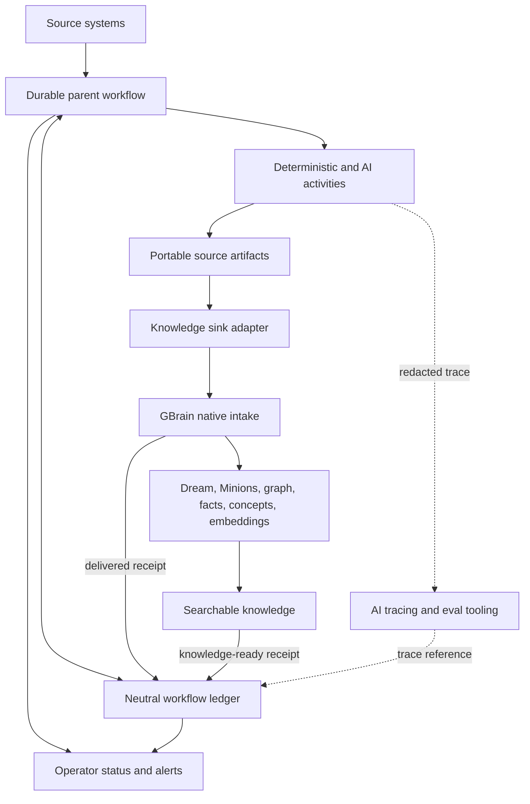

# Portable Knowledge Workflows - Plan

## Goal Capsule

- **Objective:** Establish a knowledge-first workflow architecture that makes every intake item visible from capture through searchable knowledge while keeping source processing portable across knowledge stores.
- **Product authority:** The operator prioritizes end-to-end visibility first, easy addition of intake sources second, replaceable storage third, and measurable AI quality fourth.
- **Open blockers:** None before technical planning. Implementation details listed under Outstanding Questions may be resolved during planning.

---

## Product Contract

### Summary

Create durable, observable workflows that turn many kinds of source material into portable source artifacts and then hand admitted evidence to a knowledge sink.
GBrain remains the first knowledge sink and owns knowledge-native enrichment, while the workflow and its history remain useful if the sink changes.

### Problem Frame

The current bookmark and email paths expose a repeated architectural problem.
Useful work is distributed across collectors, filesystem queues, n8n executions, GBrain receipts, generated pages, model traces, and manual actions.
An operator can inspect each component, but cannot ask one system where an item is, what happened to it, or why it failed.

The same source-to-knowledge sequence is currently expressed differently for bookmarks, video, email, and attachments.
Adding another source risks creating another special-purpose pipeline with its own statuses, retries, and observability.
Earlier bookmark work also moved source-specific behavior into GBrain to gain native Dream processing, making the boundary between portable acquisition and knowledge-native enrichment difficult to see.

### Key Decisions

- **Use a knowledge-first foundation that can later support broader automation.** (session-settled: user-directed — chosen over knowledge-only and all-automation scopes: preserve future reuse without designing a general personal automation platform now.) Governs R1, R18.
- **Produce source artifacts before durable knowledge.** (session-settled: user-directed — chosen over evidence-only and finished-knowledge handoffs: transcripts, OCR, and normalized evidence should remain portable while GBrain owns cross-source knowledge.) Governs R6-R9.
- **Separate delivery from knowledge readiness.** (session-settled: user-directed — chosen over a single completion event: intake acceptance and searchable enrichment fail and recover independently.) Governs R3-R5.
- **Favor automatic usefulness over preventive review.** (session-settled: user-directed — chosen over review-first and policy-constrained promotion: this single-operator system should capture useful material first and add controls after observed problems.) Governs R10-R13.
- **Keep one neutral workflow ledger.** (session-settled: user-directed — chosen over per-brain ledgers and n8n-only history: end-to-end visibility must cross sources and sinks without copying raw content.) Governs R1-R5, R14.
- **Treat AI frameworks as activity implementations.** (session-settled: user-approved — chosen over making an agent framework the parent workflow engine: durable workflow ownership stays stable while individual AI activities may evolve.) Governs R15-R17.
- **Trace metadata and redacted content by default.** (session-settled: user-directed — chosen over full-content and brain-specific tracing: debugging and eval construction should link to source authorities rather than create another raw-content store.) Governs R14-R17.
- **Optimize tradeoffs for visibility, then extensibility.** (session-settled: user-directed — chosen from visibility, new-source reuse, sink replacement, and AI quality: all remain requirements, but visibility and reuse govern conflicts.) Governs R1, R2, R18.

### Architecture Boundary

Raw source content remains in its authoritative source system.
The neutral ledger is authoritative only for workflow identity, state, decisions, and outcomes.
GBrain is authoritative for admitted durable knowledge and its derived retrieval structures.
AI tracing systems are diagnostic surfaces rather than workflow or content authorities.

### Actors

- A1. **Operator:** Inspects status, receives actionable alerts, corrects routing, and uses the resulting knowledge.
- A2. **Source system:** Preserves raw source material and exposes a stable reference to it.
- A3. **Parent orchestrator:** Coordinates activities, durable waits, retries, branching, and handoffs.
- A4. **Activity implementation:** Performs one bounded capability such as collection, classification, OCR, transcription, or agentic research.
- A5. **Workflow ledger:** Records portable end-to-end state and outcome metadata across all workflows and brains.
- A6. **Knowledge sink:** Admits evidence and returns delivery and readiness receipts.
- A7. **AI observability system:** Stores redacted traces, evaluation runs, and diagnostic metadata for AI activities.

### Requirements

**Visibility and durable state**

- R1. Every intake item must receive a stable workflow identity that correlates source records, activities, sink receipts, traces, and resulting knowledge artifacts.
- R2. The operator must be able to see an item's current stage, last meaningful outcome, target brain, failure state, and resulting artifact without inspecting each participating system.
- R3. Workflow status must distinguish evidence accepted by a knowledge sink as `delivered` from required knowledge processing becoming `knowledge_ready`.
- R4. A failure after `delivered` must remain visible and recoverable without repeating successful acquisition, OCR, transcription, or other source work.
- R5. Retries and repeated delivery must preserve one logical workflow history rather than creating duplicate outcomes.

**Portable workflow boundary**

- R6. Source workflows may produce deterministic or source-specific artifacts such as normalized evidence, OCR text, media metadata, and transcripts.
- R7. Portable source artifacts must preserve provenance and stable references without depending on GBrain page, fact, atom, concept, or embedding structures.
- R8. A knowledge-sink boundary must allow the parent workflow to deliver the same portable evidence to GBrain or a future storage implementation.
- R9. GBrain must own admission, durable knowledge promotion, facts, entities, concepts, Dream enrichment, Minion work, embeddings, graph construction, and retrieval after evidence is accepted.

**Routing and correction**

- R10. Eligible knowledge must promote automatically by default unless an observed safety rule or activity failure prevents it.
- R11. A content classifier may select any configured brain based on what the evidence concerns.
- R12. When classification is uncertain, the item must remain useful by entering the personal brain with a visible ambiguity marker.
- R13. Correcting a brain assignment must move and reprocess the item, supersede the incorrect copy, and record the corrected label as routing feedback.

**Privacy, AI activities, and evaluation**

- R14. The workflow ledger must contain references, decisions, statuses, hashes, versions, and outcomes but no raw source bodies or binary content.
- R15. LangChain, LangGraph, DeepAgents, local models, hosted models, and similar tools may implement bounded activities without becoming required workflow or ledger infrastructure.
- R16. AI activities must expose redacted traces containing enough model, prompt, timing, confidence, reason, source-reference, and outcome metadata to diagnose behavior.
- R17. Routing corrections and adjudicated outcomes must support versioned evaluation datasets that can resolve approved examples from their authoritative source systems.

**Extensibility**

- R18. A new intake source must reuse the workflow identity, activity receipt, source-artifact, knowledge-sink, status, and trace concepts without creating another orchestration architecture.
- R19. The architecture must permit future non-knowledge Accipiter workflows to reuse its contracts without making those workflows part of the current product scope.

### Key Flows

- F1. Source item to portable evidence
  - **Trigger:** A collector detects a new or changed item.
  - **Actors:** A2-A5
  - **Steps:** The parent workflow records its identity, invokes the required deterministic and AI activities, and produces a source artifact with provenance.
  - **Outcome:** The workflow is ready for sink delivery or carries a visible bounded failure.
  - **Covers:** R1, R5-R7, R14-R16.

- F2. Evidence to searchable GBrain knowledge
  - **Trigger:** A source artifact is ready for delivery.
  - **Actors:** A3, A5, A6
  - **Steps:** The GBrain adapter submits evidence, records the `delivered` receipt, observes required native processing, and records `knowledge_ready` with resulting artifact references.
  - **Outcome:** The operator can follow one workflow identity from source to searchable knowledge.
  - **Covers:** R1-R4, R8, R9.

- F3. Automatic brain routing
  - **Trigger:** Evidence is ready for knowledge promotion.
  - **Actors:** A3-A6
  - **Steps:** The classifier selects a brain, automatic promotion proceeds, and uncertain classification routes to personal with an ambiguity marker.
  - **Outcome:** Evidence remains available without creating a blocking review queue.
  - **Covers:** R10-R12.

- F4. Routing correction
  - **Trigger:** The operator identifies an incorrectly routed or ambiguous item.
  - **Actors:** A1, A3, A5, A6
  - **Steps:** The correction is recorded, the personal or incorrect copy is superseded, and the evidence is reprocessed in the selected brain.
  - **Outcome:** Knowledge is filed correctly and the correction becomes eval feedback.
  - **Covers:** R13, R17.

- F5. AI quality improvement
  - **Trigger:** An AI activity is wrong, uncertain, or selected for evaluation.
  - **Actors:** A1, A5, A7
  - **Steps:** Evaluators join ledger outcomes with redacted trace metadata and approved source examples, then compare activity versions on a stable dataset.
  - **Outcome:** Quality changes are measurable without retaining raw private content in every trace.
  - **Covers:** R14-R17.

### Acceptance Examples

- AE1. **Bookmark with attached video**
  - **Covers:** R1-R9, R18.
  - **Given:** A collected bookmark contains a video requiring transcription.
  - **When:** The workflow acquires media, invokes transcription, produces a transcript artifact, and submits it to GBrain.
  - **Then:** One workflow record shows the source, transcription outcome, `delivered` receipt, `knowledge_ready` receipt, and searchable artifact.

- AE2. **Durable finding in email**
  - **Covers:** R1-R11, R14, R18.
  - **Given:** A message remains stored only in the email archive and contains durable company knowledge.
  - **When:** The workflow classifies and promotes a bounded evidence artifact.
  - **Then:** The ledger retains the message reference and decisions without the raw body, and the company brain exposes the admitted knowledge.

- AE3. **Ambiguous domain**
  - **Covers:** R10-R13.
  - **Given:** Evidence plausibly belongs to more than one brain and the classifier is uncertain.
  - **When:** Automatic routing completes.
  - **Then:** The item appears in personal with an ambiguity marker and does not wait in a review queue.

- AE4. **Corrected routing**
  - **Covers:** R13, R17.
  - **Given:** The operator corrects an ambiguous personal item to another brain.
  - **When:** Reclassification is applied.
  - **Then:** The personal copy is superseded, the selected brain processes the evidence, and the corrected label is available to classifier evals.

- AE5. **GBrain enrichment failure**
  - **Covers:** R3-R5.
  - **Given:** GBrain accepts a transcript but a required native enrichment activity fails.
  - **When:** The operator inspects the workflow.
  - **Then:** It remains `delivered` but not `knowledge_ready`, names the failed stage, and can resume without retranscription.

- AE6. **Knowledge sink replacement**
  - **Covers:** R7-R9.
  - **Given:** A different knowledge storage implementation replaces GBrain.
  - **When:** An existing source workflow delivers its portable artifact through the new adapter.
  - **Then:** Source acquisition, activity history, traces, and workflow identity remain valid.

- AE7. **Private AI classification trace**
  - **Covers:** R14-R17.
  - **Given:** An AI classifier processes private source content.
  - **When:** Its trace and outcome are recorded.
  - **Then:** Observability contains safe metadata and source references but not a second raw copy of the source.

### Success Criteria

1. Given a source reference or workflow identity, the operator can determine where the item is, whether it failed, which brain received it, and whether its knowledge is searchable.
2. Bookmark and email processing can be described through the same lifecycle and receipt vocabulary despite using different activities.
3. A future intake source can adopt the shared contracts without adding a new status model or observability mechanism.
4. A knowledge-sink substitution does not invalidate completed source activities or workflow history.
5. A classifier correction can enter a reproducible evaluation dataset without changing global trace privacy to full-content capture.

### Scope Boundaries

**Deferred for later**

- General Accipiter workflows that do not ingest, transform, or promote knowledge.
- Stricter source-to-brain allowlists, mandatory review gates, and domain-specific trace policies if observed failures justify them.
- A comparative selection of n8n, Temporal, Restate, DBOS, or other orchestration engines after concrete requirements exceed the current tool.

**Outside this product's identity**

- A custom general-purpose workflow engine.
- A replacement for source archives such as an email vault or bookmark archive.
- A second raw-content warehouse in the workflow ledger or AI tracing system.
- Reimplementing GBrain's knowledge-native Dream, Minion, graph, embedding, or retrieval mechanisms in the parent workflow.

### Dependencies and Assumptions

- n8n remains the initial parent orchestrator because it is already deployed and supports persisted executions, waits, retries, and visual inspection.
- Existing source systems provide stable references or immutable archived copies suitable for later evaluation.
- GBrain can expose correlation-friendly intake and processing receipts without making its internal queue the parent workflow authority.
- The personal brain is an acceptable fallback for ambiguous content even when the classifier later proves incorrect.
- The central ledger is protected as operationally sensitive because its metadata spans otherwise separate brains.

### Outstanding Questions

**Resolve Before Planning**

- None.

**Deferred to Planning**

- What storage and access surface should implement the neutral ledger while preserving its tool-neutral contract?
- Which shared lifecycle states and activity receipt fields are the minimum needed for the first two workflows?
- How should GBrain publish or expose `knowledge_ready` without coupling the parent workflow to internal table details?
- Which AI activities are simple model calls and which, if any, warrant LangGraph or DeepAgents?
- How should a sink supersede an incorrectly routed artifact while retaining enough audit history to explain the correction?
- What user-facing view should provide fleet status, item drill-down, and actionable alerting?

### Sources and Related Decisions

- `docs/architecture/brains-and-sources.md`
- `docs/architecture/system-of-record.md`
- `docs/architecture/topologies.md`
- `docs/plans/2026-07-12-001-feat-native-bookmark-dream-plan.md`
- `docs/plans/2026-07-13-001-refactor-stabilize-native-research-fork-plan.md`
- `docs/architecture/decisions/0001-portable-parent-workflow-boundary.md`
- `docs/architecture/decisions/0002-neutral-workflow-ledger.md`
- `docs/architecture/decisions/0003-automatic-brain-routing.md`
- `docs/architecture/decisions/0004-ai-activities-tracing-and-evals.md`
