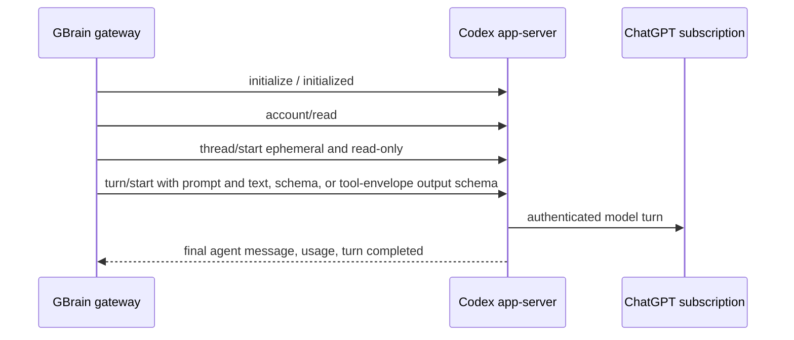

# Codex App Server Provider - Plan

## Goal Capsule

- **Objective:** GBrain uses the host user's existing ChatGPT subscription for reliable reasoning on both personal and work brains.
- **Means:** Replace the OpenCode subscription bridge with a native `codex-app-server` gateway provider (KTD1).
- **Authority:** Requirements govern behavior; KTDs govern implementation; existing brain/source boundaries remain unchanged.
- **Execution profile:** Direct cutover with characterization tests and live verification.
- **Stop conditions:** Do not read or copy Codex credentials. Do not merge the personal and work databases.
- **Tail ownership:** Implementation, tests, documentation, configuration cutover, pull request, and CI.

---

## Product Contract

### Summary

Replace GBrain's custom OpenCode OAuth transport with Codex app-server over local stdio. Codex owns ChatGPT login and refresh. vLLM and embedding routes remain unchanged.

### Problem Frame

OpenCode reports output tokens but returns no visible synthesis text. The database, MCP server, and OAuth access to GBrain are healthy. The broken seam is the subscription-backed model transport.

### Key Decisions

- **Use Codex's ChatGPT login.** (session-settled: user-approved — chosen over API-key billing: the user wants subscription-backed Codex.) Governs R1-R3.
- **Cut over instead of running parallel transports.** (session-settled: user-directed — chosen over staged canaries and rollback machinery: the user requested a simple cutover.) Governs R4, R5.
- **Keep personal and work brains separate.** (session-settled: user-approved — chosen over database consolidation: they are distinct privacy and routing boundaries.) Governs R6.
- **Ship through LFG.** (session-settled: user-directed — chosen over a manual handoff: the user requested implementation and shipping.) Governs R7.

### Requirements

- R1. GBrain must expose `codex-app-server:<model>` through the canonical AI gateway for text, JSON-schema, and GBrain-managed tool-loop generations.
- R2. Codex must own ChatGPT authentication and refresh; GBrain must never read, copy, or log Codex credential data.
- R3. A successful call requires a completed turn with non-empty final assistant text; output-token usage without final text is an error.
- R4. The OpenCode provider, adapter, configuration fields, and documentation must be removed in the same change.
- R5. Existing OpenCode and paid-API model references must migrate to Codex app-server, while self-hosted Skippy and embedding routes remain unchanged.
- R6. Personal and work brains must keep separate databases and model configuration while sharing the host's Codex login.
- R7. The cutover must include focused protocol/provider tests, repository verification, a live authenticated synthesis test, documentation, and a merge-ready pull request.

### Acceptance Examples

- AE1. **Covers R1-R3.** Given a host logged into Codex with ChatGPT, when `gbrain think` uses a Codex app-server model, then it returns the completed final answer without any API key in GBrain.
- AE2. **Covers R3.** Given a completed turn with output usage but no final assistant text, then GBrain reports a provider error instead of successful empty synthesis.
- AE3. **Covers R4, R5.** Given the shipped cutover, then no OpenCode provider remains, text/reasoning/tool-loop routes resolve to Codex, and existing self-hosted Skippy routes are unchanged.
- AE4. **Covers R6.** Given personal and work calls, then each uses its own database/configuration and neither provider call carries a mutable brain identity.

### Scope Boundaries

- In scope: Codex stdio protocol client, gateway recipe/adapter, config/model migration, OpenCode removal, docs, tests, and live cutover.
- Out of scope: database consolidation, exposing app-server over the network, or changing vLLM/embedding infrastructure.

---

## Planning Contract

### Key Technical Decisions

- KTD1. **Use a first-class gateway recipe and AI SDK language-model adapter.** (session-settled: user-directed — chosen over retaining the OpenCode compatibility bridge: this is a direct transport cutover.) Think and synthesis workflows remain provider-neutral.
- KTD2. **Use local stdio with one ephemeral Codex thread per generation.** Initialize app-server, read account state, start a thread and turn, collect the final assistant item and matching usage, interrupt on abort, and clean up the child.
- KTD3. **Use Codex-owned account state only.** Emit a `codex login` setup hint when needed; never inspect credential files.
- KTD4. **Run with `approvalPolicy: never`, a read-only sandbox, an empty working directory, no app-server-executed tools, and a scrubbed environment.** For tool-bearing AI SDK calls, have Codex return one strict structured tool request at a time to GBrain's existing outer loop; GBrain remains the sole tool executor and persistence authority.
- KTD5. **Migrate explicit model references in both brain configurations after the live test passes.** Use Codex subscription access for text, reasoning, and tool loops. Keep the existing self-hosted Skippy route available without adding shadow routing, rollout receipts, or rollback code.

### High-Level Technical Design

### Risks and Dependencies

- App-server is experimental and its schema can drift. The adapter implements the narrow generated contract used by the installed Codex version and fails clearly on incompatible behavior.
- Read-only Codex still has agent capabilities. The adapter exposes GBrain tool definitions only as a structured-output contract, uses an empty workspace and scrubbed environment, and rejects app-server execution activity.
- Both brain configurations must be changed independently because configuration is stored per database.

---

## Implementation Units

### U1. Implement the Codex app-server adapter

- **Goal:** Provide reliable text and structured generations through local Codex OAuth state.
- **Requirements:** R1-R3.
- **Dependencies:** None.
- **Files:** `src/core/ai/providers/codex-app-server-language-model.ts`, `test/codex-app-server-language-model.test.ts`.
- **Approach:** Implement JSONL request correlation, initialize/account/thread/turn flow, prompt conversion, output-schema forwarding, one-call tool-envelope conversion, final-message selection, usage mapping, abort interruption, child cleanup, size limits, and sanitized errors per KTD2-KTD4.
- **Execution note:** Start with fixtures for the observed empty-output failure and a normal completed turn.
- **Test scenarios:**
  - Covers AE1. A completed text turn returns final text and exact usage.
  - Object and array schemas return valid canonical JSON text.
  - Covers AE2. Usage without final text fails.
  - Abort interrupts and terminates the child without resolving from late events.
  - Missing login returns a sanitized `codex login` hint.
  - Tool definitions produce a provider-neutral AI SDK tool call; non-message app-server execution items are rejected.
- **Verification:** Hermetic adapter tests cover normal, structured, empty, abort, auth, malformed, and child-exit behavior.

### U2. Replace the gateway provider

- **Goal:** Register Codex everywhere OpenCode previously integrated and remove the old transport.
- **Requirements:** R1, R4, R5.
- **Dependencies:** U1.
- **Files:** `src/core/ai/types.ts`, `src/core/ai/recipes/codex-app-server.ts`, `src/core/ai/recipes/index.ts`, `src/core/ai/gateway.ts`, `src/core/ai/build-gateway-config.ts`, `src/core/config.ts`, `src/commands/providers.ts`, `src/commands/models.ts`, `src/core/ai/chat-pricing.ts`, `test/ai/recipe-codex-app-server.test.ts`, `test/ai/build-gateway-config.test.ts`, `test/providers.test.ts`, `test/models-report.test.ts`, `test/model-pricing.test.ts`.
- **Approach:** Add the Codex implementation and recipe, wire chat/expansion, expose readiness, migrate provider/model identifiers, and delete OpenCode implementation/configuration/docs/tests per KTD1 and KTD5.
- **Test scenarios:**
  - Codex models resolve for chat and expansion with zero metered API pricing.
  - Provider and model diagnostics distinguish ready, missing binary, logged out, and model unavailable.
  - Covers AE3. No OpenCode recipe/config/model identifier remains outside migration notes.
  - Existing vLLM and embedding recipes resolve unchanged.
- **Verification:** Provider, gateway, config, model-reporting, and pricing tests pass with no OpenCode runtime references.

### U3. Verify brain separation and cut over configuration

- **Goal:** Move personal and work reasoning routes to Codex without changing their data boundary.
- **Requirements:** R5, R6.
- **Dependencies:** U2.
- **Files:** `test/codex-app-server-brain-isolation.serial.test.ts`, `test/model-config.serial.test.ts`.
- **Approach:** Prove independent homes/configuration select providers without shared brain state, then replace installed OpenCode and paid-API text/reasoning/tool-loop references with Codex.
- **Test scenarios:**
  - Covers AE4. Concurrent personal/work prompts keep results and configuration isolated.
  - Personal and work route changes do not modify database URLs, source scopes, or mounts.
  - Existing vLLM route values remain unchanged.
  - Tool-bearing Dream and subagent routes resolve to the Codex adapter and execute through GBrain's existing outer loop.
- **Verification:** Isolation tests pass and both live model reports contain no OpenCode references.

### U4. Document and ship the cutover

- **Goal:** Make setup clear and prove the authenticated host works end to end.
- **Requirements:** R2, R7.
- **Dependencies:** U2, U3.
- **Files:** `docs/ai-providers/codex-app-server.md`, `docs/architecture/KEY_FILES.md`, `docs/TESTING.md`, `README.md`, `test/e2e/codex-app-server-live.test.ts`, generated `llms.txt` artifacts required by the documentation build.
- **Approach:** Document `codex login`, supported models, diagnostics, experimental status, separate brain configuration, and local-only transport. Add an opt-in live text/structured test and update generated references.
- **Test scenarios:**
  - Live ChatGPT-authenticated text and structured calls complete.
  - The live test skips with a clear setup hint when Codex login is unavailable.
  - Documentation never tells operators to inspect or copy Codex credentials.
- **Verification:** Documentation builds, the live host test passes, repository checks pass, and CI is green.

---

## Verification Contract

| Gate | Done signal |
|---|---|
| Focused Codex tests | Adapter, gateway, config, reporting, pricing, and isolation scenarios pass. |
| `bun run verify` | Typecheck and repository checks pass. |
| `bun run test` | Fast and serial unit suites pass. |
| `bun run test:full` | Local CI-equivalent suite passes. |
| `bun run build:llms` | Generated documentation matches source docs. |
| Live Codex smoke | Authenticated text and structured generations return usable final output. |
| Pull-request CI | All required checks pass with no unresolved correctness or security finding. |

---

## Definition of Done

- U1-U4 and all R-IDs are complete.
- OpenCode runtime code, configuration, tests, and documentation are removed.
- Former OpenCode and paid-API text/reasoning/tool-loop routes use Codex in both personal and work brain configurations.
- vLLM, embeddings, databases, sources, mounts, and OAuth access to GBrain remain unchanged.
- No credential data appears in code, logs, tests, documentation, or errors.
- Dead-end implementation code is removed.
- The branch is committed, pushed, reviewed, and represented by a merge-ready pull request with passing CI.
