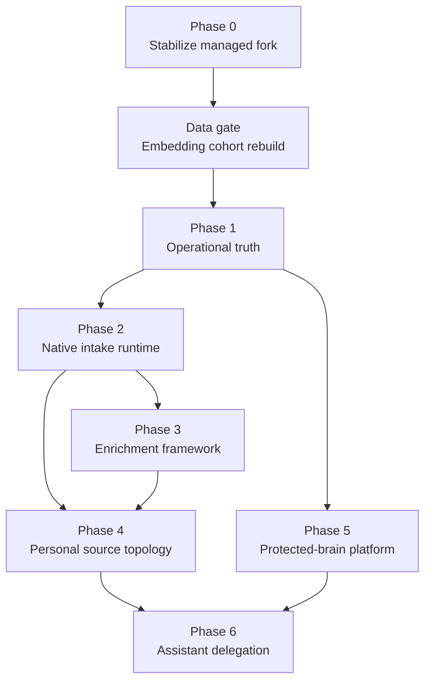

# GBrain Knowledge Runtime Roadmap

## Purpose

This roadmap sequences the observable multi-brain knowledge runtime without turning one long-lived plan into the system of record. Each phase receives its own implementation plan after its prerequisites and current upstream baseline are verified.

The governing requirements are in `docs/brainstorms/2026-07-22-001-gbrain-knowledge-runtime-requirements.md`.

Active Phase 0 and data-plane plans:

- `docs/plans/2026-07-22-002-refactor-stabilize-managed-fork-plan.md`
- `docs/plans/2026-07-22-003-refactor-rebuild-embedding-cohorts-plan.md`
- `docs/operations/managed-fork-integration-report.md`

Phase 1 delivery:

- Phase 1A implementation:
  `docs/plans/2026-07-23-001-feat-establish-operational-truth-plan.md`
- Phase 1A live acceptance:
  `docs/operations/phase-1a-observability-acceptance.md`
- Phase 1B implementation:
  `docs/plans/2026-07-23-002-feat-phase-1b-processing-receipts-and-assisted-repair-plan.md`

## Delivery principles

- Prove deployed capabilities before expanding their scope.
- Integrate upstream reliability work before building a downstream equivalent.
- Absorb useful upstream reliability work at phase boundaries (or on a fixed cadence) after Phase 0; keep the integration-report / behavior-ledger habit alive so later phases do not silently re-fork.
- Preserve a clean managed-fork boundary and prefer extension contracts over core divergence.
- Keep operational telemetry content-free by default.
- Treat database credentials and policies as the security boundary; agents remain scoped clients.
- Require an explicit exit gate before beginning a dependent phase.
- Coexist with legacy collectors, workflows, and processors until a later phase retires them; dual ownership of an output namespace is temporary, never the end state.
- Protected-brain production intake stays disabled until that brain has an approved policy profile (Phase 5), even if the native intake runtime ships earlier.

## Dependency map

Hard stops not drawn as full phase edges:

- Phase 2 may land intake for personal paths, but protected-brain intake admission requires a Phase 5 policy profile.
- Phase 2 defines the source-posture write contract; Phase 3 must target those postures. Phase 4 owns ranking, bulk migration, promotion UX, and legacy retirement.
- Phase 1 planning may begin from the Phase 0 integration report, but retrieval canaries do not count as continuous operational truth until the embedding cohort gate is green.
- Relative risk: Phase 0, intake, and protected-brain platform are highest operational risk; enrichment and personal topology are product-shape risk; assistant delegation is security-shape risk.

## Phase 0 — Stabilize the managed fork

**Outcome:** Downstream work begins from a known, tested upstream baseline with existing fork capabilities preserved.

**Scope:**

- Finish and land active downstream model-routing work.
- Integrate the selected upstream baseline on a dedicated branch.
- Reconcile overlapping NVIDIA, embedding, provider, source, Dream, and Minion changes intentionally.
- Evaluate high-value upstream reliability work that has not yet reached the selected baseline.
- Preserve explicit personal and company deployment descriptors and defer
  live vector/data cutover to the named embedding data gate.

**Exit gate:**

- The memory-bounded stabilization gate passes: repository guards and
  typecheck, the affected unit cohorts, and changed real-Postgres/compiled
  E2E paths.
- Version and migration consistency checks pass.
- A rollback point and integration report are recorded.
- Unfinished live embedding, service-selection, and observation receipts stay
  explicit in the data-gate plan; they are not silently treated as Phase 0
  success.

Production re-embedding, vector-width cutover, and live semantic acceptance are
the separate data gate below. Phase 1 implementation may begin from the merged
Phase 0 baseline, but its semantic canaries are not continuous truth until
that data gate is green for the brain they cover.

## Data gate — Rebuild embedding cohorts

**Outcome:** Live text-semantic projections use a proven embedding identity so retrieval canaries and later quality fixtures cannot pass on incompatible or unlabeled vectors.

**Scope:**

- Rebuild personal and company text-embedding cohorts under each brain's independent credentials, database, configuration, and source boundaries.
- Rehearse on restored engine-consistent copies before live cutover.
- Keep lexical retrieval available during rebuild; enable semantic ranking only after identity checks pass.
- Preserve pre-migration artifacts and a tested rollback coordinate through an observation window.
- Standardize future protected-brain provisioning on the same text-embedding identity without weakening hard brain boundaries.

**Exit gate:**

- Each rebuilt cohort proves complete embedding provenance (provider, model, dimensions, column, preprocessing signature, stored labels).
- Held retrieval queries win on the expected vector branch, not cache or lexical fallback alone.
- Personal cutover is accepted before company cutover.
- Phase 1 semantic-retrieval canaries may be treated as continuous truth only after this gate is green for each brain they cover.

Implementation: `docs/plans/2026-07-22-003-refactor-rebuild-embedding-cohorts-plan.md`.

## Phase 1 — Establish operational truth

**Outcome:** Operators can see whether critical GBrain capabilities work continuously across the fleet.

**Entry criterion:** Phase 0 exit plus the embedding cohort gate for brains included in retrieval canaries.

**Minimum capability set (MVP):**

1. Intake freshness / source health
2. Minion worker and queue liveness
3. Dream phase failure
4. Embed identity and readiness
5. Retrieval canary with lexical and semantic stages distinguished

**Scope:**

- Define stable capability identities and state semantics for the MVP set first; expand only after those five are trustworthy.
- Export content-free metrics for the MVP set, then additive coverage for enrichment, processors, knowledge derivation, and provider routes.
- Create fleet and per-brain Grafana views focused on the MVP set.
- Add actionable alert policies with noise controls.
- Add initial end-to-end canaries for capture, durable jobs, embedding, and retrieval.
- Relate Doctor diagnostics to capability failures without making Doctor scores the dashboard contract.

**Exit gate:**

- A stopped worker, stale intake source, dead job, failed Dream phase, and degraded semantic retrieval each produce a correct dashboard state and bounded alert.
- Monitoring stores no page bodies or sensitive evidence.
- Every current production brain reports identity, freshness, and canary status.

## Phase 2 — Complete the native intake runtime

**Outcome:** Intake sources submit normalized evidence through one supervised, durable GBrain path.

**Scope:**

- Complete production lifecycle wiring for ingestion sources.
- Preserve brain and source identity from event through derived output.
- Provide validation, deduplication, backpressure, checkpoints, dead-letter visibility, and health.
- Establish processor chaining for representative text, document, audio, video, and image inputs.
- Convert one existing collector and one workflow-based integration to the native contract as reference migrations.
- Define the source-posture write contract (canonical, inbox, research, session-evidence targets and promotion boundary) so later enrichment does not invent namespaces.
- Coexist with legacy collectors and workflows; do not retire them in this phase.
- Keep protected-brain production intake admission closed unless that brain already has an approved policy profile.

**Exit gate:**

- Representative text and media fixtures reach durable evidence pages exactly once.
- Failures are retriable or dead-lettered with visible ownership and repair guidance.
- Collector restarts and database interruptions do not lose accepted events.
- Intake capability canaries run through the deployed path.
- Enrichment and retrieval consumers can resolve the named source postures for write and read targeting.

## Phase 3 — Make enrichment passes first-class

**Outcome:** New reasoning passes are independently configurable, durable, observable, and evaluable.

**Scope:**

- Define the enrichment-pass contract and lifecycle.
- Use Dream for selection and coordination and Minions for durable execution.
- Track eligibility, versions, checkpoints, dependencies, lineage, quality, cost, and approval posture.
- Migrate representative research, transcription, entity, and synthesis enrichments onto the Phase 2 source-posture write targets.
- Prevent unchanged evidence from causing unnecessary repeated model work.
- Coexist with legacy reasoning paths; do not delete or reclaim shared output namespaces yet.

**Exit gate:**

- A pass can be enabled, disabled, versioned, retried, observed, and replayed independently.
- Unchanged inputs remain idempotent.
- Outputs trace to both source evidence and processing receipt.
- At least one multi-step media enrichment and one periodic synthesis pass satisfy quality fixtures.
- Pass outputs land in the correct posture namespaces rather than a temporary dual-write sink.

## Phase 4 — Establish personal source topology

**Outcome:** Raw intake and research remain available without overwhelming durable personal knowledge.

**Scope:**

- Complete operational use of the canonical, inbox, research, and session-evidence postures defined in Phase 2.
- Migrate existing research-derived material without losing provenance.
- Implement canonical-first retrieval with controlled evidence fallback.
- Define review and promotion behavior for durable concepts, decisions, and project proposals.
- Retire overlapping legacy reasoning paths after native quality gates pass.

**Exit gate:**

- Ordinary retrieval fixtures favor canonical knowledge while still finding relevant research evidence when needed.
- Research-derived concepts resolve to their supporting evidence.
- Re-running migration and synthesis produces no duplicates or timestamp-only churn.
- Legacy and native processors no longer own the same output namespace.

## Phase 5 — Provision protected-brain platform

**Outcome:** Hard-boundary brains can be deployed, operated, and governed consistently, starting from the existing company deployment class.

**Scope:**

- Complete runtime brain selection across CLI, MCP, Minions, and delegated agents.
- Package repeatable brain provisioning, backup, restore, identity, monitoring, and credential rotation.
- Formalize and harden the existing company deployment as the first platform consumer, not a greenfield brain.
- Define policy templates for approved data classes, prohibited material, retention, export, and deletion.
- Provision employment and confidential-service brains only after their policies are approved.
- Give each domain agent independent least-privilege credentials.
- Enforce the hard stop that no protected brain accepts production intake without an approved policy profile.

**Exit gate:**

- Cross-brain isolation tests prove reads, writes, jobs, logs, derived pages, and dashboard queries stay within scope.
- Backup and restore are exercised for each deployment class.
- Company brain operates under the packaged platform profile; new protected brains cannot open production intake without an approved policy.
- The fleet dashboard shows health without revealing protected content.

## Phase 6 — Add bounded assistant delegation

**Outcome:** A personal assistant can coordinate across authorized domains without becoming an unrestricted superuser.

**Entry criterion:** A recorded design decision on delegation transport and authorization that keeps domain credentials off the personal assistant and avoids turning the assistant into a credential proxy. Implementation plans do not start until that decision is recorded.

**Scope:**

- Route domain-specific requests to the correct scoped agent.
- Return bounded answers with brain and source provenance.
- Define ambiguity, denial, contradiction, timeout, and partial-result behavior.
- Support cross-domain status briefings that disclose only the information needed for personal prioritization.
- Require explicit authorization for cross-brain persistence or promotion.
- Evaluate routing accuracy and boundary violations with repeatable fixtures.

**Exit gate:**

- Representative personal, company, employment, and confidential-service requests route correctly.
- Misclassified and ambiguous requests fail closed or request clarification.
- The personal assistant cannot directly invoke protected-brain tools using another agent's credential.
- Cross-domain answers remain attributable and produce no unintended durable copies.

## Planning and tracking model

- Keep this roadmap stable at the outcome and exit-gate level.
- Write one implementation plan per phase under `docs/plans/`. Data-plane work that blocks a phase exit may use its own plan, as with the embedding cohort rebuild.
- Split a phase into multiple plans when its exit gate can be reached through independently shippable units.
- Track implementation through issues or the project board, while the requirements document remains the product-scope source of truth.
- Update this roadmap when phase order, dependencies, or exit gates change; do not append release-history narration.

## First implementation plans

Phase 0 is covered by `docs/plans/2026-07-22-002-refactor-stabilize-managed-fork-plan.md`: preserve active fork work, integrate a selected upstream baseline, reconcile overlapping provider and embedding contracts, run full CI, and verify deployed personal and company-brain paths.

The embedding cohort rebuild runs as the named data gate via `docs/plans/2026-07-22-003-refactor-rebuild-embedding-cohorts-plan.md`. It may proceed in parallel with Phase 0 cutover work but is an entry criterion for treating Phase 1 semantic-retrieval canaries as continuous operational truth.

Phase 1 planning should begin from the Phase 0 integration report and the embedding gate status, not from the pre-merge tree.
