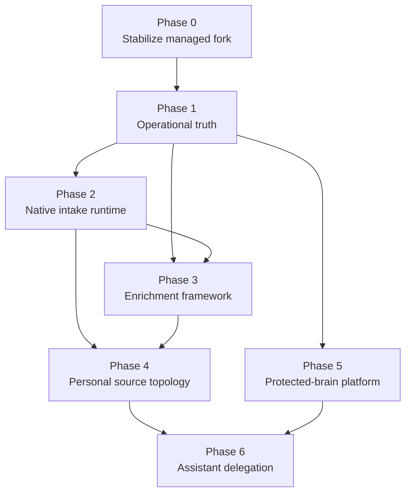

# GBrain Knowledge Runtime Roadmap

## Purpose

This roadmap sequences the observable multi-brain knowledge runtime without turning one long-lived plan into the system of record. Each phase receives its own implementation plan after its prerequisites and current upstream baseline are verified.

The governing requirements are in `docs/brainstorms/2026-07-22-001-gbrain-knowledge-runtime-requirements.md`.

## Delivery principles

- Prove deployed capabilities before expanding their scope.
- Integrate upstream reliability work before building a downstream equivalent.
- Preserve a clean managed-fork boundary and prefer extension contracts over core divergence.
- Keep operational telemetry content-free by default.
- Treat database credentials and policies as the security boundary; agents remain scoped clients.
- Require an explicit exit gate before beginning a dependent phase.

## Dependency map

## Phase 0 — Stabilize the managed fork

**Outcome:** Downstream work begins from a known, tested upstream baseline with existing fork capabilities preserved.

**Scope:**

- Finish and land active downstream model-routing work.
- Integrate the selected upstream baseline on a dedicated branch.
- Reconcile overlapping NVIDIA, embedding, provider, source, Dream, and Minion changes intentionally.
- Evaluate high-value upstream reliability work that has not yet reached the selected baseline.
- Exercise personal and company-brain deployed paths after the merge.

**Exit gate:**

- Full repository CI passes.
- Version and migration consistency checks pass.
- Existing production brain routes, model providers, embeddings, source identity, Minion jobs, and native research processing pass deployed-path smoke tests.
- A rollback point and integration report are recorded.

## Phase 1 — Establish operational truth

**Outcome:** Operators can see whether critical GBrain capabilities work continuously across the fleet.

**Scope:**

- Define stable capability identities and state semantics.
- Export content-free metrics for sources, queues, workers, Dream phases, enrichment, processors, embeddings, knowledge derivation, provider routes, and retrieval.
- Create fleet and per-brain Grafana views.
- Add actionable alert policies with noise controls.
- Add initial end-to-end canaries for capture, durable jobs, embedding, and retrieval.
- Relate Doctor diagnostics to capability failures without making Doctor scores the dashboard contract.

**Exit gate:**

- A stopped worker, stale intake source, dead job, failed Dream phase, and degraded semantic retrieval each produce a correct dashboard state and bounded alert.
- Monitoring stores no page bodies or sensitive evidence.
- Every current production brain reports identity, freshness, and canary status.

## Phase 2 — Complete the native intake runtime

**Outcome:** Intake sources submit normalized evidence through one supervised, durable GBrain path.

**Scope:**

- Complete production lifecycle wiring for ingestion sources.
- Preserve brain and source identity from event through derived output.
- Provide validation, deduplication, backpressure, checkpoints, dead-letter visibility, and health.
- Establish processor chaining for representative text, document, audio, video, and image inputs.
- Convert one existing collector and one workflow-based integration to the native contract as reference migrations.

**Exit gate:**

- Representative text and media fixtures reach durable evidence pages exactly once.
- Failures are retriable or dead-lettered with visible ownership and repair guidance.
- Collector restarts and database interruptions do not lose accepted events.
- Intake capability canaries run through the deployed path.

## Phase 3 — Make enrichment passes first-class

**Outcome:** New reasoning passes are independently configurable, durable, observable, and evaluable.

**Scope:**

- Define the enrichment-pass contract and lifecycle.
- Use Dream for selection and coordination and Minions for durable execution.
- Track eligibility, versions, checkpoints, dependencies, lineage, quality, cost, and approval posture.
- Migrate representative research, transcription, entity, and synthesis enrichments.
- Prevent unchanged evidence from causing unnecessary repeated model work.

**Exit gate:**

- A pass can be enabled, disabled, versioned, retried, observed, and replayed independently.
- Unchanged inputs remain idempotent.
- Outputs trace to both source evidence and processing receipt.
- At least one multi-step media enrichment and one periodic synthesis pass satisfy quality fixtures.

## Phase 4 — Establish personal source topology

**Outcome:** Raw intake and research remain available without overwhelming durable personal knowledge.

**Scope:**

- Establish canonical, inbox, research, and session-evidence postures.
- Migrate existing research-derived material without losing provenance.
- Implement canonical-first retrieval with controlled evidence fallback.
- Define review and promotion behavior for durable concepts, decisions, and project proposals.
- Retire overlapping legacy reasoning paths after native quality gates pass.

**Exit gate:**

- Ordinary retrieval fixtures favor canonical knowledge while still finding relevant research evidence when needed.
- Research-derived concepts resolve to their supporting evidence.
- Re-running migration and synthesis produces no duplicates or timestamp-only churn.
- Legacy and native processors no longer own the same output namespace.

## Phase 5 — Provision protected-brain platform

**Outcome:** Additional hard-boundary brains can be deployed, operated, and governed consistently.

**Scope:**

- Complete runtime brain selection across CLI, MCP, Minions, and delegated agents.
- Package repeatable brain provisioning, backup, restore, identity, monitoring, and credential rotation.
- Define policy templates for approved data classes, prohibited material, retention, export, and deletion.
- Provision representative company, employment, and confidential-service brains only after their policies are approved.
- Give each domain agent independent least-privilege credentials.

**Exit gate:**

- Cross-brain isolation tests prove reads, writes, jobs, logs, derived pages, and dashboard queries stay within scope.
- Backup and restore are exercised for each deployment class.
- No protected brain accepts production intake without an approved policy profile.
- The fleet dashboard shows health without revealing protected content.

## Phase 6 — Add bounded assistant delegation

**Outcome:** A personal assistant can coordinate across authorized domains without becoming an unrestricted superuser.

**Scope:**

- Route domain-specific requests to the correct scoped agent.
- Return bounded answers with brain and source provenance.
- Define ambiguity, denial, contradiction, timeout, and partial-result behavior.
- Support cross-domain status briefings that disclose only the information needed for personal prioritization.
- Require explicit authorization for cross-brain persistence or promotion.
- Evaluate routing accuracy and boundary violations with repeatable fixtures.

**Exit gate:**

- Representative personal, company, employment, and confidential-service requests route correctly.
- Misclassified and ambiguous requests fail closed or request clarification.
- The personal assistant cannot directly invoke protected-brain tools using another agent's credential.
- Cross-domain answers remain attributable and produce no unintended durable copies.

## Planning and tracking model

- Keep this roadmap stable at the outcome and exit-gate level.
- Write one implementation plan per phase under `docs/plans/`.
- Split a phase into multiple plans when its exit gate can be reached through independently shippable units.
- Track implementation through issues or the project board, while the requirements document remains the product-scope source of truth.
- Update this roadmap when phase order, dependencies, or exit gates change; do not append release-history narration.

## First implementation plan

The first plan should cover Phase 0 only: preserve active fork work, integrate a selected upstream baseline, reconcile overlapping provider and embedding changes, run full CI, and verify deployed personal and company-brain paths. Phase 1 planning should begin from the resulting integration report rather than the pre-merge tree.
